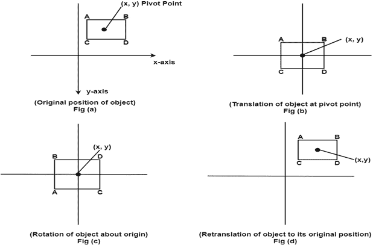
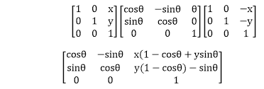
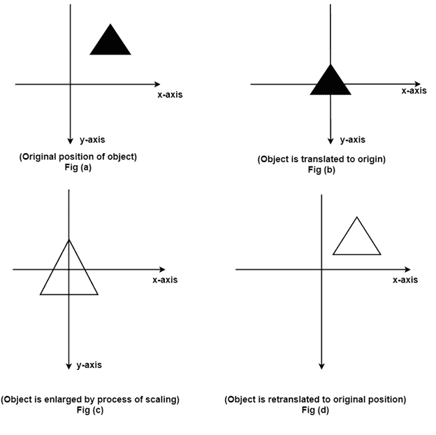

# 一般枢轴点旋转或围绕固定点旋转:

> 原文：<https://www.javatpoint.com/general-pivot-point-rotation-or-rotation-about-fixed-point>

首先使用旋转功能。下面给出了围绕原点旋转对象的步骤序列。

1.  将对象从其原始位置平移到原点，如图(b)所示
2.  如图(c)所示，围绕原点旋转对象。
3.  将对象从原点平移到其原始位置。这被称为反向翻译，如图(d)所示。

以上 3 步的矩阵乘法如下

## 相对于固定点的缩放:

为此，执行以下步骤:

**步骤 1:** 物体保持在如图(a)所示的期望位置

**步骤 2:** 平移物体，使其中心与原点重合，如图(b)所示

**步骤 3:** 通过保持物体在原点来缩放物体，如图(c)所示

**步骤 4:** 再次完成翻译。这种翻译被称为反向翻译。

* * *