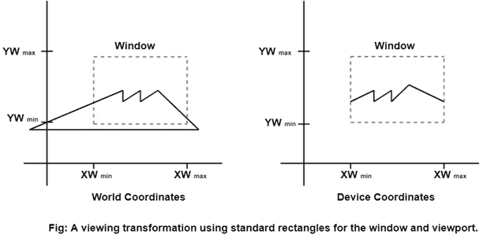
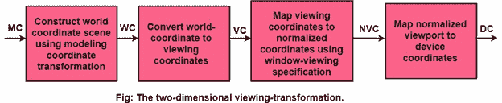
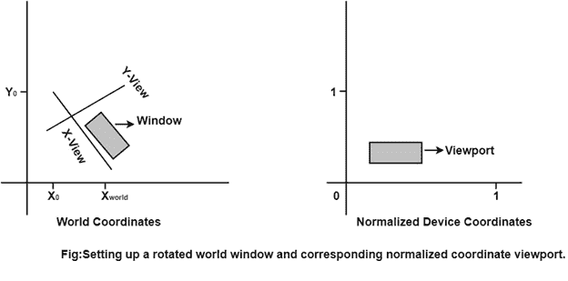
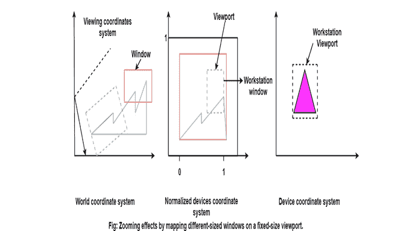

# 计算机图形窗口:

> 原文：<https://www.javatpoint.com/computer-graphics-window>

选择和放大绘图的一部分的方法称为窗口。为此显示选择的区域称为窗口。窗口由世界坐标选择。

有时我们对物体的某一部分感兴趣，而对整个物体不感兴趣。所以我们将决定一个假想的盒子。此框将包含对象的所需或感兴趣的区域。这样一个假想的盒子叫做窗户。

**视口:**显示设备上的一个区域，窗口被映射到该区域[要显示的位置]。

基本上，窗口是对象空间中的一个区域。它包围了对象。用户选择此选项后，空间将映射到视口的整个区域。几乎所有的 2D 和三维图形软件包都提供了在屏幕上定义视口大小的方法。可以确定不同显示区域上的许多视口，并在每个视口中以不同的角度查看同一对象。

窗口的大小是(0，0)坐标，这是一个左下角和右侧，直到窗口包围所需的区域。一旦定义了窗口，在表示到屏幕坐标之前，窗口外的数据被剪切。这个过程减少了显示信号的数据量。

帝国理工学院泰克 4.14 管的窗口大小横向包含 4.96 点，纵向包含 3072 点。

**查看变换或窗口到视口变换或窗口变换:**将世界坐标场景的一部分映射到设备坐标被称为查看变换等。

**分几步查看变换:**

首先，我们使用输出图元和属性在世界坐标中构建场景。

为了获得特定的方向，我们可以在窗口坐标平面中设置一个二维观察坐标系，并在观察坐标系中定义一个窗口。

一旦观察框架建立，然后将世界坐标中的描述转换为观察坐标。

然后，我们在规范化坐标(范围从 0 到 1)中定义视口，并将场景的查看坐标描述映射到规范化坐标。

在最后一步，图片的所有部分(即，视口之外的部分)被倾斜，内容被转移到设备坐标。

**通过改变视口的位置:**我们可以在输出设备的显示区域上查看不同位置的对象，如图:

**通过改变视口的大小:**我们可以改变显示对象的大小和比例。我们可以通过在固定大小的视口上连续映射不同大小的窗口来实现缩放效果。

随着窗口变小，我们放大场景的某些部分，以查看较大窗口未显示的细节。

* * *