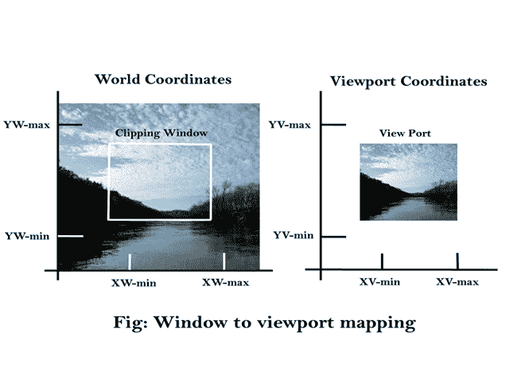
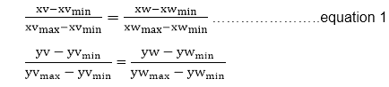
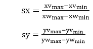
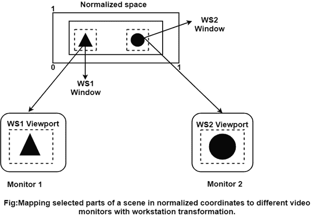
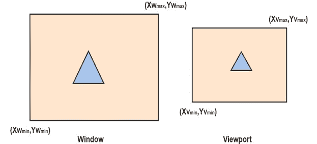
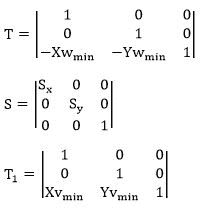

# 计算机图形窗口到视口的坐标变换

> 原文：<https://www.javatpoint.com/computer-graphics-window-to-viewport-co-ordinate-transformation>

一旦对象描述被传输到查看参考框架，我们选择窗口在查看坐标中延伸，并选择标准化坐标中的视口限制。

然后，对象描述被转换为标准化的设备坐标:

我们使用一种变换来实现这一点，这种变换保持对象在标准化空间中的相对位置与它们在观察坐标中的相对位置相同。

如果坐标位置位于观察窗的中心:

它将显示在视口的中心。

图显示了窗口到视口的映射。窗口中位置(xw，yw)处的点映射到关联视口中的位置(xv，yv)。

为了保持点在视口中与窗口中的相对位置相同，我们需要:

求解视口位置(xv，yv)的这些印象，我们有

XV = XVmin+【xw】minsx
yv = yvmin+【yw】minsy…………………方程式 2

比例因子在哪里

公式(1)和公式(2)也可以通过一组将窗口或世界坐标区域转换为视口或屏幕坐标区域的变换来导出。此对话通过以下转换序列来执行:

1.  使用定点位置(xw min 、yw min )执行缩放变换，将窗口区域缩放到视口的大小。
2.  将缩放的窗口区域平移到视口的位置。如果缩放因子相同(sx=sy)，则保持对象的相对比例。

从标准化坐标，对象描述被映射到各种显示设备。

我们可以在特定的应用程序中打开任意数量的输出设备，并且可以为每个打开的输出设备执行三个窗口到视口的转换。

这种映射称为工作站变换(通过在归一化空间中选择一个窗口区域，在显示设备的坐标中选择一个视口区域来完成)。

如图 2 所示，工作站转换以划分视图，使得标准化空间的不同部分可以显示在各种输出设备上)。

## 以上三个变换步骤的矩阵表示:

**步骤 1:** 将窗口转换到原点 1
Tx=-XwminTy=-Ywmin

**步骤 2:** 缩放窗口以使其大小与视口相匹配
Sx=(Xymax-Xvmin)/(Xwmax-Xwmin)
Sy=(Yvmax-Yvmin)/(Yw

**步骤 3:** 再次将视口平移到屏幕上的正确位置。
Tx= XvminT7】Ty= Yvmin

以上三个步骤可以用矩阵形式表示:
VT=T * S * T 1

T =将窗口平移到原点

s =将窗口缩放到视口大小

t1=屏幕上的平移视口。

查看变换= T * S * T 1

## 查看转换的优势:

我们可以根据自己的需要和选择在设备或显示系统上显示图片。

**注:**

*   根据应用程序选择适合的世界坐标系。
*   根据设计需要选择屏幕坐标系。
*   观看变换被选择作为世界和屏幕坐标之间的桥梁。

* * *