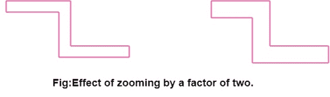
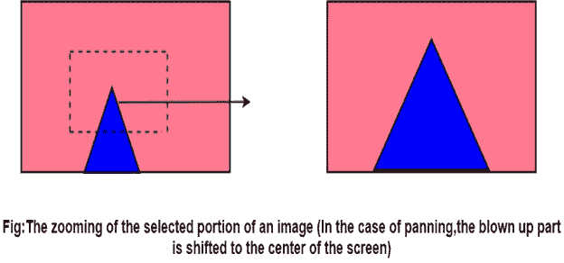

# 计算机图形缩放

> 原文：<https://www.javatpoint.com/computer-graphics-zooming>

缩放是一种通常由虚拟软件提供的变换。根据用户的指示，该变换有效地缩小或放大了像素图或其一部分。这种缩放通常在像素级而不是坐标级实现。视频显示或图像必然是像素图，即像素的集合，这些像素是图片中最小的可寻址元素。缩放过程沿着连续的扫描线复制像素。

**示例:**缩放因子为 2

每个像素值在两条连续扫描线上的每一条上被使用四次。

图中显示了放大 2 倍的效果。

这种像素集成有时涉及使用一组有序模式的复制，通常称为抖动。

两种最常见的抖动类型是:

*   有序抖动。
*   随机抖动。

有广泛的应用，特别是当灰度级(亮度份额)是合成产生的。

* * *