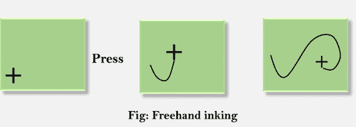

# 计算机图形平移

> 原文：<https://www.javatpoint.com/computer-graphics-panning>

平移过程充当缩放变换的限定符。该步骤将图像的放大部分移动到屏幕中心，并根据比例因子填充整个屏幕。

## 优势:

即使所选图像部分(用于缩放)接近屏幕边界，在所有四个方向上缩放区域的有效增加。

## 上墨:

如果我们以规则的时间间隔对图形输入设备的位置进行采样，并在每个采样位置显示一个点，将显示设备移动的试验。这种紧密模拟纸上绘画效果的技术被称为“着墨”。

多年来，墨迹的主要用途是与在线字符识别程序结合使用。

## 剪枝:

在计算机图形学中，删除图像中落在窗口之外的任何部分，该窗口的大小和位置一直保持原来的视觉。它也被称为剪辑。

* * *