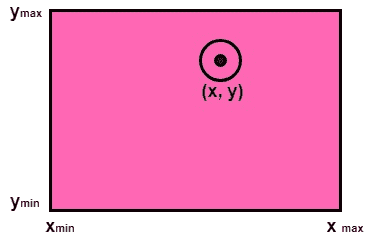
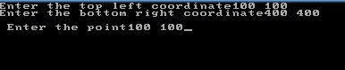
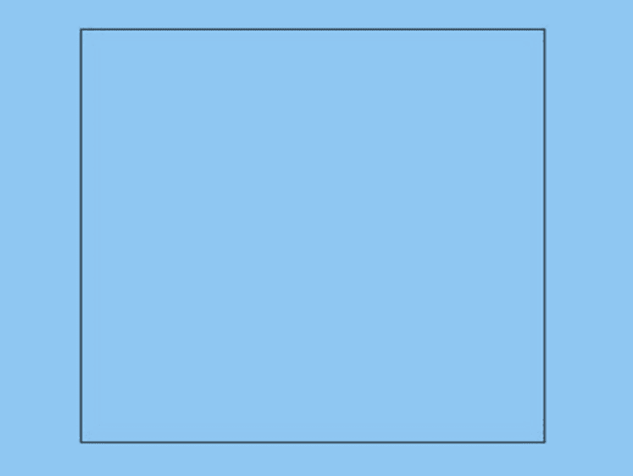
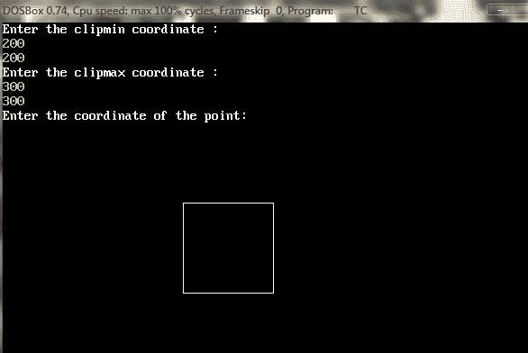
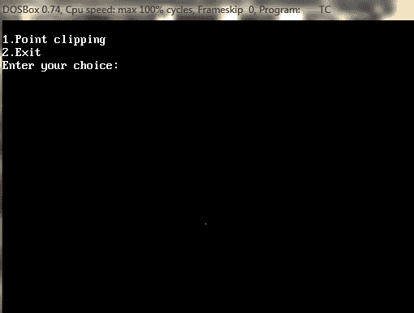
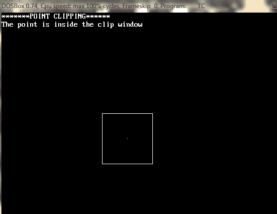

# 点裁剪:

> 原文：<https://www.javatpoint.com/computer-graphics-point-clipping>

点裁剪用于确定点是否在窗口内。为此，检查以下条件。

1.  x ≤ x <sub>最大</sub>
2.  x ≥ x <sub>min</sub>
3.  y ≤ y <sub>最大</sub>
4.  y ≥ y <sub>min</sub>



(x，y)是该点的坐标。如果上述不等式中的任何一个都是假的，那么该点将落在窗口之外，并且不会被认为是可见的。

### 方案 1:

**实现点裁剪:**

```

#include<stdio.h>
#include<conio.h>
#include<graphics.h>
inttlx,tly,brx,bry,px,py;
void point_clip()
{
intwxmin,wymin,wxmax,wymax;
wxmin=tlx;
wxmax=brx;
wymin=tly;
wymax=bry;
if(px>=wxmin&&px<=wxmax)
if(py>=wymin&&py<=wymax)
putpixel(px,py,RED);
getch();
closegraph();
}
void main()
{ 
intgd=DETECT,gm,xc,yc,r;
clrscr();
printf("Enter the top left coordinate");
scanf("%d%d",&tlx,&tly);
printf("Enter the bottom right coordinate");
scanf("%d%d",&brx,&bry);
printf("\n Enter the point");
scanf("%d%d",&px,&py);
initgraph(&gd,&gm,"c:\\tc\\bgi");
setbkcolor(BLUE);
setcolor(RED);
rectangle(tlx,tly,brx,bry);
point_clip();
}

```

**输出:**




### 程序 2:

**实现矩形窗口的点裁剪:**

```

#include<stdio.h>
#include<conio.h>
#include<graphics.h>
void main()
{
        int gm,gr,xcmin,ycmin,xcmax,ycmax,x,y,c;
        clrscr();
        detectgraph(&gm,&gr);
        initgraph(&gm,&gr,"c:\\tc\\BGI");
          printf("Enter the clipmin coordinate :\n");
          scanf("%d%d",&xcmin,&ycmin);
          printf("Enter the clipmax coordinate :\n");
          scanf("%d%d",&xcmax,&ycmax);
          rectangle(xcmin,ycmax,xcmax,ycmin);
          printf("Enter the coordinate of the point:\n");
          scanf("%d%d",&x,&y);
          detectgraph(&gm,&gr);
          initgraph(&gm,&gr,"c:\\tc\\BGI");
          putpixel(x,y,15);
          printf("\n1.Point clipping\n2.Exit\nEnter your choice:\n");
           scanf("%d",&c);
           switch(c)
     {
           case 1:
          detectgraph(&gm,&gr);
          initgraph(&gm,&gr,"d:\\tc\\BGI");
          rectangle (xcmin,ycmax,xcmax,ycmin);
          printf("*******POINT CLIPPING******\n");
          if ((xcmin<x) && (x<xcmax))
      {
         if ((ycmin<y) && (y<ycmax))
        {
          printf("The point is inside the clip window\n");
           putpixel(x,y,15);
        }
     }
          else
          printf("The point is outside the clipwindow \nThe point is clipped\n");
          break;
         case 2: exit(0);
    }
         getch();
}

```

**输出:**





* * *