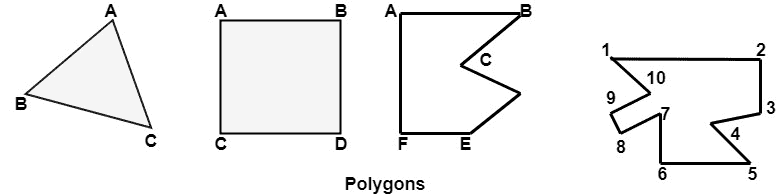
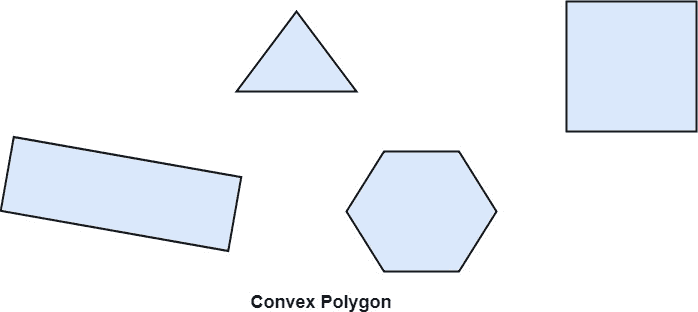
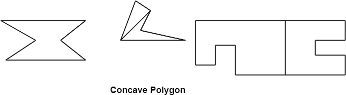
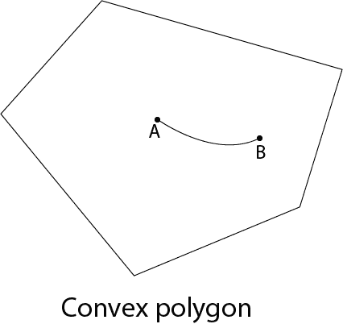
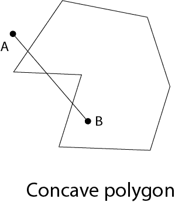
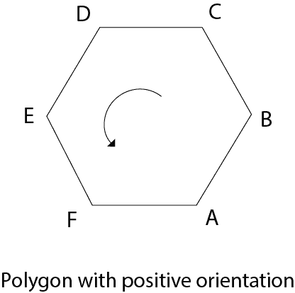
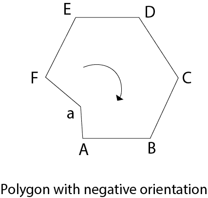

# 多边形:

> 原文：<https://www.javatpoint.com/computer-graphics-polygon>

多边形是表面的表示。它是原始的，本质上是封闭的。它是由一组线条组成的。也叫多面图。组合形成多边形的线称为边。线是通过组合两个顶点获得的。

## 多边形示例:

1.  三角
2.  矩形
3.  六边形
4.  五边形

下图显示了一些多边形。

  

## 多边形的类型

1.  凹面
2.  凸面的

多边形被称为连接多边形内部任意两个点的线的凸。非凸多边形被称为凹多边形。凹多边形有一个大于 180°的内角。这样它就可以被裁剪成相似的多边形。

多边形可以是正的，也可以是负的。如果我们访问顶点，顶点访问产生逆时针回路，那么方向被称为正。

* * *