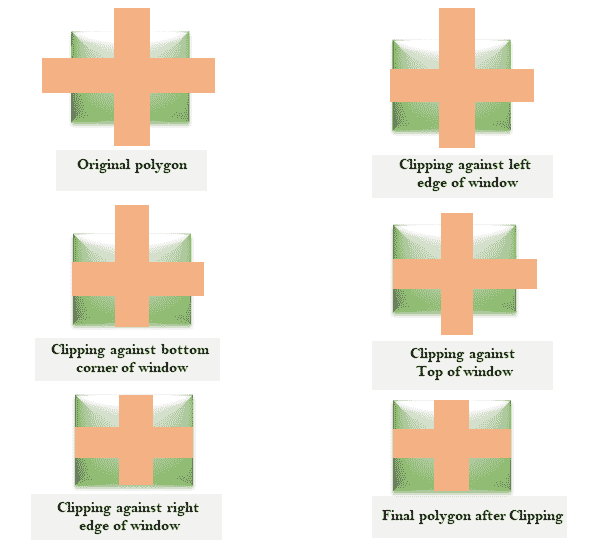
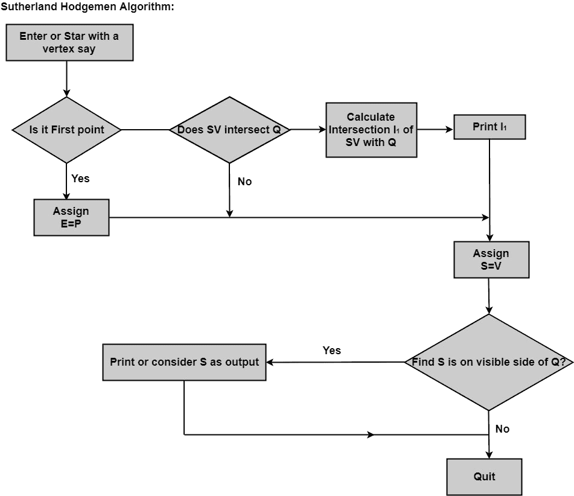

# 萨瑟兰-霍奇曼多边形裁剪:

> 原文：<https://www.javatpoint.com/sutherland-hodgeman-polygon-clipping>

它是通过对每个窗口角或边处理多边形的边界来执行的。首先，整个多边形在一条边上被裁剪，然后考虑得到的多边形，然后多边形在第二条边上被考虑，对所有四条边都是如此。

**处理**时可能出现的四种情况

1.  如果第一个顶点在窗口外，第二个顶点在窗口内。然后将第二个顶点添加到输出列表中。窗口边界和多边形边(边)的交点也被添加到输出线。
2.  如果两个顶点都在窗口边界内。然后只有第二个顶点被添加到输出列表中。
3.  如果第一个顶点在窗口内，第二个顶点在窗口外。与窗口相交的边被添加到输出列表中。
4.  如果两个顶点都在窗口外，则输出列表中不添加任何内容。

下图显示了原始多边形和对四个窗口的多边形裁剪。

## 科恩·霍奇曼算法的缺点:

这种方法需要相当大的内存。第一个多边形以原始形式存储。然后对左边缘进行剪裁，并存储输出。然后靠右边缘剪裁完成，然后是上边缘。最后，修剪下边缘。所有这些操作的结果都存储在内存中。所以浪费内存来存储中间多边形。

* * *