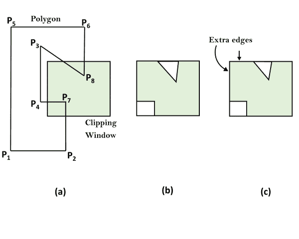
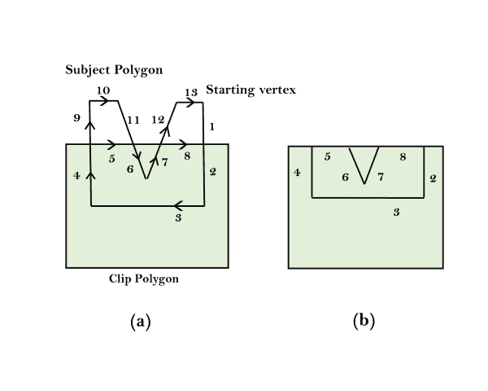

# 魏勒-阿泽顿多边形裁剪:

> 原文：<https://www.javatpoint.com/weiler-atherton-polygon-clipping>

当裁剪后的多边形有两个或两个以上单独的部分时，它就是该算法处理的凹多边形。修改窗口边界的顶点处理过程，以便显示凹多边形。

让裁剪窗口最初被称为裁剪多边形，并且要裁剪的多边形是主题多边形。我们从主体多边形的任意顶点开始，沿顺时针方向围绕其边界进行追踪，直到遇到与裁剪多边形的交点:

1.如果边进入裁剪多边形，记录交点并继续追踪主题多边形。

2.如果边离开了裁剪多边形，记录交点并右转，以同样的方式跟随裁剪多边形(即，将裁剪多边形视为主体多边形，将主体多边形视为裁剪多边形，并像以前一样继续)。

每当我们的遍历路径形成一个子多边形时，我们就输出该子多边形作为整体结果的一部分。然后，我们继续从记录的交点追踪原始主体多边形的其余部分，该交点标记了尚未追踪的边或边的一部分的开始。当原始主体多边形的整个边界被精确跟踪一次时，算法终止。

**例如，**图(a)中的数字表示边缘和部分边缘被追踪的顺序。我们从起始顶点开始，继续沿着主体多边形的同一条边(从 1 到 2)进入裁剪多边形。当我们沿着离开裁剪多边形的边移动时，我们右转(从 4 到 5)到裁剪多边形上，它现在被认为是主体多边形。按照同样的逻辑，下一个右转(从 5 到 6)到当前剪辑多边形，这是原始的主题多边形。以同样的方式完成下一步(从 7 到 8)，我们有一个子多边形用于图(b)中的输出。然后，我们从我们第一次改变路线的记录交叉点恢复原始主题多边形的遍历。从 9 到 10 到 11 不会产生任何输出。跳过已经遍历的 6 和 7 后，我们继续 12 和 13，结束。图(b)是最终结果。

* * *