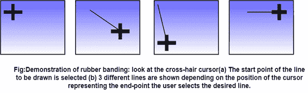
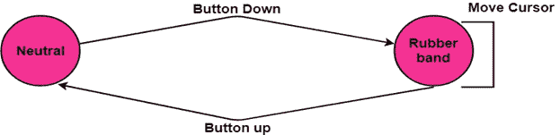
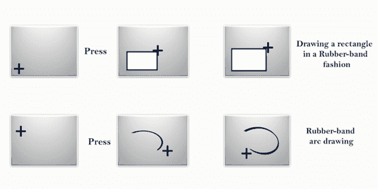

# 弹性或橡皮筋技术

> 原文：<https://www.javatpoint.com/computer-graphics-elastic-or-rubber-band-techniques>

橡皮筋是一种在计算机屏幕上绘制直线、折线、矩形、圆形和椭圆形等几何图元的流行技术。

它成为图形用户界面(GUI)不可分割的一部分和事实上的标准，几乎被所有基于 windows 的应用程序普遍接受。

用户通过定位线的两个端点，以通常的方式指定线。当我们从第一个端点移动到第二个端点时，程序会显示一条从第一个端点到光标位置的线，因此他可以在完成定位之前看到线的位置。

效果是在第一个端点和光标之间拉伸一条弹性线；因此这些技术的名字。

根据十字线光标的位置，考虑图(a)和图(d)中不同的线性结构。用户可以移动光标来产生更多的可能性，并选择适合他的特定应用。

### 线路终点的选择:

用户将光标移动到适当的位置并选择。

然后，随着光标的移动，线发生变化，以光标的最新位置作为终点。

只要按下按钮，橡皮筋的状态就会激活。

该过程用图 1 中橡胶带的状态转移图来解释:

当用户对最终位置满意时，按下的按钮被释放，并且在光标的开始和最后位置之间画出一条线。

**示例:**这在基于微软窗口的应用程序中得到广泛遵循，例如画笔绘图包。

其他几何图元可以用橡皮筋方式绘制:

-水平或垂直构建的线条

-长方形

-圆弧

这种技术在绘制相对复杂的实体(如矩形和弧形)时非常有用。

### 优势:

1.  它用于绘制所有几何实体，如直线、多边形、圆、矩形、椭圆和其他曲线。
2.  很容易理解和实现。

### 缺点:

1.  它需要像软件和中央处理器速度这样的计算资源。
2.  昂贵的

* * *