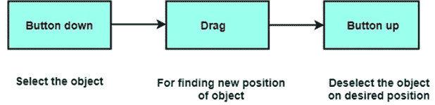
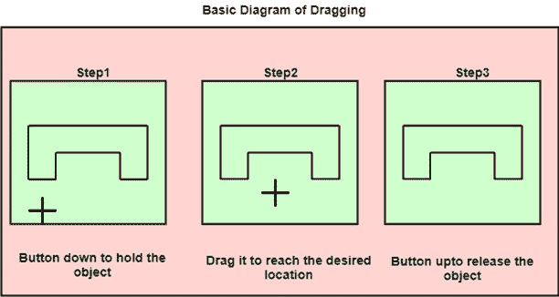

# 拖延的

> 原文：<https://www.javatpoint.com/computer-graphics-dragging>

拖动用于将对象从计算机屏幕上的一个位置移动到另一个位置。要拖动任何其他对象，首先，我们必须通过按住鼠标按钮来选择要在屏幕上移动的对象。当光标在屏幕上移动时，对象也随着光标位置移动。当光标到达所需位置时，按钮被释放。

**下图为拖动程序:**

* * *