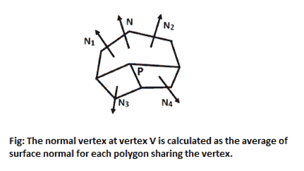
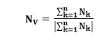
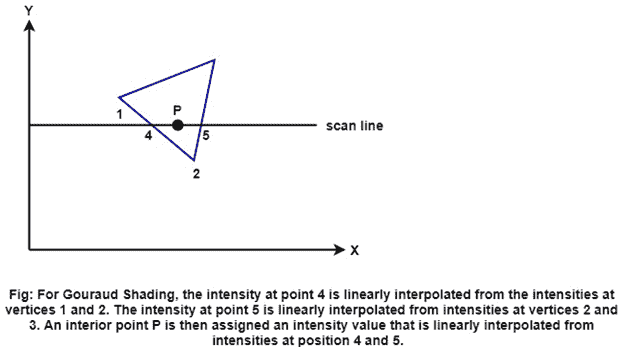
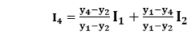
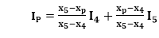
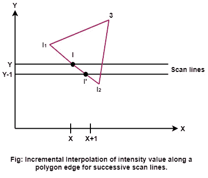
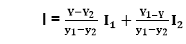
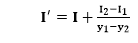
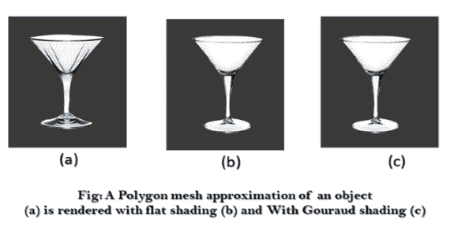

# 高质量着色

> 原文：<https://www.javatpoint.com/computer-graphics-gouraud-shading>

这种强度插值方案，由古罗开发，通常被称为古罗着色，通过在表面上线性插值强度值来渲染多边形表面。每个多边形的强度值与沿公共边的相邻多边形的值相协调，从而消除了平面着色中可能出现的强度不连续性。

通过执行以下计算，每个多边形表面都使用古罗着色进行渲染:

1.  确定每个多边形顶点的平均单位法向量。
2.  将照明模型应用于每个顶点，以确定顶点强度。
3.  线性插值多边形表面上的顶点强度。

在每个多边形顶点，我们通过平均从该顶点开始的所有多边形的表面法线获得一个法向量，如图:

因此，对于任何顶点位置 V，我们通过计算获得单位顶点法线

一旦我们有了顶点法线，我们就可以从光照模型中确定顶点的强度。

**下图演示了下一步:**沿多边形边缘插值强度。对于每条扫描线，扫描线与多边形边缘相交处的强度根据边缘端点处的强度线性插值。**例如:**在图中，端点顶点位于位置 1 和位置 2 的多边形边缘与点 4 的扫描线相交。获得点 4 处的强度的快速方法是仅使用扫描线的垂直位移在强度 I 1 和 I 2 之间进行插值。

类似地，从顶点 2 和 3 处的强度值内插该扫描线的右交点(点 5)处的强度。一旦为扫描线建立了这些边界强度，就从点 4 和 5 处的边界强度内插一个内点(如前图中的点 P)

增量计算用于获得扫描线之间的连续边缘强度值，并获得沿扫描线的连续强度，如图 1 所示:

如果边缘位置(x，y)的强度被插值为

然后，我们可以获得下一条扫描线沿这条边的强度，Y-1 为

类似的计算用于获得沿着每条扫描线的连续水平像素位置的强度。

当要用颜色渲染表面时，每个颜色分量的强度都是在顶点计算的。Gouraud Shading 可以与隐藏表面算法相结合，沿着每条扫描线填充可见多边形。下图显示了一个使用 Gouraud 方法着色的对象示例:

古罗着色抛弃了与恒定着色模型相关的强度不连续性，但它有一些其他的不足。表面上的高光有时会以异常形状显示，线性强度插值会导致表面上出现亮或暗的强度条纹，称为匹配带。可以通过将曲面划分为更多数量的多边形面，或者使用其他需要更多计算的方法(如 Phong 着色)来减少这些影响。

* * *