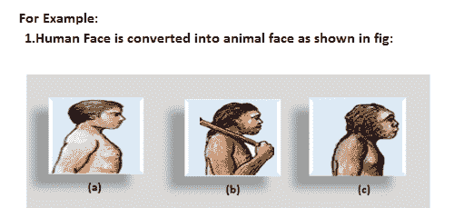
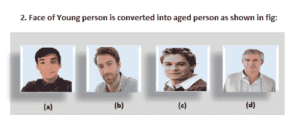
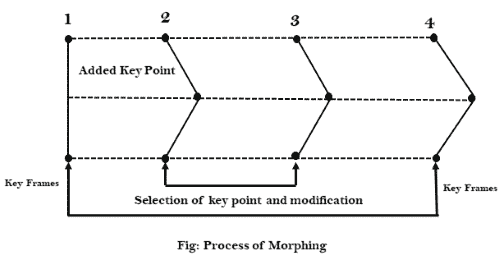
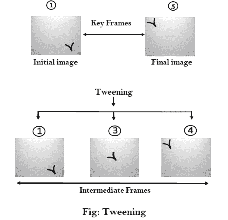
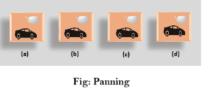
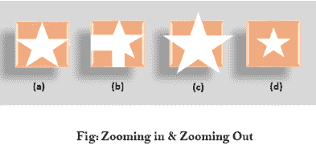

# 动画功能

> 原文：<https://www.javatpoint.com/computer-graphics-animation-functions>

**1。变形:**变形是一种动画功能，用于将对象形状从一种形式转换为另一种形式，称为变形。这是最复杂的转变之一。该功能通常用于电影、漫画、广告和电脑游戏。

**变形的过程包括三个步骤:**

1.  在第一步中，一个初始图像和另一个最终图像被添加到变形应用中，如图:I st & 4 th 对象被认为是关键帧。
2.  第二步包括选择两幅图像上的关键点，以在两幅图像之间实现平滑过渡，如 2 和对象所示。

3.第三步，第一幅图像的关键点转换为第二幅图像的对应关键点，如图 3 rd 对象所示。

2.**包裹:**包裹功能类似于变形功能。它只会扭曲初始图像，以便与最终图像匹配，并且在此功能中不会出现褪色。

3.**补间:**补间是‘中间’的简称补间是在最初的&最后的最终图像之间生成中间帧的过程。这个功能在电影界很流行。

4.**摇摄:**通常摇摄是指相机在水平面上的旋转。在计算机图形学中，平移涉及场景中固定大小的窗口在窗口对象上的移动。固定大小的窗口向哪个方向移动，对象似乎向相反的方向移动，如图:

如果窗口向后移动，则对象看起来向前移动，而窗口向前移动，则对象看起来向后移动。

5.**缩放:**在缩放中，窗口是固定一个对象并改变其大小，对象也出现大小变化。当窗口围绕一个固定的中心变小时，窗口内的对象看起来更大。这个功能被称为**放大**。

当我们增加窗口的大小约固定中心，对象来到窗口内显得很小。该功能称为**缩小**。

6.**分形:**利用分形函数，通过迭代生成复杂的图像。迭代是指再次重复单个公式&，基于之前的迭代结果，其值略有不同。这些结果以显示图片的形式显示在屏幕上。

* * *