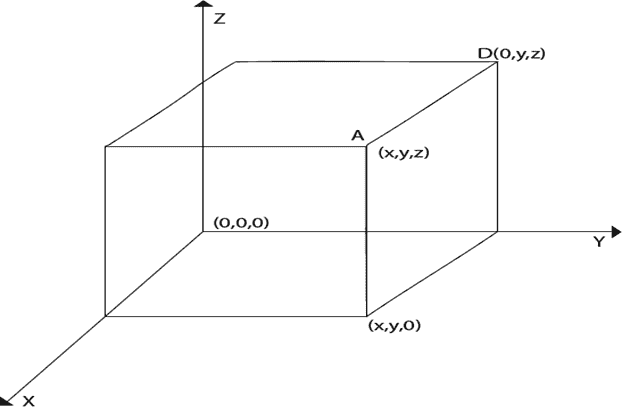

# 三维图形

> 原文：<https://www.javatpoint.com/computer-graphics-3d-graphics>

三维变换是二维变换的扩展。在 2D 使用两个坐标，即 x 和 y，而在 3D 中使用三个坐标 x、y 和 z。

对于三维图像和物体，需要三维变换。这些是平移、缩放和旋转。这些也称为基本变换，用矩阵表示。在 3D 中使用矩阵来处理更复杂的变换。

2D 可以展示二维物体。像条形图、饼图、图表。但是一些更自然的物体可以用 3D 来表示。使用 3D，我们可以在不同的部分看到不同形状的物体。

在 3D 中，当平移完成时，我们还需要三个旋转因子，它是三个旋转的一个分量。每个都可以沿着任意三个笛卡尔轴执行。在 3D 中，我们也可以将一系列变换表示为单个矩阵。

计算机图形学使用计算机辅助设计。计算机辅助设计允许操纵三维机器部件。它还提供汽车车身、飞机零部件的研究。所有这些活动都需要现实主义。为了逼真，需要 3D。从 2D 制作一个逼真的三维场景是很困难的。它需要三维，即深度。

## 三维几何

三维系统有三个轴 x，y，z。三维坐标系的方向有两种。右手系统和左手系统。

在右手系统中，右手拇指指向正 z 方向，左手拇指指向负两个方向。下图显示了立方体的右手方向。

使用正方体的角 A，B，C，D 的右手系统坐标

点 A x，y，z
点 B x，y，0
点 C 0，y，0
点 D 0，y，z

**产生 3D 真实感:**三维物体是用计算机图形学制作的。用于三维物体的二维显示的技术称为投影。几种类型的投影是可用的，即，

1.  平行投影
2.  透视投影
3.  正投影

**1。平行投影:**在该投影中，屏幕上的点由垂直于显示屏的线在三维物体中的一个点内识别。建筑图纸，即平面图、正视图、侧视图、立面图，不过是平行投影的线条。

**2。透视投影:**这个投影有一个特性，它提供了关于深度的概念。物体离观察者越远，它就会显得越小。透视投影中的所有线都汇聚在一个称为投影中心的中心点。

**3。正投影:**是最简单的一种投影。在这种情况下，我们通过从对象中提取平行线来获取对象的俯视图、仰视图和侧视图。

## 三维模型

生成固体物体的不同图像的技术取决于物体的类型。有两种查看技术可用于查看三维对象。

1.  **几何:**它与测量有关。测量是关于物体原点或尺寸的点的位置。
2.  **拓扑信息:**用于立体物体的结构。它主要涉及借助于物体的点形成多边形或者用多边形创建物体。

* * *