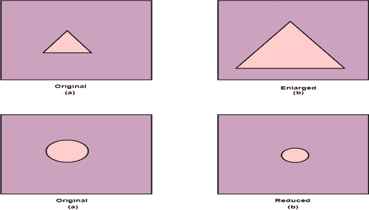
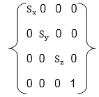
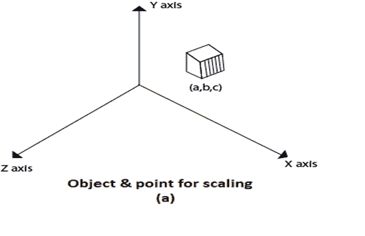
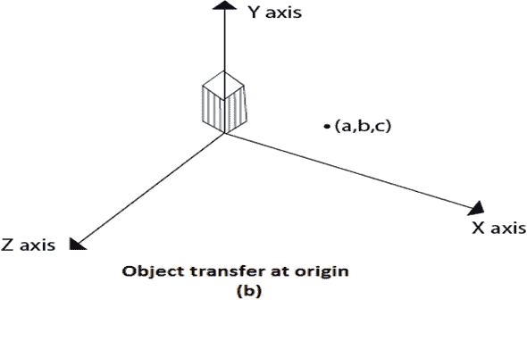
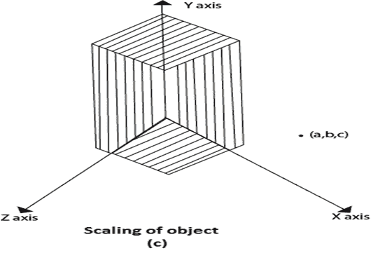
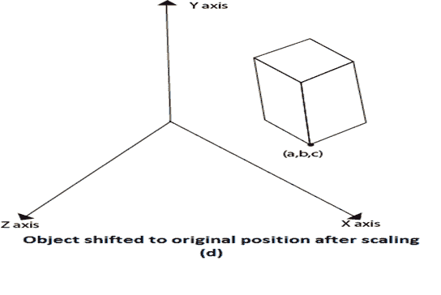

# 缩放比例

> 原文：<https://www.javatpoint.com/computer-graphics-3d-scaling>

缩放用于更改对象的大小。大小可以增加或减少。需要缩放三个因子 S x S y 和 S z 。

Sx= x 方向的比例因子
Sy= y 方向的比例因子
Sz= z 方向的比例因子

## 缩放矩阵

## 相对于固定点缩放对象

以下是使用固定点(a、b、c)缩放对象时执行的步骤。它可以表示如下:

1.  将定点平移到原点
2.  相对于原点缩放对象
3.  将对象平移回其原始位置。

#### 注:如果所有比例因子 Sx= Sy= Sz。那么缩放称为均匀。如果用不同的缩放向量进行缩放，这被称为差分缩放。

在图(a)中，示出了点(a，b，c)，并且在图(b)、图(c)和图(d)的步骤中也示出了要进行缩放的对象。

* * *