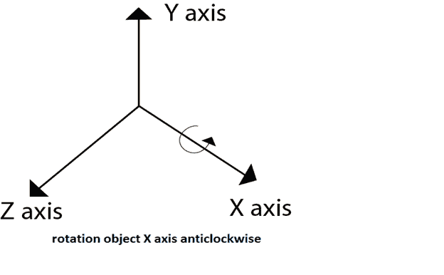
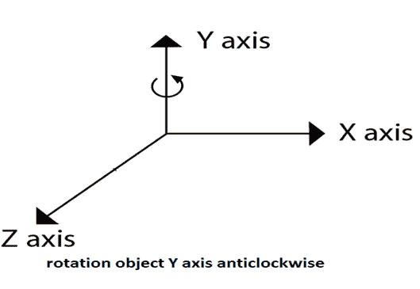
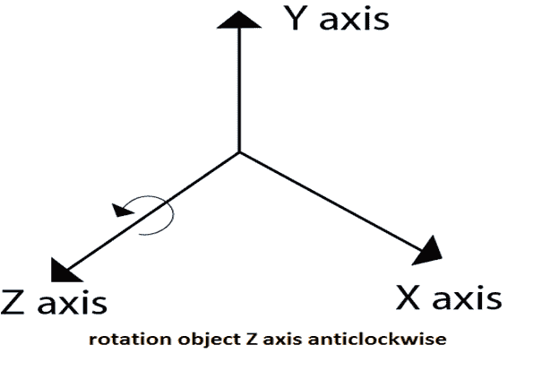
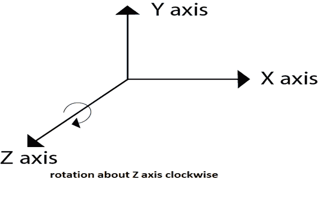
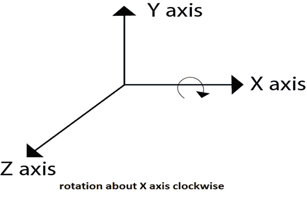
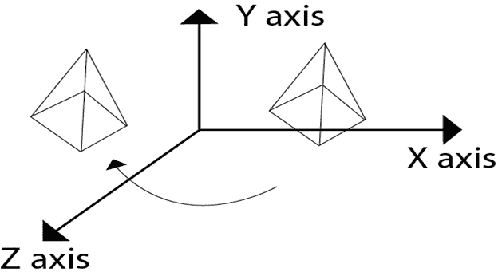
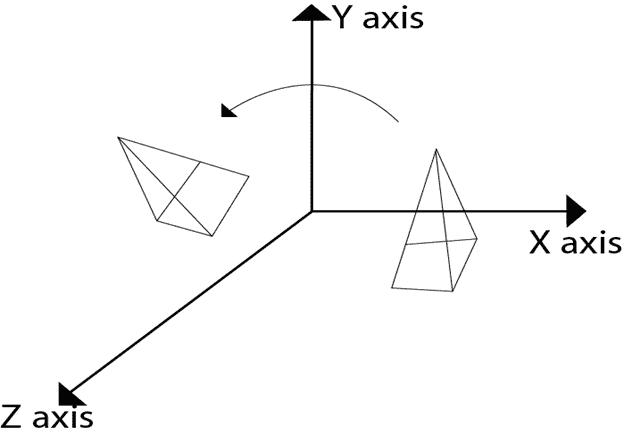

# 循环

> 原文：<https://www.javatpoint.com/computer-graphics-3d-rotation>

它是物体围绕一个角度的运动。运动可以是逆时针或顺时针。与 2D 旋转相比，三维旋转更加复杂。对于 2D，我们描述旋转角度，但是对于三维旋转角度和旋转轴是必需的。轴可以是 x 或 y 或 z。

**下图显示了围绕 x、y、z 轴的旋转**

下图显示了对象围绕 Y 轴的旋转

下图显示了对象围绕 Z 轴的旋转

* * *