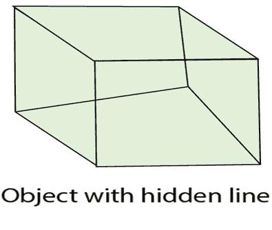
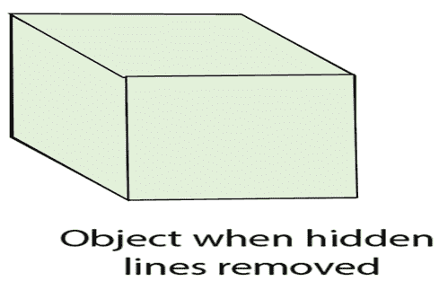

# 隐藏表面移除

> 原文：<https://www.javatpoint.com/computer-graphics-hidden-surface-removal>

1.  计算机图形学中最具挑战性的问题之一是从固体物体的图像中去除隐藏部分。
2.  在现实生活中，这些物体的不透明材料会阻挡隐藏部分的光线，阻止我们看到它们。
3.  在计算机生成中，当对象被投影到屏幕坐标系上时，不会发生这种自动消除。
4.  而是显示每个对象的所有部分，包括许多应该不可见的部分。
5.  为了移除这些部分以创建更逼真的图像，我们必须对一组对象应用隐藏线或隐藏表面算法。
6.  该算法在不同种类的场景模型上运行，生成各种形式的输出或迎合不同复杂性的图像。
7.  它们都使用某种形式的几何排序来区分对象的可见部分和隐藏部分。
8.  就像字母排序被用来区分字母开头和结尾的单词一样。
9.  几何排序定位位于观察者附近并因此可见的对象。
10.  隐藏线和隐藏面算法利用各种形式的一致性来减少生成图像所需的计算。
11.  不同类型的连贯与图像中不同形式的有序性或规律性有关。
12.  扫描线相干性的出现是因为光栅图像中扫描线的显示通常与前一条扫描线的显示非常相似。
13.  **帧一致性**在一系列旨在显示运动的图像中，识别出连续的帧非常相似。
14.  **物体一致性**源于不同物体之间或同一物体的不同部分之间的关系。
15.  隐藏表面算法通常被设计成利用这些相干特性中的一个或多个来提高效率。
16.  隐藏表面算法与二维扫描转换非常相似。

## 隐藏表面检测算法的类型

1.  对象空间方法
2.  图像空间方法

**物体空间方法:**在该方法中，比较物体的各个部分。比较后，确定可见、不可见或几乎不可见的表面。这些方法通常决定可见表面。在线框模型中，这些用于确定可见线。所以这些算法是基于线的，而不是基于面的。方法通过确定视图被其他对象遮挡的对象部分来进行，并以相同的颜色绘制这些部分。

**图像空间方法:**这里确定各个像素的位置。它用于定位可见表面，而不是可见线。检测每个点的可见性。如果一个点是可见的，那么像素是打开的，否则是关闭的。因此靠近观察者的物体被投影仪穿透一个像素被确定。画的那个像素是合适的颜色。

这些方法也称为**可见表面测定**。在计算机上实现这些方法需要大量的计算机处理时间和处理能力。

图像空间方法需要更多的计算。每个对象都有明确的定义。每个物体表面的可见性也被确定。

## 区分对象空间和图像空间方法

| 物体空间 | 图像空间 |
| 1.图像空间是基于对象的。它集中于场景中物体之间的几何关系。 | 1.这是一种基于像素的方法。它与最终图像有关，即每个光栅像素中可见的内容。 |
| 2.这里确定了表面可见度。 | 2.这里确定了线可见性或点可见性。 |
| 3.它以定义每个对象的精度执行，不考虑分辨率。 | 3.使用显示设备的分辨率来执行。 |
| 4.计算不是基于显示器的分辨率，因此可以轻松调整对象的变化。 | 4.计算是基于分辨率的，因此很难调整变化。 |
| 5.这些是为矢量图形系统开发的。 | 5.这些是为光栅设备开发的。 |
| 6.基于对象的算法对连续的对象数据进行操作。 | 6.这些对对象数据进行操作。 |
| 7.用于对象方法的矢量显示有很大的地址空间。 | 7.用于图像空间方法的光栅系统的地址空间有限。 |
| 8.目标精度用于需要速度的应用。 | 8.适用于要求精度的应用场合。 |
| 9.如果要放大图像，需要进行大量计算。 | 9.图像可以放大而不损失精度。 |
| 10.如果场景中的对象数量增加，计算时间也会增加。 | 10.在这种方法中，复杂性随着可见部分的复杂性而增加。 |

## 物体相似性与图像空间方法

在这两种方法中，排序都是使用各条线的深度比较，表面与视图平面的距离相反。

**选择或设计隐藏面算法的考虑因素:**考虑以下三点:

1.  整理
2.  一致性
3.  机器

**排序:**所有曲面分为可见和不可见两类进行排序。像素会相应地着色。有几种排序算法可用，即

1.  冒泡排序
2.  外壳分类
3.  快速分类
4.  树形排序
5.  基数排序

不同的排序算法适用于不同的隐藏面算法。使用 x 和 y，z 坐标对对象进行排序。z 坐标主要用于排序。排序算法的效率影响隐藏面去除算法。对于复杂场景或数百个多边形的排序，使用复杂排序，即快速排序、树排序、基数排序。

对于简单的对象选择、插入，使用冒泡排序。

## 一致性

它用于利用场景表面的恒定值。它基于场景中有多少规律性。当我们从一个物体的一个多边形移动到另一个物体颜色相同的多边形时，剪切将保持不变。

## 连贯的类型

1.  边缘相干性
2.  目标一致性
3.  面部一致性
4.  区域一致性
5.  深度一致性
6.  扫描线相干性
7.  帧相干性
8.  隐含边缘相干性

**1。边缘相干性:**当边缘穿过另一条边缘或穿透可见边缘时，边缘的可见性会发生变化。

**2。对象一致性:**每个对象都被认为是独立于其他对象的。在对象中，相干性比较是用一个对象而不是边或顶点来完成的。如果对象 A 离对象 B 更远，那么就不需要比较边和面。

**3。面一致性:**在这个例子中，面或多边形通常比图像的大小小。

**4。区域一致性:**用于对同一可视面覆盖的像素进行分组。

**5。深度一致性:**各种多边形的位置分隔了深度的基础。表面某一点的深度是计算出来的，表面其余各点的深度往往可以用一个简单的差分方程来确定。

**6。扫描线相干性:**使用一条扫描线扫描物体，然后使用第二条扫描线。第一行的截距。

**7。帧一致性:**用于动画对象。当图像从一帧到另一帧几乎没有变化时使用。

**8。隐含边缘一致性:**如果一个面穿透另一个面，可以从两个交点确定交线。

## 隐藏线表面检测算法

1.  背面去除算法
2.  z 缓冲算法
3.  画家算法
4.  扫描线算法
5.  细分算法
6.  浮动地平线算法

* * *