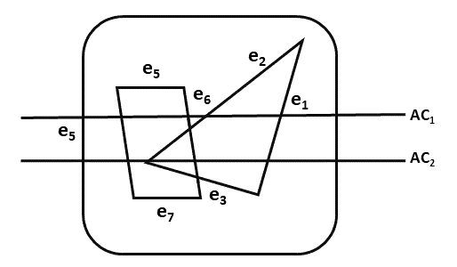

# 扫描线算法

> 原文：<https://www.javatpoint.com/computer-graphics-scan-line-algorithm>

它是一种图像空间算法。它一次处理一行，而不是一次处理一个像素。它使用一致性的概念领域。该算法记录边列表、活动边列表。所以精确记账是必要的。边列表或边表包含两个端点的坐标。活动边缘列表(AEL)包含给定扫描线在其扫描期间相交的边缘。活动边列表(AEL)应该按照 x 的递增顺序排序。AEL 是动态的，不断增长和收缩的。

下图显示了边和活动边列表。扫描线 AC 1 的活动边缘列表包含 e 1 ，e 2 ，e 5 ，e 6 边缘。扫描线交流 2 的活动边缘列表包含 e 5 、e 6 、e 1 。

扫描线可以处理多个表面。当处理每条扫描线时，这条线将与许多表面相交。相交的线将决定哪个表面可见。完成每个表面的深度计算。定义了视图平面后方的曲面。当表面的可见性被确定时，强度值被输入到刷新缓冲区。

## 算法

**步骤 1:** 开始算法

**步骤 2:** 初始化所需的数据结构

1.  创建一个包含颜色、边缘指针、系数
2.  建立边表包含关于边的端点、多边形指针、反斜率的信息。
3.  创建活动边列表。这将按照 x 的递增顺序进行排序。
4.  创建一个标志 f。它将有两个值或开或关。

**步骤 3:** 对所有扫描线执行以下步骤

1.  使用 y 作为值，按排序顺序在活动边列表(AEL)中输入值
2.  使用背景色扫描直到标志，即 F 打开
3.  当一个多边形标志打开，这是为表面 S 1 输入颜色强度作为 I 1 进入刷新缓冲区
4.  当两个或图像表面标志打开时，根据深度对表面进行排序，并对第 n 个表面使用强度值 S n 。该表面将具有最小 z 深度值
5.  对剩余的平面使用一致性的概念。

**步骤 4:** 停止算法

* * *