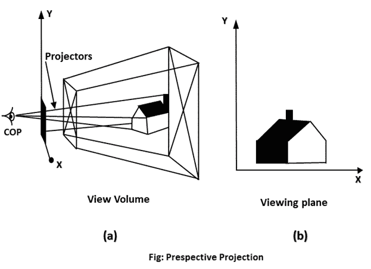
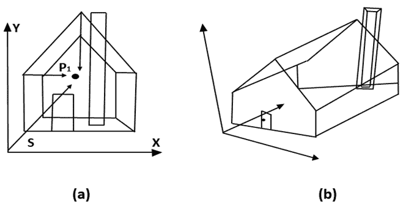
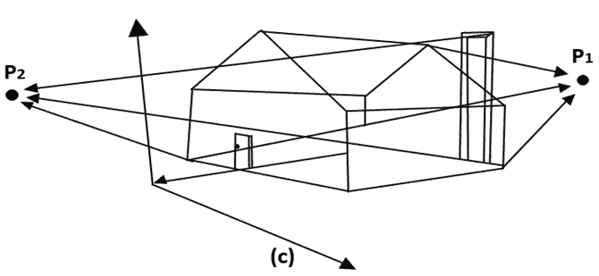

# 透视投影

> 原文：<https://www.javatpoint.com/computer-graphics-perspective-projection>

在远离观察者的透视投影中，物体看起来越小。投影的这一特性给出了深度的概念。艺术家使用透视投影来绘制三维场景。

透视的两个主要特征是消失点和透视缩短。由于缩短，物体和长度从投影中心看起来更小。我们越是增加离投影中心的距离，物体就会显得越小。

## 消失点

这是所有线条看起来交汇的点。可以有一点、两点和三点视角。

**一点:**只有一个消失点，如图(a)

**两点:**有两个消失点。一个是 x 方向，另一个是 y 方向，如图(b)所示

**三点:**有三个消失点。一个是 x，第二个是 y，第三个是两个方向。

在透视投影中，投影线不保持平行。这些线汇聚在一个称为投影中心的点上。屏幕上的投影图像是通过会聚线与屏幕平面的交点获得的。当观察者的眼睛位于投影中心时，屏幕上的图像是可见的，投影线对应于来自物体的光束传播的路径。

## 与视角相关的重要术语

1.  **视平面:**是世界坐标系中投影到视平面的一个区域。
2.  **投影中心:**是投射光线汇聚的眼睛位置。
3.  **投影器:**也叫投影向量。这些光线从物体场景开始，用于在观察平面或视图平面上创建物体的图像。

## 透视投影中的异常

由于这些对象的形状和外观受到影响，它引入了一些异常。

1.  **透视缩短:**物体的大小会随着其与投影中心的距离增大而变小。
2.  **消失点:**所有线看起来都在视图平面的某个点相交。
3.  **线条扭曲:**一个范围位于观看者的前面到观看者的后面，出现在六个滚轮上。

图(a)中 z 轴的缩短产生一个消失点 P 1 。缩短 x 轴和 z 轴会导致图(b)中出现两个消失点。在图(c)中添加 y 轴缩短会沿着负 y 轴添加消失点。

* * *