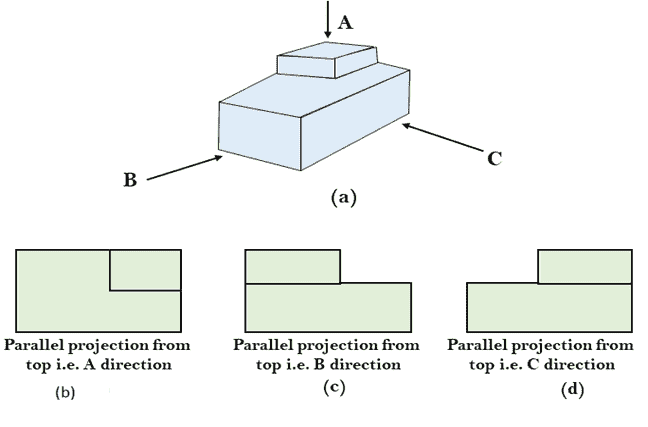
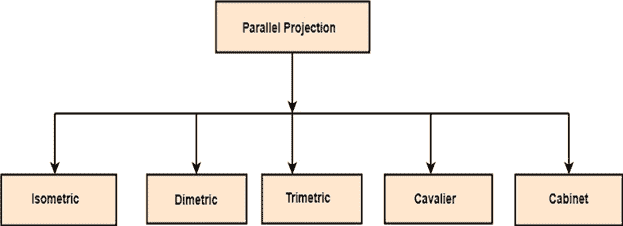
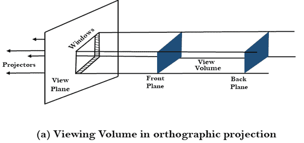
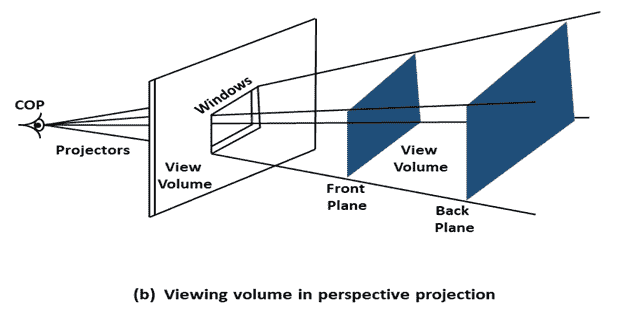
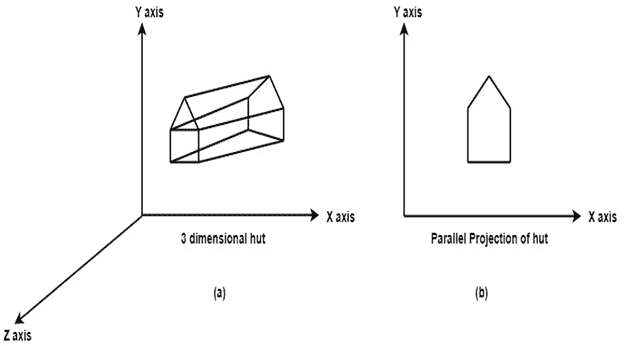
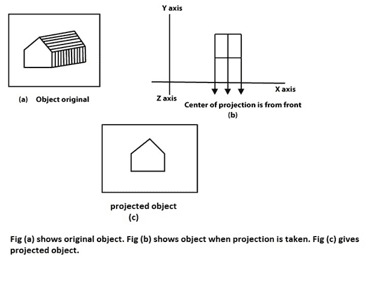
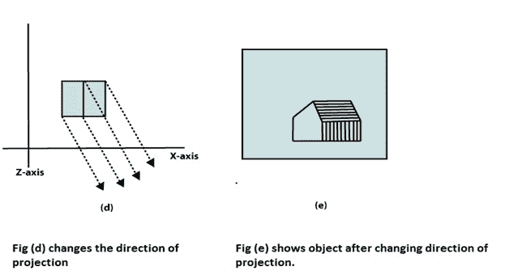
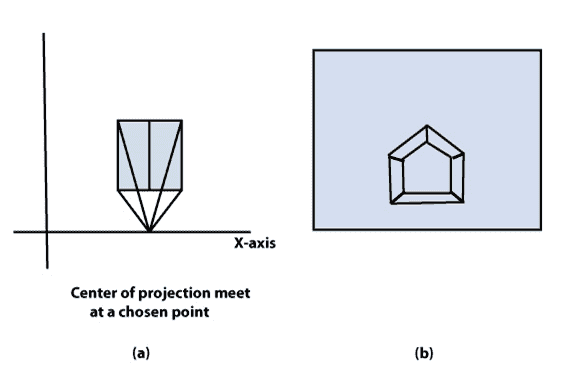
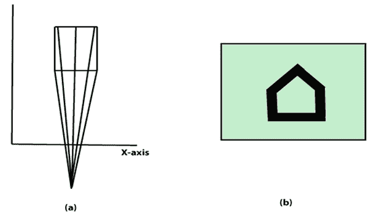

# 平行投影

> 原文：<https://www.javatpoint.com/computer-graphics-parallel-projection>

平行投影用于显示图片的真实形状和大小。当投影仪垂直于观察平面时，称为**正投影**。平行投影是通过从物体上的每个顶点延伸平行线直到它们与屏幕平面相交而形成的。交点是顶点的投影。

建筑师和工程师使用平行投影来创建对象的工作图，因为完整的表达需要使用不同平面的两个或多个对象视图。

1.  **等角投影:**所有投影仪角度相等，一般角度为 30°。
2.  **维度:**在这两个投影仪中有相等的角度。关于两个主轴。
3.  **三度角:**投影方向与它们的主轴成不等角。
4.  **骑士:**所有垂直于投影平面的线都是投影的，长度没有变化。
5.  **机柜:**所有垂直于投影平面的线都投影到其长度的一半。这些给物体一个逼真的外观。

* * *