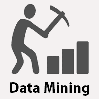
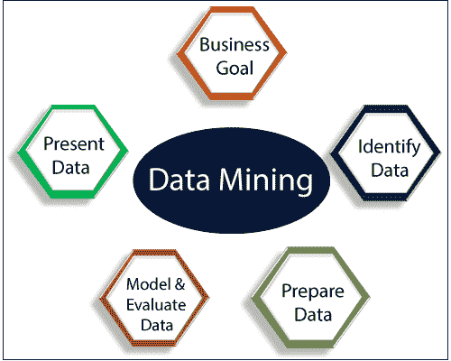
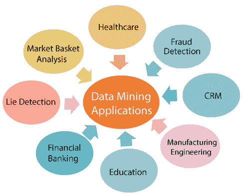
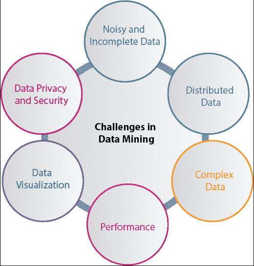

# 数据挖掘教程

> 原文：<https://www.javatpoint.com/data-mining>

数据挖掘教程提供了数据挖掘的基本和高级概念。我们的数据挖掘教程是为学习者和专家设计的。

数据挖掘是帮助企业家、研究人员和个人从大量数据中提取有价值信息的最有用的技术之一。数据挖掘又称 ***【数据库中的知识发现(KDD)*** 。知识发现过程包括数据清理、数据集成、数据选择、数据转换、数据挖掘、模式评估和知识展示。

我们的数据挖掘教程包括数据挖掘的所有主题，如应用程序、数据挖掘与机器学习、数据挖掘工具、社交媒体数据挖掘、数据挖掘技术、数据挖掘中的聚类、数据挖掘中的挑战等。

## 什么是数据挖掘？

提取信息以识别模式、趋势和有用数据的过程被称为数据挖掘，这些数据将允许企业从大量数据中做出数据驱动的决策。

换句话说，我们可以说，数据挖掘是将信息的隐藏模式调查到各种角度，以分类为有用数据的过程，这些数据在特定的领域进行收集和组装，如数据仓库、高效分析、数据挖掘算法、帮助决策和其他数据需求，最终削减成本并产生收入。

数据挖掘是一种自动搜索大量信息以发现趋势和模式的行为，它超越了简单的分析过程。数据挖掘对数据段使用复杂的数学算法，并评估未来事件的概率。数据挖掘也被称为数据的知识发现(KDD)。

数据挖掘是组织用来从庞大的数据库中提取特定数据以解决业务问题的过程。它主要将原始数据转化为有用的信息。

数据挖掘类似于数据科学，由一个人在特定的情况下，在特定的数据集上进行，有一个目标。这个过程包括各种类型的服务，例如文本挖掘、网络挖掘、音频和视频挖掘、图片数据挖掘和社交媒体挖掘。它是通过简单或高度特定的软件完成的。通过外包数据挖掘，可以以较低的运营成本更快地完成所有工作。专业公司也可以使用新技术来收集无法人工定位的数据。各种平台上有成吨的信息，但可获得的知识很少。最大的挑战是分析数据，以提取可用于解决问题或公司发展的重要信息。有许多强大的工具和技术可以用来挖掘数据，并从中找到更好的见解。

## 数据挖掘的类型

可以对以下类型的数据执行数据挖掘:

**关系数据库:**

关系数据库是由表、记录和列正式组织的多个数据集的集合，从中可以以各种方式访问数据，而不必识别数据库表。表格传递和共享信息，这有助于数据的搜索、报告和组织。

**数据仓库:**

数据仓库是从组织内的各种来源收集数据以提供有意义的业务见解的技术。海量数据来自营销和金融等多个领域。提取的数据用于分析目的，并有助于商业组织的决策。数据仓库是为数据分析而不是事务处理而设计的。

**数据仓库:**

数据存储库通常指数据存储的目的地。然而，许多信息技术专业人员更清楚地使用这个术语来指代信息技术结构中的特定类型的设置。例如，一组数据库，其中一个组织保存了各种信息。

**对象关系数据库:**

面向对象数据库模型和关系数据库模型的组合称为对象关系模型。它支持类、对象、继承等。

对象关系数据模型的主要目标之一是缩小关系数据库和面向对象模型实践之间的差距，面向对象模型实践在许多编程语言中经常使用，例如 C++、Java、C#等。

**交易数据库:**

事务数据库指的是一个数据库管理系统(DBMS)，如果数据库事务执行不当，它有可能撤销数据库事务。尽管这在很久以前是一项独特的功能，但今天，大多数关系数据库系统都支持事务性数据库活动。

## 数据挖掘的优势

*   数据挖掘技术使组织能够获得基于知识的数据。
*   数据挖掘使组织能够在运营和生产中进行有利可图的修改。
*   与其他统计数据应用相比，数据挖掘是一种经济高效的方法。
*   数据挖掘有助于组织的决策过程。
*   它促进了隐藏模式的自动发现以及趋势和行为的预测。
*   它可以在新系统和现有平台中引入。
*   这是一个快速的过程，使新用户能够在短时间内轻松分析大量数据。

## 数据挖掘的缺点

*   组织有可能会将客户的有用数据出售给其他组织以获取利润。根据这份报告，美国运通已将其客户的信用卡购买出售给其他组织。
*   许多数据挖掘分析软件难以操作，需要高级培训才能使用。
*   由于设计中使用的算法不同，不同的数据挖掘工具以不同的方式运行。因此，选择合适的数据挖掘工具是一项非常具有挑战性的任务。
*   数据挖掘技术并不精确，因此在某些情况下可能会导致严重的后果。

## 数据挖掘应用

数据挖掘主要用于消费者需求强烈的组织-零售、通信、金融、营销公司，确定价格、消费者偏好、产品定位以及对销售、客户满意度和公司利润的影响。数据挖掘使零售商能够使用客户购买的销售点记录来开发有助于组织吸引客户的产品和促销活动。

以下是数据挖掘被广泛使用的领域:

**医疗保健中的数据挖掘:**

医疗保健中的数据挖掘在改善卫生系统方面有着巨大的潜力。它使用数据和分析来获得更好的见解，并确定最佳实践，从而增强医疗保健服务并降低成本。分析师使用数据挖掘方法，如机器学习、多维数据库、数据可视化、软计算和统计。数据挖掘可用于预测每个类别的患者。这些程序确保病人在正确的时间和正确的地点得到重症监护。数据挖掘还使医疗保险公司能够识别欺诈和滥用。

**菜篮子分析中的数据挖掘:**

市场篮子分析是一种基于假设的建模方法。如果你购买了一组特定的产品，那么你更有可能购买另一组产品。这种技术可以使零售商了解购买者的购买行为。这些数据可以帮助零售商了解买方的要求，并相应地改变商店的布局。使用不同的分析方法，可以对不同商店之间、不同人群中的顾客之间的结果进行比较。

**教育中的数据挖掘:**

教育数据挖掘是一个新兴领域，涉及开发从教育环境生成的数据中探索知识的技术。EDM 目标被认为是肯定学生未来的学习行为，研究教育支持的影响，促进学习科学。一个组织可以使用数据挖掘来做出精确的决策，也可以预测学生的成绩。有了结果，学校可以集中精力教什么和怎么教。

**制造工程中的数据挖掘:**

知识是制造公司拥有的最佳资产。数据挖掘工具有利于在复杂的制造过程中发现模式。数据挖掘可用于系统级设计，以获取产品架构、产品组合和客户数据需求之间的关系。它还可以用来预测产品开发周期、成本和其他任务的期望值。

**CRM(客户关系管理)中的数据挖掘:**

客户关系管理(CRM)是关于获得和保持客户，也提高客户忠诚度和实施以客户为导向的战略。为了与客户建立良好的关系，企业需要收集数据并分析数据。利用数据挖掘技术，收集的数据可以用于分析。

**欺诈检测中的数据挖掘:**

欺诈行为损失了数十亿美元。传统的欺诈检测方法有点耗时且复杂。数据挖掘提供了有意义的模式，并将数据转化为信息。一个理想的欺诈检测系统应该保护所有用户的数据。监督方法由一组样本记录组成，这些记录被分为欺诈性或非欺诈性。使用该数据构建一个模型，并使用该技术来识别文档是否是欺诈性的。

**测谎中的数据挖掘:**

逮捕一个罪犯不是什么大不了的事，但从他身上揭露真相是一项非常具有挑战性的任务。执法部门可以使用数据挖掘技术来调查犯罪，监控可疑的恐怖分子通信等。这项技术还包括文本挖掘，它在数据中寻找有意义的模式，这些数据通常是非结构化的文本。将从以前的调查中收集的信息进行比较，并构建了一个测谎模型。

**数据挖掘金融银行:**

银行系统的数字化应该会在每次新交易中产生大量数据。数据挖掘技术可以帮助银行家解决银行和金融中与业务相关的问题，方法是识别业务信息和市场成本中的趋势、伤亡和相关性，经理或高管不会立即发现这些问题，因为数据量太大或专家在屏幕上生成得太快。经理可能会发现这些数据，以便更好地锁定、获取、保留、细分和维护盈利客户。

## 数据挖掘实施的挑战

虽然数据挖掘非常强大，但在执行过程中面临许多挑战。各种挑战可能与性能、数据、方法和技术等有关。当挑战或问题得到正确认识和充分解决时，数据挖掘过程就会变得有效。

**不完整且有噪声的数据:**

从大量数据中提取有用数据的过程就是数据挖掘。现实世界中的数据是异构的、不完整的和嘈杂的。大量数据通常是不准确或不可靠的。这些问题可能是由于数据测量仪器或人为错误造成的。假设一家零售连锁店收集消费超过 500 美元的顾客的电话号码，会计员工将这些信息输入他们的系统。此人在输入电话号码时可能会出现数字错误，从而导致数据不正确。甚至有些客户可能不愿意透露自己的电话号码，导致数据不完整。由于人为或系统错误，数据可能会被更改。所有这些后果(嘈杂和不完整的数据)使得数据挖掘具有挑战性。

**数据分布:**

真实世界的数据通常存储在分布式计算环境中的各种平台上。它可能在一个数据库，个别系统，甚至在互联网上。实际上，主要出于组织和技术方面的考虑，将所有数据放入一个集中的数据存储库是一项相当艰巨的任务。例如，各地区办事处可能有自己的服务器来存储数据。将来自所有办公室的所有数据存储在中央服务器上是不可行的。因此，数据挖掘需要开发允许挖掘分布式数据的工具和算法。

**复杂数据:**

现实世界的数据是异构的，它可以是多媒体数据，包括音频和视频、图像、复杂数据、空间数据、时间序列等等。管理这些不同类型的数据并提取有用的信息是一项艰巨的任务。大多数情况下，新技术、新工具和方法都需要改进，以获得特定的信息。

**性能:**

数据挖掘系统的性能主要取决于所使用的算法和技术的效率。如果设计的算法和技术不符合标准，那么数据挖掘过程的效率将受到不利影响。

**数据隐私和安全:**

数据挖掘通常会导致数据安全、治理和隐私方面的严重问题。例如，如果一个零售商分析了购买商品的细节，那么它会在未经顾客允许的情况下，透露顾客的购买习惯和偏好。

**数据可视化:**

在数据挖掘中，数据可视化是一个非常重要的过程，因为它是以可呈现的方式向用户显示输出的主要方法。提取的数据应该传达它想要表达的确切含义。但是很多时候，以一种精确和简单的方式向最终用户表示信息是困难的。输入数据和输出信息是复杂的、非常高效的，需要实现成功的数据可视化过程才能使其成功。

> *除了上述问题，数据挖掘还有很多挑战。随着实际数据挖掘过程的开始，更多的问题被揭示出来，数据挖掘的成功依赖于摆脱所有这些困难。*

## 先决条件

在学习数据挖掘的概念之前，您应该对统计学、数据库知识和基本编程语言有一个基本的了解。

## 观众

我们的数据挖掘教程是为所有初学者或计算机科学毕业生准备的，以帮助他们学习与数据挖掘相关的高级技术的基础知识。

## 问题

我们向您保证，在学习我们的数据挖掘教程时，您不会发现任何困难。但是如果本教程有任何错误，请将问题或错误张贴在联系表中，以便我们改进。

* * *