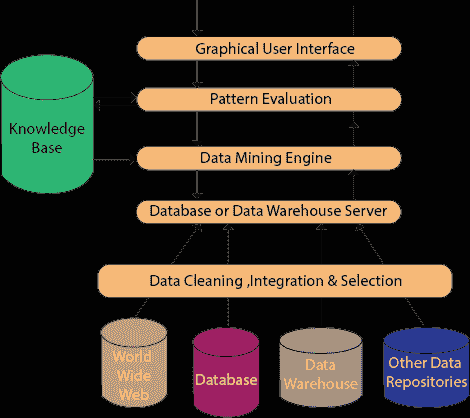

# 介绍

> 原文：<https://www.javatpoint.com/data-mining-architecture>

数据挖掘是一种重要的方法，它从大量数据中提取以前未知的和潜在有用的信息。数据挖掘过程涉及几个组件，这些组件构成了数据挖掘系统架构。

## 数据挖掘架构

数据挖掘系统的重要组成部分是数据源、数据挖掘引擎、数据仓库服务器、模式评估模块、图形用户界面和知识库。

### 数据来源:

数据的实际来源是数据库、数据仓库、万维网(WWW)、文本文件和其他文档。数据挖掘要想成功，需要大量的历史数据。组织通常将数据存储在数据库或数据仓库中。数据仓库可以包括一个或多个数据库、文本文件、电子表格或其他数据存储库。有时，甚至纯文本文件或电子表格也可能包含信息。另一个主要的数据来源是万维网或互联网。

### 不同的流程:

在将数据传递到数据库或数据仓库服务器之前，必须对数据进行清理、集成和选择。由于信息来源不同，格式也不同，因此不能直接用于数据挖掘过程，因为数据可能不完整和不准确。所以，第一个数据需要清理和统一。将从各种数据源收集比所需更多的信息，并且只需选择感兴趣的数据并将其传递给服务器。这些程序并不像我们想象的那么容易。作为选择、集成和清理的一部分，可以对数据执行几种方法。

### 数据库或数据仓库服务器:

数据库或数据仓库服务器由准备处理的原始数据组成。因此，服务器是根据用户请求检索基于数据挖掘的相关数据的原因。

### 数据挖掘引擎:

数据挖掘引擎是任何数据挖掘系统的主要组件。它包含几个用于操作数据挖掘任务的模块，包括关联、表征、分类、聚类、预测、时间序列分析等。

换句话说，我们可以说数据挖掘是我们数据挖掘架构的根本。它包括仪器和软件，用于从从各种数据源收集并存储在数据仓库中的数据中获取见解和知识。

### 模式评估模块:

模式评估模块主要负责通过使用阈值来测量模式的调查。它与数据挖掘引擎合作，将搜索集中在令人兴奋的模式上。

这一部分通常采用与数据挖掘模块协作的 stake 度量来将搜索集中到迷人的模式上。它可能会利用一个风险阈值来过滤掉发现的模式。另一方面，模式评估模块可能与挖掘模块相协调，这取决于所使用的数据挖掘技术的实现。为了有效地进行数据挖掘，不正常地建议尽可能地将模式桩的评估推进到挖掘过程中，以将搜索限制在仅引人入胜的模式。

### 图形用户界面:

图形用户界面模块在数据挖掘系统和用户之间进行通信。该模块帮助用户在不知道流程复杂性的情况下轻松高效地使用系统。当用户指定查询或任务并显示结果时，该模块与数据挖掘系统协作。

### 知识库:

知识库有助于数据挖掘的整个过程。这可能有助于指导搜索或评估结果模式的利害关系。知识库甚至可能包含用户视图和来自用户体验的数据，这些可能对数据挖掘过程有所帮助。数据挖掘引擎可以从知识库接收输入，以使结果更加准确和可靠。模式评估模块定期与知识库交互以获取输入，并对其进行更新。

* * *