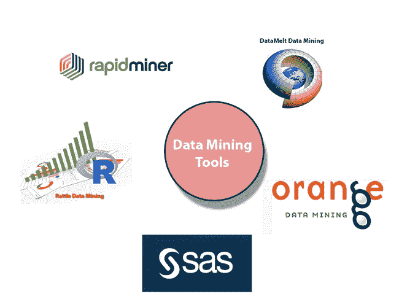
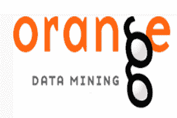
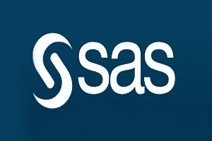
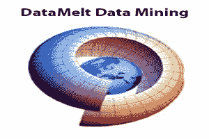
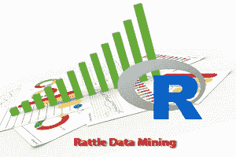
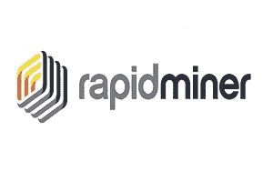

# 数据挖掘工具

> 原文：<https://www.javatpoint.com/data-mining-tools>

数据挖掘是一套利用特定算法、静态分析、人工智能和数据库系统从不同维度和角度分析数据的技术。

数据挖掘工具的目标是在大数据集之间发现模式/趋势/分组，并将数据转换为更精确的信息。

它是一个框架，如 Rstudio 或 Tableau，允许您执行不同类型的数据挖掘分析。

我们可以对您的数据集执行各种算法，如聚类或分类，并将结果本身可视化。它是一个框架，为我们的数据和数据所代表的现象提供了更好的见解。这样的框架被称为数据挖掘工具。

数据挖掘工具市场一片光明:根据 ReortLinker 的最新报告，该市场到 2023 年将超过 T2 10 亿美元的销售额，高于 T4 2018 年的 5.91 亿美元

这些是最流行的数据挖掘工具:

## 1.橙色数据挖掘:

Orange 是一个完美的机器学习和数据挖掘软件套件。它支持可视化，是一个基于 Python 计算语言编写的组件的软件，在斯洛文尼亚卢布尔雅那大学计算机和信息科学学院的生物信息学实验室开发。

因为它是基于组件的软件，所以 Orange 的组件被称为“小部件”这些小部件的范围从预处理和数据可视化到算法评估和预测建模。

小部件提供了重要的功能，例如:

*   显示数据表并允许选择特征
*   数据读取
*   训练预测器和学习算法的比较
*   数据元素可视化等。

此外，Orange 为枯燥的分析工具提供了更具互动性和趣味性的氛围。操作起来相当刺激。

### 为什么是橙色？

数据变成橙色后会被快速格式化为所需的模式，移动小部件可以很容易地转移到需要的地方。橙色对用户来说相当有趣。Orange 允许其用户通过快速比较和分析数据，在短时间内做出更明智的决策。这是一个好的开源数据可视化和评估，涉及初学者和专业人士。数据挖掘可以通过可视化编程或 Python 脚本来执行。许多分析通过其可视化编程界面(与小部件连接的拖放)是可行的，并且许多可视化工具倾向于得到支持，例如条形图、散点图、树、树状图和热图。倾向于支持大量的小部件(超过 100 个)。

该仪器具有机器学习组件、用于生物信息学和文本挖掘的附加组件，并且具有数据分析功能。这也被用作 python 库。

Python 脚本可以在终端窗口、像 PyCharmand 和 PythonWin 这样的集成环境、像 iPython 这样的 pr shells 中继续运行。Orange 由画布界面组成，用户可以在该界面上放置小部件并创建数据分析工作流。小部件提出基本操作，例如，读取数据、显示数据表、选择特征、训练预测器、比较学习算法、可视化数据元素等。Orange 在 Windows、Mac OS X 和各种 Linux 操作系统上运行。Orange 自带多元回归和分类算法。

Orange 可以读取本机和其他数据格式的文档。Orange 致力于分类或监督数据挖掘的机器学习技术。分类中使用的对象有两种:学习者和分类者。学习者考虑分级数据并返回一个分类器。回归方法与 Orange 中的分类非常相似，两者都是为监督数据挖掘而设计的，并且都需要类级别的数据。系综的学习结合了单个模型的预测，以获得精确的增益。该模型可以来自不同的训练数据，也可以在相同的数据集上使用不同的学习者。

学习者也可以通过改变他们的参数集而多样化。在橙色中，合奏只是学习者的包装。他们的行为和其他学习者一样。基于数据，它们返回可以预测任何数据实例结果的模型。

## 2.SAS 数据挖掘:

SAS 代表统计分析系统。它是 SAS 研究所为分析和数据管理而创建的产品。SAS 可以挖掘数据、更改数据、管理各种来源的信息以及分析统计数据。它为非技术用户提供了图形用户界面。

SAS 数据挖掘器允许用户分析大数据，并为及时的决策提供准确的见解。SAS 具有高度可扩展的分布式内存处理架构。它适用于数据挖掘、优化和文本挖掘。

## 3.数据熔化数据挖掘:

DataMelt 是一个计算和可视化环境，它为数据分析和可视化提供了一个交互式结构。它主要是为学生、工程师和科学家设计的。它也被称为 DMelt。

DMelt 是一个用 JAVA 编写的多平台实用程序。它可以在任何与 JVM (Java 虚拟机)兼容的操作系统上运行。它由科学和数学图书馆组成。

*   **科学图书馆:**
    科学图书馆用于绘制 2D/3D 地块。
*   **数学库:**
    数学库用于随机数生成、算法、曲线拟合等。

DMelt 可用于大量数据的分析、数据挖掘和统计分析。它广泛用于自然科学、金融市场和工程。

## 4.嘎嘎声:

Ratte 是一个基于 GUI 的数据挖掘工具。它使用 R stats 编程语言。通过提供重要的数据挖掘特性，large 暴露了 R 的静态能力。虽然拨浪鼓有一个全面和发展良好的用户界面，它有一个集成的日志代码选项卡，为任何图形用户界面操作产生重复的代码。

拨浪鼓产生的数据集可以查看和编辑。拨浪鼓为其他人提供了检查代码、将其用于多种目的以及无限制地扩展代码的便利。

## 5.快速采矿机:

Rapid Miner 是该公司创建的最受欢迎的预测分析系统之一，与 Rapid Miner 同名。它是用 JAVA 编程语言编写的。它为文本挖掘、深度学习、机器学习和预测分析提供了一个集成的环境。

该仪器可用于广泛的应用，包括公司应用、商业应用、研究、教育、培训、应用开发、机器学习。

Rapid Miner 在现场以及公共云或私有云基础架构中提供服务器。它以客户机/服务器模型为基础。快速挖掘器附带了基于模板的框架，能够快速交付，几乎没有错误(这在手工编码编写过程中是常见的)

* * *