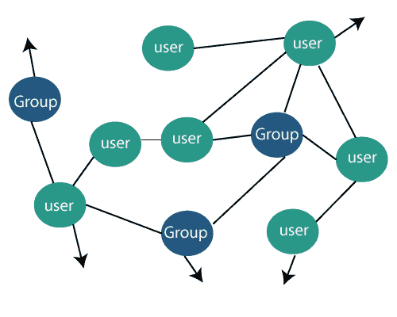

# 社交媒体数据挖掘方法

> 原文：<https://www.javatpoint.com/social-media-data-mining-methods>

与社交网络分析相关的其他研究领域相比，将数据挖掘技术应用于社交媒体相对较新。当我们承认社交媒体网络分析的研究可以追溯到 20 世纪 30 年代。使用由工业界和学术界开发的数据挖掘技术的应用程序已经在商业上使用。例如，一个“社交媒体分析”组织向我们提供服务，并跟踪社交媒体，向客户提供关于商品和服务如何通过社交媒体网络得到认可和讨论的数据。组织中的分析师已经应用了文本挖掘算法，并检测到博客的传播模型，以创建技术来更好地理解数据如何在博客圈中移动。

数据挖掘技术可以应用于社交媒体网站，以更好地理解信息，并将数据用于分析、研究和商业目的。代表性领域包括社区或群体检测、数据传播、受众传播、主题检测和跟踪、个人行为分析、群体行为分析和组织市场研究。

## 数据表示

类似于其他社交媒体数据，使用图表示来研究社交媒体数据集是被接受的。一个图包含一个包含顶点(节点)和边(链接)的集合。用户通常显示为图中的节点。个人(节点)之间的关系或合作在图中显示为链接。

图表描述对于从社交网站提取的信息很常见，在社交网站上，人们与朋友、家人和商业伙伴互动。它有助于建立一个朋友、家人或商业伙伴的社交网络。不太明显的是，图表结构如何应用于博客、维基、意见挖掘和类似类型的在线社交媒体平台。

如果我们考虑博客，一个图表示以博客为节点，可以视为“博客网络”，另一个图描述以博客文章为节点，可以视为“后网络”当另一个博客文章引用另一个博客文章时，在博客文章网络中创建边。用于表示博客网络的其他技术同时考虑了个人、关系、内容和时间，称为互联网在线分析处理。维基可以从把作者描绘成节点的上下文来考虑，当作者贡献给一个对象时，边就被创建了。

图形表示允许应用经典的数学图论、分析社交媒体平台的传统技术以及挖掘图形数据。用于描述社交媒体平台的图形可能很大，这可能会给自动化处理带来困难，因为计算机内存受到限制。当试图处理庞大的社交媒体数据集时，处理速度被最大化，并且通常被超过。实现自动化程序以允许社交媒体数据挖掘的其他挑战包括识别和处理垃圾邮件、社交媒体同一子类别中使用的各种格式，以及不断改变内容和结构。

## 数据挖掘——一个过程

无论研究什么样的社交媒体，一些基本的东西都是必不可少的，以考虑最有意义的结果是否可行。应用于社交媒体的每一种社交媒体和每一种数据挖掘目的都可能涉及独特的方法和算法，以从数据挖掘中产生优势。各种数据集和数据问题包括不同种类的工具。如果知道如何组织数据，分类工具可能是合适的。如果我们了解数据是关于什么的，但是不能确定数据的趋势和模式，那么使用聚类工具可能是最好的。

问题本身可以总结出最好的方法。在应用数据挖掘技术以及了解各种可用的数据挖掘工具之前，没有其他方法可以尽可能了解数据。可能需要主题分析师来帮助更好地理解数据集。为了更好地理解可用于数据挖掘的各种工具，有大量的数据挖掘和机器学习文本以及不同的资源可用于支持关于各种特定数据挖掘技术和算法的更准确的信息。

一旦理解了问题并选择了合适的数据挖掘方法，就要考虑需要进行的任何预处理。可能还需要一个系统的过程来开发一组足够的数据，以允许合理的处理时间。预处理应包括适当的隐私保护机制。尽管社交媒体平台包含大量可公开访问的数据，但保障个人权利很重要，而且社交媒体平台的版权是有保障的。垃圾邮件的影响应该与时间表示一起考虑。

除了预处理，思考时间的影响也是必不可少的。根据调查和研究，我们可能会在某个时间获得不同于其他时间的结果，尽管对于特定领域来说，时间段是一个容易考虑的因素。例如，主题检测、影响传播和网络发展，时间对网络识别、群体行为和营销的影响就不那么明显了。在一个时间点定义网络的东西在另一个时间点可能会有很大的不同。群体行为和兴趣在一段时间后会发生变化，今天提供给个人或群体的东西明天可能就不流行了。

数据以图形的形式表示，任务从选定数量的节点开始，称为种子。从种子的排列开始，遍历图，当使用来自种子节点的链接结构时，收集数据，并且也检查结构本身。利用链接结构从种子集中延伸出来并收集新信息，这就是所谓的网络爬行。作为爬虫执行的应用程序和算法应该有效地管理强大的社交媒体平台中存在的挑战，例如受限站点、格式更改和结构错误(无效链接)。当爬虫找到新数据时，它会将新数据存储在存储库中，以供进一步分析。找到链接数据后，爬虫程序会更新关于网络结构的数据。

一些社交媒体平台，如脸书、推特和 Technorati，提供了应用程序编程接口，允许爬虫应用程序直接与数据源交互。然而，这些平台通常限制每天的应用编程接口事务数量，这取决于应用编程接口用户与平台的关联。对于某些平台，可以在不使用 API 的情况下收集数据(爬网)。鉴于社交媒体平台数据的巨大规模，可能有必要限制爬虫收集的数据量。当爬虫收集了数据后，可能需要一些后处理来验证和清理数据。可以应用传统的社交媒体平台分析方法，**例如，**中心性测度和群体结构研究。在许多情况下，额外的数据将与节点或链接相关，这为更复杂的方法提供了机会，以考虑文本和数据挖掘技术可以揭示的更周到的语义。

我们现在关注两个特定的社交媒体平台数据，以进一步展示数据挖掘技术如何应用于社交媒体网站。这两个主要领域是社交媒体平台，博客功能强大，丰富的数据源描绘了这两个领域。这两个领域为更广泛的科学网络和商业组织提供了潜在价值。

## 社交媒体平台:例证

脸书或领英等社交媒体平台由拥有独特个人资料的互联用户组成。用户可以与朋友和家人互动，分享新闻、照片、故事、视频、喜欢的链接等。用户可以根据个人喜好自定义个人资料，但一些常见数据可能包含关系状态、生日、电子邮件地址和家乡。用户可以选择在个人资料中包含多少数据以及谁有权访问这些数据。通过社交媒体平台访问的数据量引发了安全问题，也是一个相关的社会问题。

**这里，图中展示了典型社交媒体平台的假设图结构图，箭头表示图中较大部分的链接。**

在使用社交媒体平台数据时，保护个人身份非常重要。最近的报告强调了保护隐私的必要性，因为已经证明，当使用高级数据分析策略时，即使匿名化这类数据也仍然可以揭示个人数据。安全设置还会限制数据挖掘应用程序思考社交媒体平台上每个数据的能力。然而，一些令人发指的技术可以用来接管安全设置。

* * *