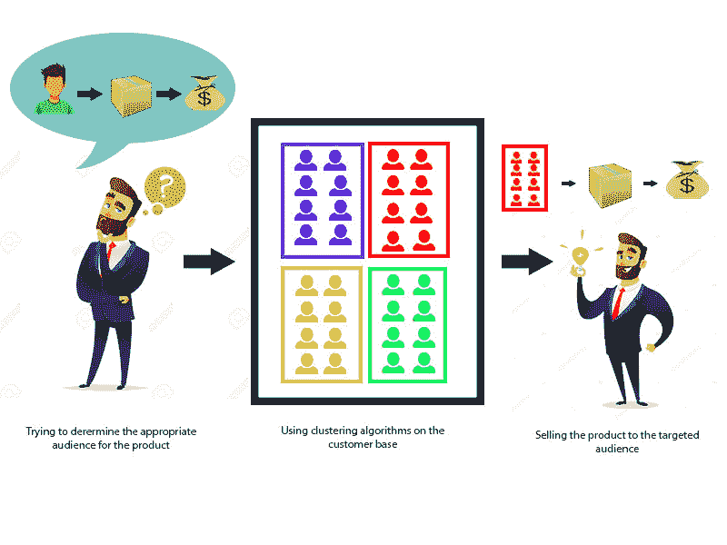
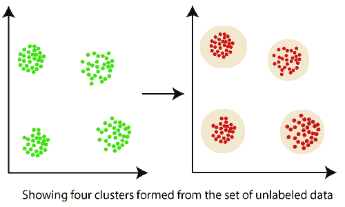
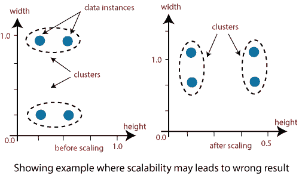

# 数据挖掘中的聚类

> 原文：<https://www.javatpoint.com/data-mining-cluster-analysis>

聚类是一种基于无监督机器学习的算法，它将一组数据点组成聚类，使对象属于同一组。

聚类有助于将数据分成几个子集。这些子集中的每一个都包含彼此相似的数据，这些子集称为集群。现在，来自我们客户群的数据被分成了多个集群，我们可以做出明智的决定，决定谁最适合这款产品。

让我们用一个例子来理解这一点，假设我们是一个市场经理，我们有一个新的诱人的产品要出售。我们确信，只要把产品卖给合适的人，它就会带来巨大的利润。那么，如何从我们公司庞大的客户群中分辨出谁最适合这款产品呢？

聚类属于**无监督机器学习**范畴，是机器学习算法解决的问题之一。

聚类仅利用输入数据来确定其输入数据中的模式、异常或相似性。

好的聚类算法旨在获得这样的聚类:

*   集群内部的相似性很高，这意味着集群内部的数据彼此相似。
*   簇间相似性低，意味着每个簇保存的数据与其他数据不相似。

## 什么是集群？

*   集群是相似对象的子集
*   对象的子集，使得群集中任意两个对象之间的距离小于群集中任意对象与不在群集中的任何对象之间的距离。
*   多维空间中物体密度相对较高的连通区域。

## 什么是数据挖掘中的聚类？

*   聚类是将一组抽象对象转换成相似对象类的方法。
*   集群是一种将一组数据或对象划分为一组称为集群的重要子类的方法。
*   它帮助用户理解数据集中的结构或自然分组，并用作独立工具来更好地了解数据分布，或者用作其他算法的预处理步骤

## 要点:

*   集群的数据对象可以被视为一个组。
*   在进行聚类分析时，我们首先将信息集进行分组。它基于数据相似性，然后将级别分配给组。
*   过度分类的主要优点是它能适应修改，并有助于挑出区分不同群体的重要特征。

## 聚类分析在数据挖掘中的应用；

*   在许多应用中，聚类分析被广泛使用，例如数据分析、市场研究、模式识别和图像处理。
*   它帮助营销人员在他们的客户群中根据购买模式找到不同的群体。他们可以描述他们的客户群。
*   它有助于在互联网上为数据发现分配文档。
*   聚类也用于跟踪应用，如信用卡欺诈检测。
*   作为一种数据挖掘功能，聚类分析是一种深入了解数据分布以分析每个聚类特征的工具。
*   就生物学而言，它可用于确定植物和动物分类，对具有相同功能的基因进行分类，以及深入了解种群固有的结构。
*   它有助于识别地球观测数据库中使用的类似土地区域，并根据房屋类型、价值和地理位置识别城市中的房屋群。

## 为什么在数据挖掘中使用聚类？

聚类分析由于其应用的多样性已经成为数据挖掘中一个不断发展的问题。过去几年各种数据聚类工具的出现及其在广泛应用中的全面使用，包括图像处理、计算生物学、移动通信、医学和经济学，必然有助于这些算法的普及。数据聚类算法的主要问题是不能标准化。高级算法可能对一种类型的数据集给出最佳结果，但对其他类型的数据集可能失败或表现不佳。尽管已经做出了许多努力来标准化能够在所有情况下都表现良好的算法，但是迄今为止还没有取得重大成就。到目前为止，已经提出了许多聚类工具。然而，每种算法都有其优缺点，不能适用于所有的实际情况。

**1。可扩展性:**

聚类中的可伸缩性意味着，随着数据对象数量的增加，执行聚类的时间应该大致与算法的复杂度成比例。例如，如果我们执行 K 均值聚类，我们知道它是 O(n)，其中 n 是数据中的对象数量。如果我们将数据对象的数量增加 10 倍，那么聚类它们所花费的时间也应该增加大约 10 倍。意思是应该有线性关系。如果不是这样，那么我们的实现过程就有一些错误。

> *数据应该是可伸缩的如果不可伸缩，那么我们就无法得到合适的结果。该图说明了可能导致错误结果的图形示例。*

**2。可解释性:**

聚类的结果应该是可解释的、可理解的和可用的。

**3。发现具有属性形状的集群:**

聚类算法应该能够找到任意形状的聚类。它们不应该仅限于那些倾向于发现小尺寸球状星团的距离测量。

**4。处理不同类型属性的能力:**

算法应该能够应用于任何数据，例如基于区间(数字)、二进制数据和分类数据的数据。

**5。处理嘈杂数据的能力:**

数据库包含有噪声、缺失或不正确的数据。很少有算法对这样的数据敏感，并且可能导致低质量的聚类。

**6。高维度:**

聚类工具不仅要能处理高维数据空间，还要能处理低维空间。

* * *