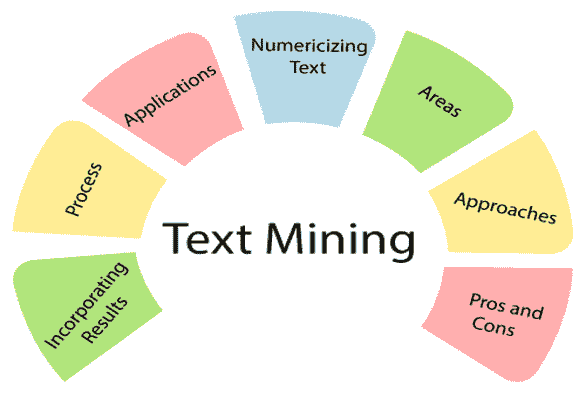
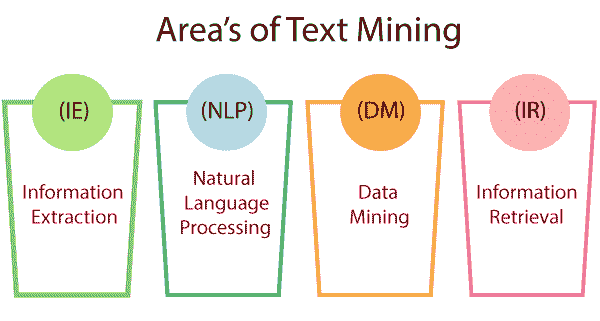
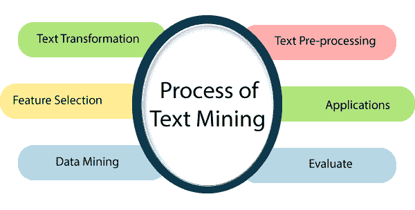

# 文本数据挖掘

> 原文：<https://www.javatpoint.com/text-data-mining>

文本数据挖掘可以描述为从标准语言文本中提取必要数据的过程。我们通过文本消息、文档、电子邮件和文件生成的所有数据都是用通用语言文本编写的。文本挖掘主要用于从这些数据中提取有用的见解或模式。

文本挖掘市场在过去几年中经历了指数级的增长和采用，并且也有望在未来获得显著的增长和采用。采用文本挖掘背后的一个主要原因是商业市场的竞争更激烈，许多组织寻求增值解决方案来与其他组织竞争。随着业务完成度的不断提高和客户视角的不断变化，组织正在进行巨额投资，以找到能够分析客户和竞争对手数据的解决方案，从而提高竞争力。数据的主要来源是电子商务网站、社交媒体平台、发表的文章、调查等。生成的大部分数据是非结构化的，这使得组织在人员的帮助下进行分析既困难又昂贵。这一挑战与数据生成的指数级增长相结合，导致了分析工具的增长。它不仅能够处理大量文本数据，而且有助于决策。文本挖掘软件使用户能够从大量可用的数据源中提取有用的信息。

## 数据挖掘中的文本挖掘领域:

这些是文本挖掘的以下领域:

*   **信息提取:**
    从非结构化源中自动提取实体、实体关系和描述实体的属性等结构化数据称为信息提取。
*   **自然语言处理:**
    NLP 代表自然语言处理。计算机软件能理解人类语言，就像它能被说一样。自然语言处理主要是人工智能的一个组成部分。自然语言处理应用程序的开发是困难的，因为计算机通常希望人类用一种准确、清晰和异常结构化的编程语言对它们“说话”。人类的语言通常是不真实的，因此它可能依赖于许多复杂的变量，包括俚语，社会背景和地区方言。
*   **数据挖掘:**
    数据挖掘是指从大数据集中提取有用的数据、隐藏的模式。数据挖掘工具可以预测行为和未来趋势，使企业能够做出更好的数据驱动决策。数据挖掘工具可以用来解决许多传统上过于耗时的业务问题。
*   **信息检索:**
    信息检索处理从存储在我们系统中的数据中检索有用的数据。或者，作为类比，我们可以将电子商务网站或任何其他网站上出现的搜索引擎视为信息检索的一部分。

## 文本挖掘过程:

文本挖掘过程包含以下步骤来从文档中提取数据。

*   **文本转换**
    文本转换是一种用于控制文本大写的技术。
    这里给出了文档表示的两种主要方式。
    1.  一大堆单词
    2.  向量空间
*   **文本预处理**
    预处理是文本挖掘、自然语言处理和信息检索中的一项重要任务和关键步骤。在文本挖掘领域，数据预处理用于从非结构化文本数据中提取有用的信息和知识。信息检索是选择集合中的哪些文档应该被检索以满足用户需求的问题。
*   **特征选择:**
    特征选择是数据挖掘的重要组成部分。特征选择可以定义为减少处理输入或寻找必要信息源的过程。特征选择也称为变量选择。
*   **数据挖掘:**
    现在，在这一步中，文本挖掘过程与常规过程合并。结构数据库中使用了经典的数据挖掘过程。
*   **评估:**
    之后，评估结果。一旦结果被评估，结果就被放弃。
*   **应用:**
    这些是以下文本挖掘应用:
*   **风险管理:**
    风险管理是分析、识别、处理和监控组织中任何行动或过程所涉及的风险的系统和逻辑程序。风险分析不足通常是失望的主要原因。在采用基于文本挖掘技术的风险管理软件可以有效增强降低风险的能力的金融机构中尤其如此。它能够管理数百万个源和数千兆字节的文本文档，并提供连接数据的能力。它有助于在正确的时间访问适当的数据。
*   **客户关怀服务:**
    文本挖掘方法，尤其是 NLP，在客户关怀领域的重要性越来越大。组织在文本分析编程方面投入资金，通过从不同来源(如客户反馈、调查、客户电话等)访问文本数据来改善整体体验。文本分析的主要目标是减少组织的响应时间，并帮助快速有效地解决客户的投诉。
*   **商业智能:**
    公司和商业公司已经开始将文本挖掘策略作为其商业智能的一个主要方面。除了提供对客户行为和趋势的重要见解之外，文本挖掘策略还支持组织分析对手 so 的质量和弱点，从而使他们在市场中具有竞争优势。
*   **社交媒体分析:**
    社交媒体分析有助于跟踪在线数据，有许多专门为社交媒体网站的性能分析而设计的文本挖掘工具。这些工具有助于监控和解释通过互联网从新闻、电子邮件、博客等产生的文本。文本挖掘工具可以精确分析社交媒体平台上的帖子、关注者和喜欢你品牌的人的总数，让你了解与你的品牌和内容互动的个人的反应。

## 数据挖掘中的文本挖掘方法:

以下是数据挖掘中使用的文本挖掘方法。

**1。基于关键词的关联分析:**

它收集经常一起出现的一组关键词或术语，然后发现它们之间的关联关系。首先，它通过解析、词干、删除停止词等对文本数据进行预处理。一旦对数据进行预处理，就会引入关联挖掘算法。在这里，不需要人工努力，因此减少了不想要的结果的数量和执行时间。

**2。文件分类分析:**

自动文档分类:

该分析用于对大量在线文本文档(如网页、电子邮件等)进行自动分类。文本文档分类随关系数据的分类而变化，因为文档数据库不是根据属性值对来组织的。

## 数字文本:

*   **词干算法**
    输入文档排序前的一个重要预处理步骤是从词干开始的。术语“词干”可以定义为单词的词根化。例如，不同语法形式的单词和有序是相同的。词干的主要目的是通过文本挖掘程序确保相似的词。
*   **支持不同的语言:**
    有一些高度依赖语言的操作，比如词干、同义词、单词中允许的字母。因此，支持各种语言很重要。
*   **排除特定字符:**
    排除数字、特定字符或一系列字符，或比特定字母数更短或更长的单词可以在输入文档排序之前完成。
*   **包含列表、排除列表(停止词):**
    可以对要列出的特定单词列表进行特征描述，当我们想要搜索特定单词时，它非常有用。它还根据这些单词出现的频率对输入文档进行分类。此外，“停止词”，这意味着将从排序中拒绝的术语可以被表征。通常，默认的英语终止词列表包含“the”、“a”、“自”等。这些词在各自的语言中使用非常频繁，但在文档中交流的数据很少。

* * *