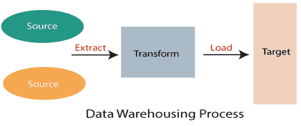
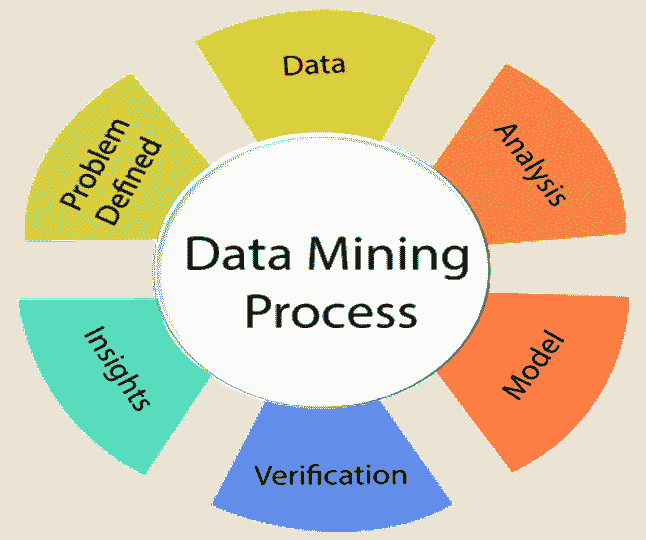
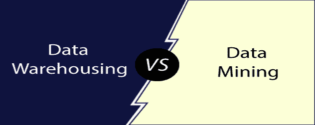

# 数据挖掘与数据仓库

> 原文：<https://www.javatpoint.com/data-mining-cluster-vs-data-warehousing>

**数据仓库**是指将数据编译组织成一个公共数据库的过程，而**数据挖掘**是指从数据库中提取有用数据的过程。数据挖掘过程依赖于在数据仓库阶段编译的数据来识别有意义的模式。创建数据仓库来支持管理系统。

## 数据仓库:

A **数据仓库**是指可以存储数据进行有用挖掘的地方。它就像一个快速的计算机系统，拥有异常巨大的数据存储容量。来自不同组织系统的数据被复制到仓库，在那里可以提取数据并确认删除错误。在这里，可以针对数据的仓库存储提出高级请求。

数据仓库结合了来自众多来源的数据，确保了数据的质量、准确性和一致性。数据仓库通过将分析处理与跨国数据库分离来提高系统执行。数据从不同的数据库流入数据仓库。数据仓库通过将数据分类成描述数据格式和类型的模式来工作。查询工具使用模式检查数据表。

**数据仓库**和**数据库**都是相对的数据系统，但两者都是为不同的目的服务的。数据仓库用于存储大量历史数据，并支持对所有数据的快速请求，通常使用**在线分析处理** (OLAP)。数据库用于存储当前事务，并允许快速访问正在进行的业务流程的特定事务，通常称为**在线事务处理** (OLTP)。

### 数据仓库的重要特征

数据仓库的重要特性如下:

**1。面向主题**

数据仓库是面向主题的。它提供关于某个主题的有用数据，而不是公司正在进行的运营，这些主题可以是客户、供应商、营销、产品、促销等。数据仓库通常侧重于数据的建模和分析，帮助业务组织做出数据驱动的决策。

**2。时间变量:**

数据仓库中存在的不同数据提供了特定时期的信息。

**3。集成**

数据仓库是通过连接来自异构源的数据而构建的，例如社交数据库、级别文档等。

**4。非挥发性**

这意味着，一旦数据进入仓库就不能更改。

### 数据仓库的优势:

*   更准确的数据访问
*   提高生产率和性能
*   经济高效
*   一致和高质量的数据

## 数据挖掘:

数据挖掘是指对数据的分析。它是由计算机支持的分析大量数据的过程，这些数据或者已经由计算机系统编译，或者已经下载到计算机中。在数据挖掘过程中，计算机分析数据并从中提取有用的信息。它在数据集中寻找隐藏的模式，并试图预测未来的行为。数据挖掘主要用于发现和指示数据集之间的关系。

数据挖掘旨在使业务组织能够查看业务行为、趋势和关系，从而使业务能够做出数据驱动的决策。它也被称为数据库中的知识发现(KDD)。数据挖掘工具利用人工智能、统计、数据库和机器学习系统来发现数据之间的关系。数据挖掘工具可以支持传统上解决任何问题都很耗时的业务相关问题。

### 数据挖掘的重要特性:

数据挖掘的重要特性如下:

*   它利用模式的自动发现。
*   它预测了预期的结果。
*   它侧重于大型数据集和数据库
*   它创造了可操作的信息。

### 数据挖掘的优势:

**一、市场分析:**

数据挖掘可以预测市场，帮助企业做出决策。例如，它预测谁热衷于购买什么类型的产品。

**二。欺诈检测:**

数据挖掘方法可以帮助发现哪些手机通话、保险索赔、信用卡或借记卡购买将是欺诈性的。

**三。金融市场分析:**

数据挖掘技术被广泛用于帮助**模拟金融市场**

**iv。趋势分析:**

分析当前市场的现有趋势是一项战略优势，因为它有助于根据市场需求降低成本和制造流程。

## 数据挖掘和数据仓库的区别:

| 数据挖掘 | 数据库 |
| 数据挖掘是确定数据模式的过程。 | 数据仓库是为分析而设计的数据库系统。 |
| 数据挖掘通常被认为是从大量数据中提取有用数据的过程。 | 数据仓库是组合所有相关数据的过程。 |
| 商业企业家在工程师的帮助下进行数据挖掘。 | 数据仓库完全由工程师进行。 |
| 在数据挖掘中，数据被反复分析。 | 在数据仓库中，数据是定期存储的。 |
| 数据挖掘使用模式识别技术来识别模式。 | 数据仓库是提取和存储数据的过程，可以更容易地进行报告。 |
| 最惊人的数据挖掘技术之一是检测和识别系统中出现的不想要的错误。 | 数据仓库的优势之一是它能够频繁更新。这就是为什么它非常适合想了解最新信息的商业企业家。 |
| 与其他统计数据应用程序相比，数据挖掘技术具有成本效益。 | 数据仓库的职责是简化每种类型的业务数据。 |
| 数据挖掘技术不是 100%准确的。在一定条件下可能导致严重后果。 | 在数据仓库中，公司分析所需的数据很有可能没有集成到仓库中。它只会导致数据丢失。 |
| 公司可以通过配备合适且可访问的基于知识的数据从这一分析工具中受益。 | 数据仓库存储了大量的历史数据，帮助用户分析不同时期和趋势，做出未来的预测。 |

* * *