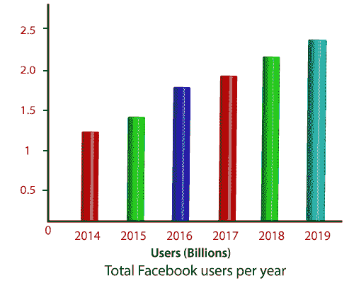
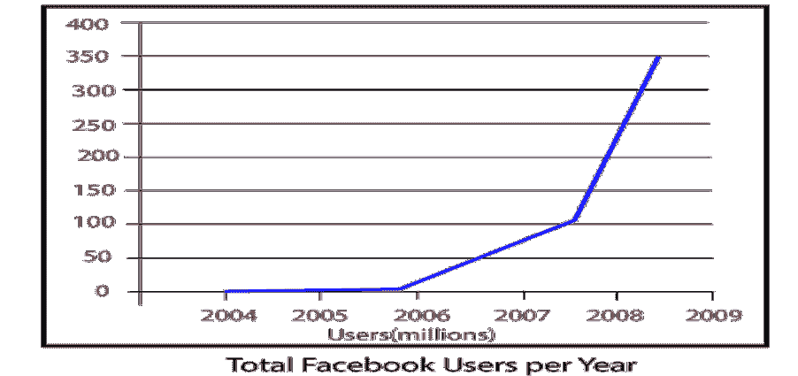

# 数据挖掘中的聚类

> 原文：<https://www.javatpoint.com/social-media-data-mining>

社交媒体是一个巨大的信息来源和完美的交流平台。企业和个人可以充分利用它，而不是只在平台上分享他们的照片和视频。该平台让用户可以自由、轻松、梦幻地与目标群体联系。无论是集团还是老牌企业，在与竞争激烈的社交媒体行业竞争时，都面临着困难。但是通过社交媒体平台，用户可以与他人一起营销或开发他/她的品牌或内容。

社交媒体挖掘包括社交媒体平台、社交网络分析和数据挖掘，为学习者、专业人士、科学家和项目经理了解社交媒体挖掘的基础和潜力提供方便和一致的平台。它提出了由社交媒体数据引起的各种问题，并介绍了数据挖掘和网络分析的基本概念、新兴问题和有效算法。它包括多种难度，可以增强知识，并有助于在不同的社交媒体挖掘情况下应用想法、原则和技术。

根据《**全球数字报告》**》显示，2019 年全球社交媒体平台活跃用户总数为**24.1 亿**，同比增长高达 9 %。随着社交媒体平台通过互联网的普遍使用，大量数据是可访问的。社交媒体平台包括许多研究领域，如社会学、商业、心理学、娱乐、政治、新闻和社会的其他文化方面。将数据挖掘应用于社交媒体可以为人类行为和人类互动提供令人兴奋的观点。数据挖掘可以与社交媒体结合使用，以了解用户对某个主题的看法，从大量人群中识别一组个人，研究群体随时间的变化，找到有影响力的人，甚至向个人推荐产品或活动。

例如，2008 年的总统选举标志着社交媒体平台在美国前所未有的使用。包括脸书、YouTube 在内的社交媒体平台在筹集资金和向选民传达候选人信息方面发挥了至关重要的作用。研究人员提取的博客数据证明了候选人使用的社交媒体平台数量和 2008 年总统竞选获胜者之间的相关性。

这个有效的例子强调了数据挖掘社交媒体数据在国家一级预测结果的潜力。数据挖掘社交媒体也能产生个人和公司利益。

社交媒体挖掘指的是社交计算。社交计算被定义为“软件被用作社交关系的中介或中心的任何计算应用。”社会计算涉及用于人际交流的应用以及与“计算社会研究”或社会行为相关的应用和研究活动。"

社交媒体平台是指许多人合作使用的各种信息服务，分为以下子类别。

| 种类 | 例子 |
| 博客 | 博主、生活日志、WordPress |
| 社会新闻 | Digg slash dot 你好吗 |
| 社交书签 | 美味极了 |
| 社交网络平台 | Facebook、LinkedIn、Myspace、Orkut |
| 微博 | 推特、GoogleBuzz |
| 意见挖掘 | 神经过敏，耶普 |
| 照片和视频共享 | Flickr，YouTube |
| 维基百科 | 学者，维基百科，维基百科，事件 |

对于流行的传统媒体，如广播、报纸和电视，传播完全是单向的，从媒体来源或广告商到大众媒体消费者。Web 2.0 技术和现代社交媒体平台改变了场景，从由媒体提供商驱动的单向媒体传播转变为几乎任何人都可以向大众发布书面、音频、视频或图像内容。

这种媒体环境正在显著改变企业与客户沟通的方式。它为个人以非常低的成本与大量的人互动提供了前所未有的机会。在线呈现并通过社交媒体平台展示的关系是社交媒体平台的数字化数据集。由此产生的数据为社会学提供了丰富的机会，并在与类似领域相关的大量应用中洞察消费者行为和营销。

社交媒体平台用户的增长和数量令人难以置信。例如，考虑一下最具诱惑力的社交媒体网站脸书。在运营的前六年，脸书的活跃用户超过了 4 亿，并且一直呈指数级增长。给定的数字说明了脸书在头六年的指数增长。根据该报告，根据用户每天在网站上的流量参与度，脸书在全球网站中排名第 2 位。

社交媒体平台的广泛使用不仅限于世界上的一个地理区域。由谷歌运营的流行社交网络平台 Orkut 拥有来自美国以外的大部分用户，互联网用户对社交媒体的使用现在在全球许多地方成为主流，包括爱莎、非洲、欧洲、南美和中东国家。社交媒体也推动了公司的重大变革，企业需要决定自己的政策，以跟上这种新媒体的步伐。

## 社交媒体中数据挖掘的动机:

通过社交媒体平台获得的数据可以让我们深入了解社交网络和社会，这在以前无论是规模还是范围都是不可行的。这种数字媒体可以改变物理世界研究人际关系的局限性，并有助于在没有具体研究的情况下衡量流行的社会和政治信仰。社交媒体有效地记录了病毒式营销趋势，是更好地理解和利用影响机制的理想来源。然而，由于特定的挑战，如果不实现数据挖掘技术，就很难从社交网站数据中获得有价值的信息。

数据挖掘技术可以有效地帮助应对社交媒体数据的三个主要挑战。首先，社交媒体数据集很大。以拥有 24.1 亿活跃用户的最受欢迎的社交媒体平台脸书为例。如果没有自动化的数据处理来分析社交媒体，社交媒体数据分析将无法在任何合理的时间范围内进行。

第二，社交媒体网站的数据集可能很吵。例如，垃圾博客在博客圈中数量众多，在推特上也有不重要的推文。

第三，来自在线社交媒体平台的数据是动态的，短时间内的定期修改和更新并不常见，但也是处理社交媒体数据时需要考虑的一个重要方面。

将数据挖掘方法应用于庞大的数据集，可以改善日常搜索引擎的搜索结果，实现商业的指定目标营销，帮助心理学家研究行为，个性化消费者网络服务，为社会学家提供对社会结构的新见解，帮助我们所有人识别和防止垃圾邮件。

此外，开放数据访问为研究人员提供了前所未有的大量数据，以提高效率和优化数据挖掘技术。数据挖掘的进展是基于庞大的数据集。社交媒体是数据挖掘边缘的最佳数据源，用于为学术和相关数据挖掘分析师开发和测试新的数据挖掘技术。

* * *