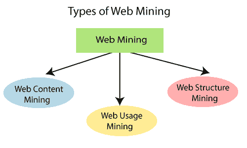

# 数据挖掘-万维网

> 原文：<https://www.javatpoint.com/data-mining-world-wide-web>

在过去的几年里，万维网已经成为一个重要的信息来源，同时也是一个受欢迎的商业平台。web 挖掘可以定义为利用数据挖掘技术和算法直接从 Web 中提取有用信息的方法，例如 Web 文档和服务、超链接、Web 内容和服务器日志。万维网包含大量数据，为数据挖掘提供了丰富的来源。网络挖掘的目标是通过收集和检查数据来寻找网络数据中的模式，从而获得洞察力。

## 什么是网络挖掘？

Web 挖掘可以被广泛地看作是适应性数据挖掘技术在 web 上的应用，而数据挖掘被定义为算法在嵌入到**知识发现过程**中的大部分结构化数据上发现模式的应用。Web 挖掘有一个独特的属性，可以提供一组不同的数据类型。web 有多个方面，为挖掘过程提供了不同的方法，例如网页由文本组成，网页通过超链接链接，用户活动可以通过 web 服务器日志进行监控。这三个特征导致了这三个领域的区别分别是网页内容挖掘、网页结构挖掘、网页使用挖掘。

### 数据挖掘有三种类型:

**1。网络内容挖掘:**

网页内容挖掘可以用来从网页内容中提取有用的数据、信息、知识。在 web 内容挖掘中，每个网页都被视为一个单独的文档。个人可以利用网页的半结构化特性，因为 HTML 提供的信息不仅涉及布局，还涉及逻辑结构。内容挖掘的主要任务是数据提取，即从非结构化网站中提取结构化数据。目标是通过使用提取的结构化数据来促进各种网站上的数据聚合。网络内容挖掘可以用来区分网络上的主题。例如，如果任何用户在搜索引擎上搜索特定的任务，那么该用户将获得一个建议列表。

**2。网络结构化挖掘:**

网页结构挖掘可以用来发现超链接的链接结构。它用于识别链接网页或直接链接网络的数据。在网页结构挖掘中，个人将网页视为有向图，网页是与超链接相关联的顶点。这方面最重要的应用是谷歌搜索引擎，它主要用 PageRank 算法来估计搜索结果的排名。当一个页面被其他高度相关的页面频繁连接时，它就显得格外相关。结构和内容挖掘方法通常是结合的。例如，web 结构化挖掘可以有利于组织规范两个商业站点之间的网络。

**3。网络使用挖掘:**

Web 使用挖掘用于从日志记录中提取有用的数据、信息和知识，并帮助识别用户对网页的访问模式。在网络资源的使用挖掘中，个人考虑的是网站访问者的请求记录，这些记录通常被收集为网络服务器日志。虽然网页集合的内容和结构遵循网页作者的意图，但是单个请求展示了消费者是如何看到这些网页的。Web 使用挖掘可能会公开页面创建者没有提出的关系。

识别和分析网络使用模式的一些方法如下:

**一、场次及访客分析:**

预处理数据的分析可以在会话分析中完成，会话分析包括客人记录、天数、时间、会话等。这些数据可以用来分析来访者的行为。

该文档是在此分析之后创建的，其中包含重复访问的网页、常用入口和出口的详细信息。

**二。OLAP(在线分析处理):**

OLAP 完成了对高级数据的多维分析。

OLAP 可以在特定时期内完成对各部分测井相关数据的处理。

OLAP 工具可用于推断重要的商业智能指标

## 网络挖掘的挑战:

基于以下观察，网络假装对资源和知识发现提出了难以置信的挑战:

*   **网页的复杂程度:**

网站页面没有统一的结构。与传统的文本文档相比，它们极其复杂。网络数字图书馆中有大量的文档。这些库不是按照特定的顺序组织的。

*   **网络是一个动态数据源:**

互联网上的数据更新很快。比如新闻、气候、购物、财经新闻、体育等等。

*   **客户端网络的多样性:**

网络上的客户网络正在迅速扩大。这些客户有不同的兴趣、背景和使用目的。有超过一亿个工作站与互联网相关联，并且仍在大幅增长。

*   **数据相关性:**

人们认为特定的人通常只关心网络的一小部分，而网络的其余部分包含用户不熟悉的数据，可能会导致不必要的结果。

*   **网太宽:**

网络的规模是巨大的，并且正在迅速增长。对于数据仓库和数据挖掘来说，网络似乎太庞大了。

## 挖掘网站的链接结构以识别权威网页:

网络由页面和指示从一个页面到另一个页面的超链接组成。当网页的创建者创建了显示另一个网页的超链接时，这可以被认为是创建者对另一个网页的授权。网络上各种创作者对给定页面的统一授权可以指示页面的重要性，并且可以自然地提示权威网页的发现。web 链接数据提供了关于 web 内容的相关性、质量和结构的丰富数据，因此是 web 挖掘的丰富来源。

## 网络挖掘的应用:

由于 Web 的各种用途，web 挖掘有着广泛的应用。下面列出了 web 挖掘的一些应用。

*   营销和转换工具
*   网站数据分析及应用实现。
*   观众行为分析
*   广告和活动成就分析。
*   站点的测试和分析。

* * *