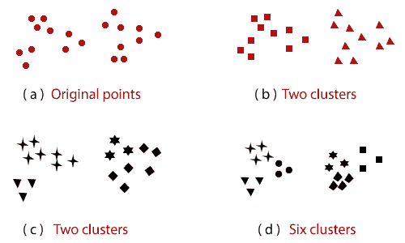
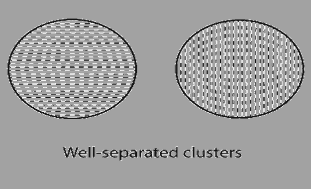
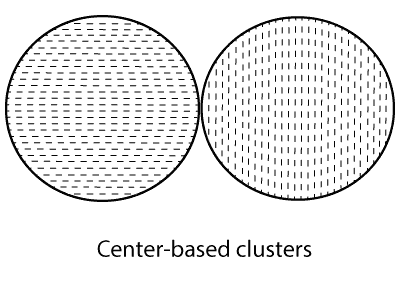
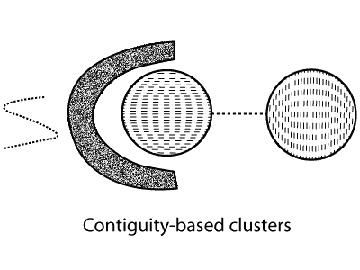
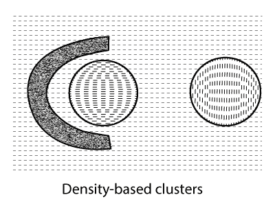
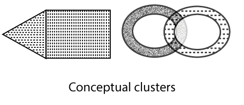

# 不同类型的聚类

> 原文：<https://www.javatpoint.com/data-mining-different-types-of-clustering>

聚类分析将数据分成组，通常称为聚类。如果目标是有意义的组，那么聚类就捕捉到了数据的一般信息。有些时候，聚类分析只是一个有用的初始阶段，用于其他目的，如数据汇总。就理解或效用而言，聚类分析长期以来在生物学、心理学、统计学、模式识别、机器学习和挖掘等广泛领域发挥着重要作用。

## 什么是聚类分析？

聚类分析是主要依赖于数据中信息的组数据对象。它定义了对象及其关系。一个群体内的目标与其他群体的目标相似或不同。

***给定的图 1 说明了在相同的点集合上聚类的不同方式。*T3】**

在各种应用中，集群的概念没有简单定义。为了更好地理解选择什么建立一个组的挑战，图 1 展示了二十个点和三种不同的方法将它们分成集群。标记的设计显示了集群成员。这些数字分别将数据分为两部分和六部分。将两个更重要的聚类分成三个子聚类可能是人类视觉系统的产物。陈述来自四个集群的点可能不符合逻辑。该图表示一个簇的含义不准确。集群的最佳定义取决于数据的性质和结果。

聚类分析类似于用于将数据对象分成组的其他方法。例如，聚类可以被视为一种分类形式。它用分类来构造对象的标签，即允许新的未标记对象使用从具有已知类别标签的对象发展而来的模型来标记类别标签。因此，聚类分析有时被定义为无监督分类。如果术语分类在数据挖掘中没有任何能力，那么它通常指的是监督分类。

术语**分割**和**分割**通常用作聚类的同义词。这些术语通常用于传统聚类分析范围之外的技术。例如，术语划分通常用于与将图分成子图并且不与聚类相关联的技术建立关系。**分割**通常采用简单的方法将数据分成组。例如，一幅图像可以根据像素频率和颜色分成不同的部分，或者人们可以根据年收入分成不同的组。然而，图划分和市场细分方面的一些工作与聚类分析有关。

## 不同类型的聚类

一整组集群通常被称为集群。在这里，我们区分了不同类型的聚类，如**分层**(嵌套)对**分区**(未嵌套)**独占**对**重叠**对**模糊**，以及**完整**对**部分**。

*   **分级与分区**

在各种类型的聚类中，最常讨论的不同特征是聚类集是嵌套的还是不嵌套的，或者用更传统的术语来说，是分区的还是分层的。一个**分区**聚类通常是将一组数据对象分布到不重叠的子集(聚类)中，这样每个数据对象正好在一个子集中。

如果我们允许集群有子集群，那么我们得到一个**层次**集群，它是一组嵌套的集群，被组织成一棵树。树中的每个节点(簇)都是其子簇的关联，树根是簇，包括所有对象。通常，树的叶子是单个数据对象的单个簇。如果我们使集群能够嵌套，那么图 1 ( a)的一个澄清是它有两个子集群图 1 (b)说明了这一点，每个子集群都有三个子集群，如图 1 (d)所示。图 1 (a-d)中的集群是以特定的顺序出现的，也是从分层(嵌套)集群中获得的，每一层有 1、2、4 和 6 个集群。最后，层次聚类可以看作是划分聚类的一种排列，而划分聚类可以通过获取该序列的任何成员来获得，这意味着在特定的级别上切割层次树。

*   **排他对重叠对模糊**

图中出现的聚类都是**独有的**，因为它们将每个对象的责任赋予了一个聚类。在许多情况下，一个点可以合理地设置在多个集群中，这些情况最好通过非排他集群来解决。一般来说，重叠的**或 n **非排他性聚类**用于反映一个对象可以一起属于多个组(类)的事实。例如，公司的一个人既可以是见习学生，也可以是公司的员工。如果一个对象位于两个或两个以上集群之间，并且可以合理地分配给这些集群中的任何一个，则通常也使用非排他集群。考虑两个集群之间的某个点，而不是将对象完全随机地分配给一个集群。它被放入所有“同样好”的集群中。**

在**模糊聚类**中，每个对象属于每个聚类，隶属度在 0 到 1 之间。换句话说，聚类被认为是模糊集。在数学上，模糊集被定义为一个对象与权重在 0 到 1 之间的任何集合相关联的集合。在模糊聚类中，我们通常设置附加约束，每个对象的权重之和必须等于 1。类似地，概率聚类系统计算每个点属于一个聚类的概率，这些概率的总和必须是 1。由于任何对象的成员权重或概率总和为 1，模糊或概率聚类不能解决实际的多类情况。

### 完全与部分

完全聚类将每个对象分配给一个聚类，而部分聚类则不分配。**部分聚类**的灵感来源于数据集中的一些对象可能不属于不同的组。大多数情况下，数据集中的对象可能会产生异常值、噪声或“无趣的背景”例如，一些新闻标题故事可能有一个共同的主题，例如“全球工业生产萎缩 1.1%”，而不同的故事更频繁或独一无二。因此，为了找到上个月故事中的重要主题，我们可能只需要搜索由一个共同主题紧密相关的文档集群。在其他情况下，需要完整的对象聚类。例如，一个应用程序利用聚类来整理文档进行浏览，需要确保所有文档都可以被浏览。

## 不同类型的集群

集群旨在发现有用的对象组(集群)，其中数据分析的目标表征了效用。当然，有各种各样的集群概念可以在实践中证明其实用性。为了直观地显示这些类型的聚类之间的差异，我们利用了二维点，如图所示，这里描述的聚类类型对不同类型的数据同样有效。

*   **分离良好的集群**

集群是一组对象，其中每个对象与集群中的其他对象更接近或更相似。有时，限制用于指示集群中的所有对象必须足够接近或彼此相似。只有当数据包含彼此相距很远的自然聚类时，聚类的定义才被满足。该图显示了由二维空间中的两点组成的分离良好的集群的示例。分离良好的团簇不一定是球形的，但可以有任何形状。

*   **基于原型的集群**

集群是一组对象，其中每个对象与表征集群的原型更接近或更相似于任何其他集群的原型。对于具有连续特征的数据，聚类的原型通常是质心。当质心不重要时，它表示群集中所有点的平均值。例如，当数据具有确定的特征时，原型通常是一个簇的最具代表性的点。对于某些类型的数据，模型可以被视为最中心的点，在这样的例子中，我们通常将基于原型的集群称为基于中心的集群。正如任何人可能预料的那样，这样的星团往往是球形的。该图显示了一个基于中心的集群示例。

*   **基于图形的聚类**

如果数据被描述为图形，其中节点是对象，那么集群可以被描述为**连接的组件**。它是一组相互关联的对象，但与组外的对象没有关联。基于图形的集群的一个重要例子是基于邻接的集群，其中当两个对象被放置在彼此相距指定距离的位置时，它们是相关联的。这表明在一个**基于邻接的集群**中的每个对象都与集群中的其他对象相同。图中展示了二维点的这种聚类的一个例子。当集群不可预测或交织在一起时，集群的含义很有用，但是当有噪声时，集群可能会遇到困难。它由图中的两个圆形簇表示；点的小延伸可以连接两个不同的集群。

其他类型的基于图形的集群也是可能的。一种这样的方式将集群描述为**小团体**。团是图中完全相互关联的一组节点。特别是，我们根据对象之间的距离在它们之间添加连接。当一组对象形成一个团时，就产生了一个簇。它就像基于原型的集群，这种集群往往是球形的。

*   **基于密度的集群**

集群是被低密度区域包围的对象的压缩域。这两个球状星团没有像图中那样合并，因为它们之间的桥梁逐渐消失在噪音中。类似地，图中出现的曲线消失在噪声中，并且在图中没有形成群集。它也会消失在噪音中，不会形成图中所示的集群。当聚类不规则地交织在一起，并且存在噪声和异常值时，通常会使用基于密度的聚类定义。另一方面，基于邻接的聚类定义对于图中的数据来说是不合适的。因为噪声会在集群之间形成网络。

*   **共享财产或概念集群**

我们可以将集群描述为一组提供某些属性的对象。基于中心的簇中的对象共享这样的属性，即它们都最接近相似的质心或 medoid。然而，共享属性方法还包含了新类型的集群。考虑图中给出的集群。一个三角形区域(簇)紧挨着一个矩形区域，有两个相互缠绕的圆(簇)。在这两种情况下，聚类算法都需要特定的聚类概念来有效地识别这些聚类。发现这种聚类的方法被称为概念聚类。

* * *