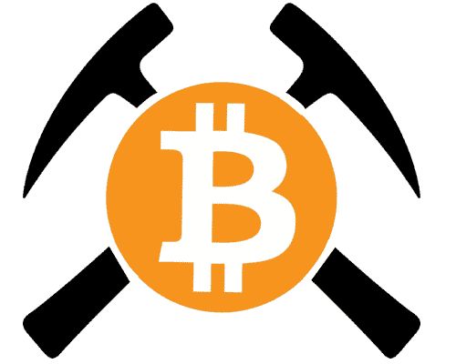
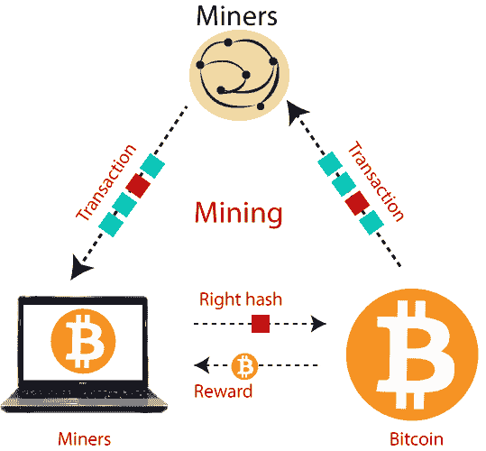
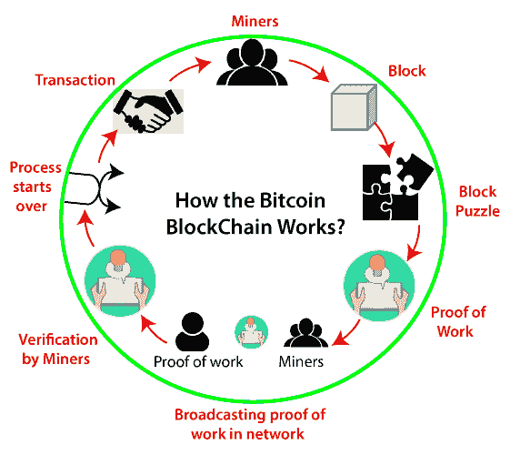
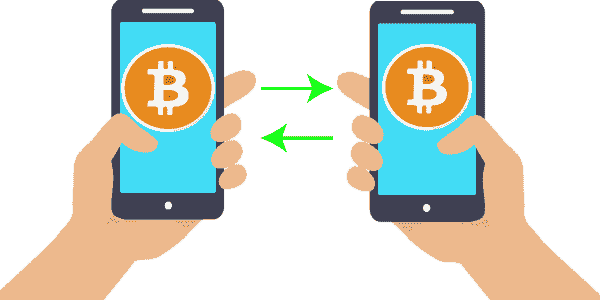

# 比特币数据挖掘

> 原文：<https://www.javatpoint.com/bitcoin-data-mining>

**比特币挖掘**是指对交易记录进行认证并添加到公共账本的过程。公共壁架被称为区块链，因为它由一系列的区块组成。

在理解比特币挖矿概念之前，我们应该先了解什么是比特币。**比特币**是有一定价值的虚拟货币，它的价值不是一成不变的，它随时间而变化。没有比特币监管机构监管比特币交易。

让我们用一个例子来理解比特币的概念。公司经理拿着一个虚拟的东西，宣布谁将得到这个东西将是该组织最快乐的雇主，并得到一张国际假日机票。因此，每个人都试图购买没有价值的虚拟物品，这样，这个虚拟物品就会有一些价值，可能在 10 美元到 20 美元之间。我们可以将这些事情与比特币联系起来，如果比特币的购买者数量增加，那么比特币的价值在停止之后也会增加到饱和值。

**比特币**是以宣布发明的化名**中本聪**创造的，后来以开源代码的形式实现。只有端到端版本的电子货币才能使在线支付从一个人直接发送到另一个人，而不受经济实体的干扰。比特币是一种网络实践，它赋予人们在名为**比特币**的账户单位上转移资产权利的权力，比特币的数量有限。当一个人向另一个人发送几个比特币时，这些数据会被传送到**点对点**比特币网络。

这项技术仍然类似于用虚拟货币购买东西。然而，比特币的一个优势是，这种安排仍未确定。发送方和受益人(接收方)的个人身份仍然是加密的。这是为什么它已经成为网络上可信的货币交易形式的主要原因。按照惯例，制造分布式货币的复杂性要求提案避免双重支出。一个人可以同时传输两笔交易，将相似的硬币发送给网络上的两个不同方。比特币解决了这一难题，并通过维护一个名为“区块链”的所有交易的社区分类账来确保权利一致。新交易相互分组，并对照现有记录进行检查，以确保所有新通信都有效。比特币的准确性是由个人来保证的，他们将计算权限授予被称为矿工的系统，以验证交易并将其附加到公共分类账中。

比特币在物理上并不存在，只是虚拟数据的一种排列。它可以兑换成真金白银，并被全球大多数国家广泛接受。比特币没有中央权威，类似于控制货币政策的中央银行(印度储备银行)。或者，开发人员解决复杂的难题来支持比特币交易。这个过程叫做**比特币挖矿**。

## 如何挖掘比特币:

这是一个相当复杂的过程，但如果你想直接接受它，那么这就是它的工作过程。你需要一个具有出色处理能力和快速网络接口的中央处理器。下一步，有许多在线网络会实时列出最新的比特币交易。之后，与比特币客户登录，并尝试通过评估称为**哈希**的数据块来批准这些交易。现在，通信通过几个系统进行，称为**节点**，它们只是数据块，由于数据是编码的，矿工需要检查他的答案是否准确。

这是一个相当复杂的过程，但如果你想直接接受它，那么这就是它的工作过程。你需要一个具有出色处理能力和快速网络接口的中央处理器。下一步，有许多在线网络会实时列出最新的比特币交易。随后，与一位比特币客户登录，并尝试通过评估称为哈希的数据块来批准这些交易。现在，通信通过几个系统进行，称为节点，它们只是数据块，由于数据是编码的，需要矿工检查他的答案是否准确。

## 比特币挖掘的工作原理:

比特币挖掘需要执行一项异常棘手的任务，但验证起来很简单。它使用密码学，有一个叫做双 SHA-256 的散列函数(一个单向函数，将任意维度的文本转换成 256 位的字符串)。哈希接受一部分数据作为输入，并将其缩减为较小的哈希值(256 位)。有了加密散列，在不尝试大量来源的情况下，没有其他选项可以获得我们想要的散列值。一旦我们找到给出我们想要的值的输入，任何人验证散列都是一个简单的任务。因此，加密散列变成了一种体面的方法来应用比特币“工作证明”(数据生产复杂，但其他人很容易验证)。

如果我们首先考虑挖掘一个块，我们需要将新的事务收集到一个块中，然后对该块进行哈希处理，形成一个 256 位的块哈希值。当散列以足够多的零开始时，该块已经被成功挖掘并被定向到比特币网络，这已经变成了该块的标识符。在许多情况下，散列并不成功，因此我们需要在某种程度上改变该块，并一次又一次地尝试。

## 比特币交易:

比特币交易是传输到网络的一部分数据，如果有效，它最终会在区块链的一个区块中结束。比特币交易的概念是转移一定数量比特币地址的责任。

当我们发送比特币时，一个单独的数据结构，即比特币交易，是由您的钱包客户制作的，然后进行通信以转播交易。如果操作有效，节点会将其合并到正在开采的区块中，在 10-20 分钟内，该事务将与其他事务一起包含在区块链的区块中。最后，接收者可以在他们的钱包中看到交易金额。

## 关于交易的一些事实:

*   我们发送的比特币金额总是发送到特定的地址。
*   我们获得的比特币金额被锁定在接收地址，该地址与我们的钱包相关联。
*   每次我们消费比特币，我们的消费金额将始终来自之前收到的、目前存在我们钱包中的资金。
*   地址接收比特币，但他们没有？不要发送比特币，它是从钱包中发送的。

## 比特币 wallets:

比特币钱包编译私钥，我们通过私钥访问比特币地址并支付资金。它们以不同的形式出现，为特定类型的设备而设计。我们甚至可以使用硬拷贝来存储数据，以避免在计算机上拥有它们。保护和备份我们的比特币钱包非常重要。比特币是最新的现金技术，很快，其他商家开始接受比特币作为支付手段。

我们知道比特币交易机制是如何工作的，它们是如何创建的，但是它们是如何存储的呢？我们将钱存储在实体钱包中，比特币的工作原理类似，只是它通常是数字的。简而言之，我们不需要在任何地方储存比特币。我们存储的是用于访问我们的公共比特币地址和签署交易的安全数字密钥。

钱包主要有五种类型，如下所示:

## 桌面钱包:

首先，我们需要安装原始的比特币客户(比特币核心)。如果我们已经安装了，那么我们正在运行一个钱包，但可能不知道它。除了依赖网络上的交易，该软件还使我们能够创建一个比特币地址，用于转账和获取虚拟货币。多比特(比特币钱包)在 Mac OSX、Windows 和 Linux 上运行。Hive 是一款总部位于 OS X 的钱包，具有一些特殊功能，包括一个与比特币服务直接关联的应用商店。

## 移动钱包:

钱包是我们手机上的一个应用程序，它可以存储我们比特币地址的安全密钥，并使我们能够用手机直接付款。很多时候，比特币钱包甚至会利用手机？的近场通信(NFC)方面，使我们能够在阅读器上点击手机并支付比特币，而无需输入任何数据。一个比特币客户必须下载整个比特币区块链，它一直在发展，大小有几十亿字节。一吨重的手机无法将区块链留在记忆中。在这种情况下，他们可以使用替代选项，这些移动用户在设计时会反复考虑简化支付验证(SPV)。他们下载区块链的有限子集，并依赖比特币系统中的其他可信节点来确保他们拥有精确的数据。菌丝体是移动钱包的例子，包括基于安卓的比特币钱包。

## 在线钱包:

电子钱包将我们的安全密钥存储在网络上，存储在计算机上，受他人限制，并连接到互联网。各种在线服务是可访问的，移动和桌面钱包的网络在我们拥有的各种设备之间复制我们的地址。在线钱包的一个显著优势是，无论我们使用哪种设备，我们都可以从任何地方访问它们。

## 硬件钱包:

硬件钱包是不完整的数字。这些都是锐利的设备，可以通过电子方式保存私钥，并轻松支付。紧凑型莱杰通用串行总线比特币钱包利用智能卡保护，可以以合理的成本访问。

## 纸质钱包:

保持我们的比特币安全和健康的最便宜的替代方案明显被称为纸质钱包。有各种网站提供纸质比特币钱包服务。他们为我们传递一个比特币地址，并生成一个包含两个二维码的图像。第一个是我们可以用来接收比特币的公共地址，另一个是我们用来支付存储在该地址的比特币的私钥。纸质钱包的主要优点是私钥不会以数字形式存储在任何地方，因此它可以保护我们的钱包免受网络攻击。

* * *