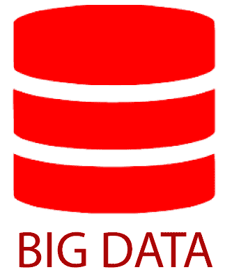
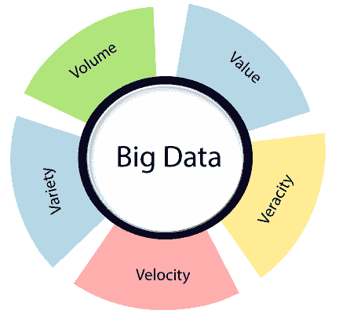
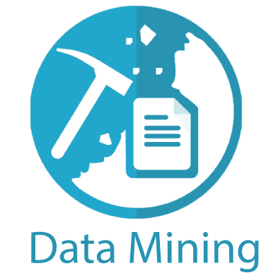
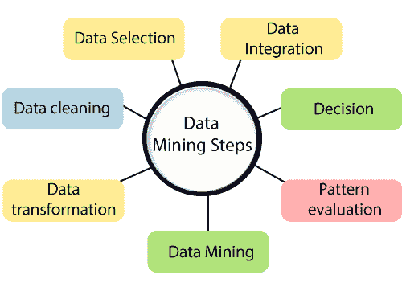
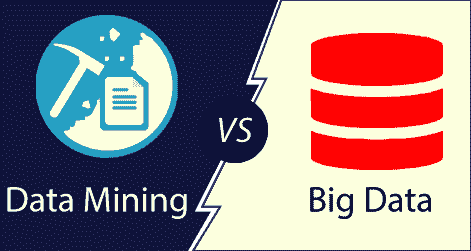

# 数据挖掘与大数据

> 原文：<https://www.javatpoint.com/data-mining-vs-big-data>

**数据挖掘**使用统计模型、机器学习和可视化等工具从**大数据**中“挖掘”(提取)有用的数据和模式，而大数据处理大容量和高速度的数据，这在较旧的数据库和分析程序中是具有挑战性的。

## 大数据:

大数据是指海量的结构化、半结构化和非结构化数据集，以万亿字节为单位。在单个系统上处理大量数据是一项挑战，这就是为什么我们计算机的内存会在处理和分析过程中存储临时计算。当我们试图处理如此大量的数据时，在单个系统上执行这些处理步骤需要花费很多时间。此外，由于过载，我们的计算机系统无法正常工作。

在这里，我们将通过一个真实的例子来理解这个概念(产生了多少数据)。我们都知道大巴扎。作为顾客，我们每月至少去一次大巴扎。这些商店监视顾客从他们那里购买的每一件产品，以及世界上哪个商店的位置。他们有一个实时信息反馈系统，将所有数据存储在巨大的中央服务器中。想象一下，仅印度的大巴扎商店就有 250 家左右。监控每个客户购买的每一件物品以及物品描述，将使数据在一个月内达到 1 TB 左右。

## 大巴扎如何处理这些数据:

我们知道大巴扎里有些商品正在促销。我们真的相信大巴扎会在没有任何充分支持的情况下运行这些产品，以发现这些促销活动会增加它们的销量并产生盈余吗？这就是大数据分析发挥重要作用的地方。使用数据分析技术，大巴扎瞄准新客户和现有客户，从其商店购买更多商品。

大数据由 5 个**和**组成，即数量、种类、速度、准确性和价值。

**体量**:在大数据中，体量是指涉及到大数据时，可以是巨大的数据量。

**品种**:大数据中，品种是指 web 服务器日志、社交媒体数据、公司数据等各种类型的数据。

**速度**:在大数据中，速度是指数据相对于时间的增长方式。总的来说，数据正以极快的速度呈指数级增长。

**准确性**:大数据准确性是指数据的不确定性。

**价值**:在大数据中，价值指的是我们正在存储、处理的数据是否有价值，以及我们如何从这些庞大的数据集中获得优势。

## 如何处理大数据:

一种非常有效的方法，称为 **Hadoop** ，主要用于大数据处理。这是一个基于**分布式并行处理**方法的开源软件。

## Apache Hadoop 方法由给定的模块组成:

### Hadoop 通用:

它包含其他 Hadoop 模块所需的字典和实用程序。

### Hadoop 分布式文件系统(HDFS):

一种分布式文件系统，将数据存储在商用机器上，支持集群中非常高的总带宽。

### Hadoop 纱:

它是一个资源管理平台，负责管理集群中的各种资源，并使用它们来调度用户的应用程序。

### Hadoop MapReduce:

它是一个用于大规模数据处理的编程模型。

## 数据挖掘:

顾名思义，**数据挖掘**是指对庞大的数据集进行挖掘，以识别趋势、模式，并提取有用的信息称为数据挖掘。

在数据挖掘中，我们在寻找隐藏的数据，但不知道我们在寻找什么类型的数据，以及一旦找到它，我们计划使用它做什么。当我们发现有趣的信息时，我们开始思考如何利用它来促进业务。

我们将通过一个例子来理解数据挖掘概念:

一个数据挖掘者开始发现一个移动网络运营商的呼叫记录，而他的经理没有任何具体的目标。经理可能会给他一个重要的目标，在一个月内发现至少几个新的模式。当他开始提取数据时，发现了一种模式，即与其他所有日子相比，周五有一些国际电话(例如)。现在，他与管理层分享了这些数据，他们在周五提出了一项缩减国际通话费率的计划，并发起了一场运动。通话持续时间延长，客户对低通话率感到满意，越来越多的客户加入，随着利用率的提高，组织可以获得更多利润。

数据挖掘涉及多个步骤:

### 数据集成:

第一步，整合数据并从各种来源收集数据。

### 数据选择:

在第一步中，我们可能不会同时收集所有的数据，所以在这一步中，我们只选择那些剩下的数据，我们认为这对数据挖掘是有用的。

### 数据清理:

在这一步中，我们收集的信息是不干净的，可能包括错误、有噪声或不一致的数据、缺失的值。因此，我们需要实施各种策略来解决这些问题。

### 数据转换:

即使经过清理的数据也没有为挖掘做好准备，所以我们需要将它们转换成结构进行挖掘。用于实现这一点的方法有聚集、归一化、平滑等。

### 数据挖掘:

一旦数据已经转换，我们就可以对数据实施数据挖掘方法，从数据集中提取有用的数据和模式。像聚类关联规则这样的技术是用于数据挖掘的多种技术之一。

### 模式评估:

Patten 评估包含可视化、移除随机模式、转换等。从我们生成的模式中。

### 决定:

这是数据挖掘的最后一步。它帮助用户利用获取的用户数据做出更好的数据驱动决策。

## 数据挖掘和大数据的区别:

| 数据挖掘 | 大数据 |
| 它的主要目标是分析数据以提取有用的信息。 | 它主要针对数据关系。 |
| 它可以用于大容量和小容量数据。 | 它包含了大量的数据。 |
| 这是一种主要用于数据分析的方法。 | 这是一个完整的概念，而不是一个简单的术语。 |
| 它主要基于统计分析，通常是目标预测，并在小范围内寻找业务因素。 | 它主要基于数据分析，通常是目标预测，并大规模寻找业务因素。 |
| 它使用以下数据类型，例如结构化数据、关系数据库和维度数据库。 | 它使用以下数据类型，例如结构化、半结构化和非结构化数据。 |
| 它表达了**关于数据的**是什么。 | 指的是数据的**为什么**。 |
| 这是最接近数据的视图。 | 这是对数据的广泛观察。 |
| 它主要用于战略决策目的。 | 它主要用于仪表板和预测性度量。 |

* * *