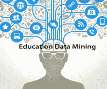
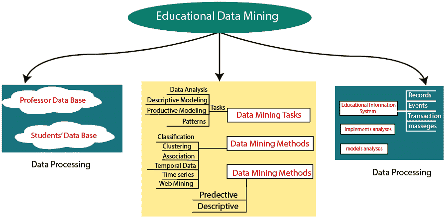
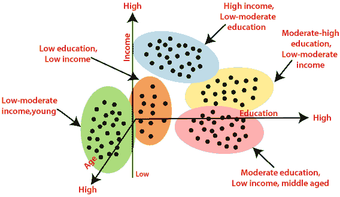
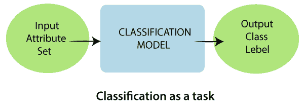
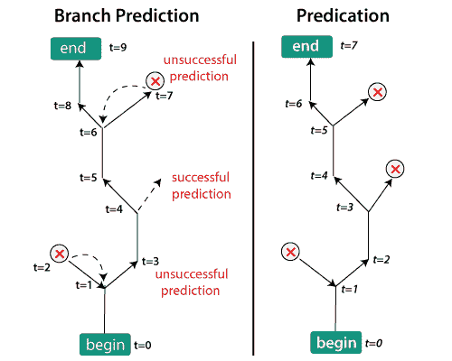

# 教育数据挖掘

> 原文：<https://www.javatpoint.com/educational-data-mining>

目前，数据挖掘领域正在进行各种研究。教育数据挖掘是一个重要的研究领域。它使用多种算法来提高教育结果，并解释教育程序，以便进一步决策。

在这里，我们将讨论一些应用于教育相关领域的数据挖掘算法。这些算法用于从教育数据中挖掘知识，并研究能够增加性能的属性。学习最初始于课堂，基于行为、心理和建设性模型。行为模型依赖于学生行为中可观察到的变化来确定学习结果。心理模型建立在教师有效参与学习过程的基础上。在建构模型中，学生需要从各种可用的资源中学习。

**根据西门子**的说法，学习不再是一种内部的、孤立的活动。它被视为一个节点网络中的演示，可以改善学生的学习体验，减少教授立即加入的要求。传统的学习环境已经逐渐转变为基于社区的学习环境。

## 什么是教育数据挖掘？

EDM stands for Educational Data Mining. It can be defined as the technique for finding the specific types of data that come from the education system and implementing those techniques to understand students and the system better. EDM is the process of transforming raw data obtained from educational systems into useful data that can be used to make data-driven decisions. The development of data mining and analytics in the education field was relatively late as compared to other fields. However, it is challenging for educational data mining via the web because of its specific features on data. While numerous types of data have sequential aspects, the distribution of educational information over time has extraordinary attributes.

教育数据挖掘技术卓有成效，创造了一系列关于在线平台上学生学习的现象，并不断提高准确性。为了证明教育数据的非凡进步，有许多重要的方面需要研究，教育数据正在发展一种认识，即并非所有的关键数据都存储在一个数据流中。

教育研究带来了一些新的教育改进。基于计算机的创新改变了我们的生活和学习方式。如今，通过这些进步收集的信息的利用正在支持所有领域的第二轮转型和取得各种成就的学习。数据挖掘是最强大的技术，具有难以置信的潜力，可以帮助学校和大学关注他们收集的关于学生行为和潜在学习者的数据集中最重要的信息。

数据挖掘利用其工具在庞大的数据集中发现以前未知的模式和关系。这些工具可以结合统计模型、数学算法和机器学习技术。这些技术能够在数据中找到查询和报告无法有效揭示的信息。

## 教育数据的数据挖掘方法；

数据挖掘是计算机科学的一个分支，旨在发现不同的因素和模式来帮助决策。下图中的模型旨在设计教育数据挖掘。数据挖掘可以鼓励机构记忆。数据挖掘，也称为 KDD(数据库中的知识发现)，指的是“挖掘”或从庞大的数据集中提取有知识的数据。教育系统通常有一个巨大的教育数据库。这些数据可能包括教师数据、账户数据、学生数据、校友数据等。教育数据挖掘侧重于探索源自教育背景的特殊类型数据的开发技术。这些数据来源于各种渠道，包括来自传统面对面课堂环境、在线课件、教育软件等的数据。

数据挖掘方法用于对庞大的数据集进行操作，以发现隐藏的模式和关系，这有助于许多组织做出数据驱动的决策。聚类、分类、回归、神经网络、人工智能、关联规则、遗传算法、决策树等各种技术和算法。用于从数据库中发现知识。

### 聚类:

聚类是指将对象识别和分类成不同组的过程，将一个数据集分割成子集(聚类)，使每个子集中的数据共享相似类别对象的一些共同特征。

### 分类:

分类是指描述数据关系和表达未来观察值的过程。分类是学习一个目标函数的任务，该目标函数将每个属性集 A 映射到预定义的类级别 b 之一。有各种分类技术，即基于决策树的方法、基于记忆的推理、基于规则的方法、朴素贝叶斯和贝叶斯信念网络、神经网络。在分类中，测试数据用于估计分类规则的确定性。如果确定性是可接受的，则规则可以应用于新的数据元组。分类器训练算法利用这些预先分类的例子来确定正确识别所需的参数排列。

### 预测:

回归技术可以适用于预测。它可以用来证明一个或多个自变量和因变量之间的联系。在数据挖掘中，自变量是已经知道的属性，响应因子是我们需要预测的。不幸的是，许多日常现实问题并不容易预测。因此，更先进的技术，如逻辑回归、神经网络和决策树，可能对预测未来值很重要。

## 未来的教育数据挖掘；

被称为教育数据挖掘的新兴流行领域关注创建策略，以发现源自教育环境的有用数据。数据挖掘是一个极其广阔的领域，它采用各种技术和算法来寻找模式。

* * *