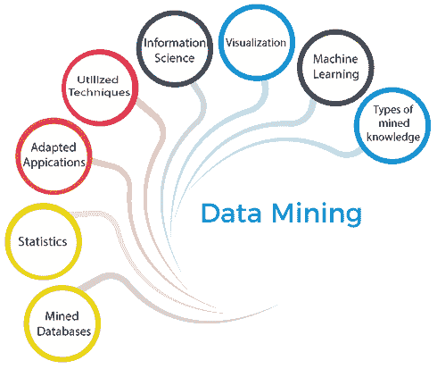
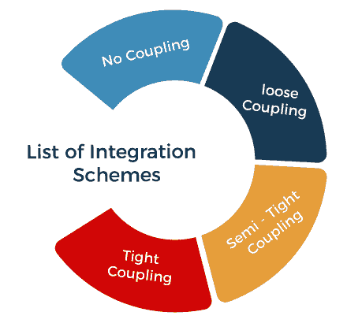

# 数据挖掘系统的分类

> 原文：<https://www.javatpoint.com/classification-of-data-mining-systems>

数据挖掘是指从原始数据中提取重要数据的过程。它在几个软件的帮助下分析大量数据中的数据模式。自从数据挖掘发展以来，它就被研究和开发领域的研究者所采用。

借助[数据挖掘](https://www.javatpoint.com/data-mining)，发现商家获得更多利润。它不仅有助于了解客户需求，而且有助于制定有效的战略来加强整体业务周转。它有助于确定业务目标，以便做出明确的决策。

数据收集和数据仓库以及计算机处理是数据挖掘最强有力的支柱。数据挖掘利用数学算法的概念来分割数据并评估未来事件发生的可能性。

为了了解系统并满足所需的要求，数据挖掘可以分为以下几个系统:

*   基于挖掘数据库的分类
*   基于挖掘知识类型的分类
*   基于统计的分类
*   基于机器学习的分类
*   基于可视化的分类
*   基于信息科学的分类
*   基于所用技术的分类
*   基于适用应用的分类

## 基于挖掘数据库的分类

数据挖掘系统可以根据已挖掘的数据库类型进行分类。数据库系统可以根据不同的原则进一步细分，例如数据模型、数据类型等。这进一步有助于对数据挖掘系统进行分类。

例如，如果我们想根据数据模型对数据库进行分类，我们需要选择关系型、事务型、对象关系型或数据仓库挖掘系统。

## 基于知识挖掘类型的分类

基于知识思维类型分类的数据挖掘系统可能具有以下功能:

1.  特性描述
2.  歧视
3.  关联和相关分析
4.  分类
5.  预报
6.  异常值分析
7.  进化分析

## 基于所用技术的分类

数据挖掘系统也可以根据所采用的技术类型进行分类。这些技术可以基于所涉及的用户交互的参与或所采用的分析方法来评估。

## 基于适应的应用的分类

基于适应的应用分类的数据挖掘系统如下:

1.  金融
2.  电信
3.  脱氧核糖核酸
4.  股票市场
5.  电子邮件

## 分类任务示例

以下是分类任务的一些主要示例:

*   分类有助于确定肿瘤细胞是良性还是恶性。
*   将信用卡交易分类为欺诈或合法。
*   蛋白质二级结构分类为α-螺旋、β-折叠或随机卷曲。
*   将新闻故事分为不同的类别，如金融、天气、娱乐、体育等。

## 数据库与数据仓库系统的集成方案

**无耦合**

在无耦合模式中，数据挖掘系统不使用任何数据库或数据仓库系统功能。

**松耦合**

在松散耦合中，数据挖掘利用了一些数据库或数据仓库系统功能。它主要从这些系统管理的数据仓库中获取数据，然后进行数据挖掘。结果保存在文件或数据库或数据仓库中的任何指定位置。

**半紧密耦合**

在半紧密耦合中，数据挖掘链接到数据库或数据仓库系统，并在数据库中提供数据挖掘原语的有效实现。

**紧耦合**

数据挖掘系统可以轻松地与数据库或数据仓库系统紧密耦合。

* * *