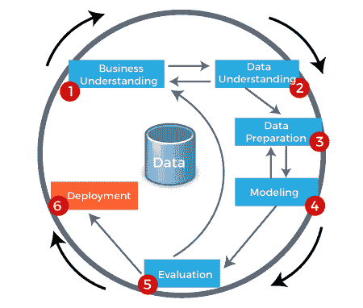
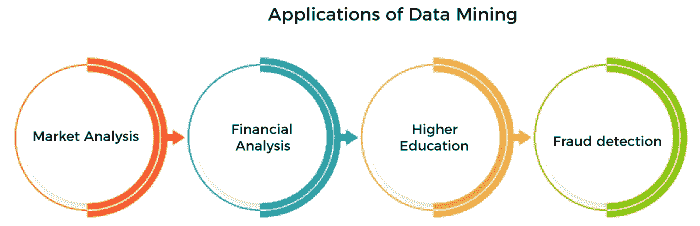
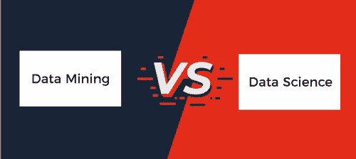

# 数据挖掘和数据科学的区别

> 原文：<https://www.javatpoint.com/data-mining-vs-data-science>

数据挖掘是一个从大型数据库中提取有用的信息、模式和趋势的过程，这些信息、模式和趋势超出了样本分析的范围，并且提供了可用于解决业务问题的相关和可用的信息。相比之下，数据科学被定义为通过使用各种工具和技术从结构化和非结构化数据中获得有价值见解的过程。阅读给定的文章，了解数据挖掘和数据科学之间的区别。

## 什么是数据挖掘？

[数据挖掘](https://www.javatpoint.com/data-mining)是从原始数据中提取有用信息、模式和趋势的过程。数据挖掘使用复杂的数学算法来划分数据和评估未来事件的概率。数据挖掘过程中有不同类型的服务，如文本挖掘、网页挖掘、音频、视频挖掘、图片数据挖掘和社交网络数据挖掘。数据挖掘是通过简单或先进的软件完成的。数据挖掘被称为数据中的知识发现(KDD)。

这些是数据挖掘过程中涉及的给定步骤

**业务理解:**

突出地说，主要方面是理解目标和工作。介绍了业务目标，发现了有助于实现目标的重要因素。

**数据理解:**

在这一步中进行数据收集，所有收集的数据都累积在工具中(如果您正在使用任何工具)。然后，列出数据及其源数据、位置和实现方式，如果出现任何问题，将可视化数据并要求检查其完整性。

**数据准备:**

数据准备包括选择有用的数据，清理数据，从数据中构造属性，以及从多个数据库中集成数据。

**建模:**

建模包括选择数据挖掘技术，例如决策树归纳、生成用于评估所选模型的测试设计、从数据集创建模型，以及与专家一起评估所创建的模型以了解结果。

**评估:**

顾名思义，评估决定了最终模型满足业务需求的程度。这是通过基于实际应用测试模型来完成的。

**部署:**

在这个阶段，制定部署计划，形成维护和监控数据挖掘模型结果检查有用性的策略。

### 数据挖掘的应用

**市场分析:**

市场分析提供了广泛的数据来帮助您规划营销策略。虽然与市场规模相关的数据可能会让你决定市场是否适合投资，但你也需要知道市场是如何运作的。

**财务分析:**

银行和金融系统依赖于高质量、准确的数据。在贷款部门，与财务和用户相关的数据可以用于多种目的，例如计算信用评级。

**高等教育:**

随着全球范围内对高等教育需求的增加，各机构正在寻找多种解决方案来满足不断增长的需求。机构使用数据挖掘来分析哪些学生将注册特定的项目，哪些学生需要更多的帮助。

**欺诈检测:**

事实证明，用于检测欺诈活动的机制非常耗时。引入数据挖掘后，欺诈检测变得更加容易。数据挖掘使识别模式变得更加容易，并有助于采取措施确保用户信息的隐私。

## 什么是数据科学？

[数据科学](https://www.javatpoint.com/data-science)结合数据的技术、算法开发、数据干扰等几个方面，对数据进行研究、分析，找到解决难题的创新方案。数据科学就是要分析数据，并通过寻找创新的方法来推动业务增长。

换句话说，我们有很多数据，但我们无法从中找到任何见解。理解和分析数据以做出更好决策的需求催生了数据科学。

### 数据科学的应用

**医疗保健:**

数据科学在各个领域的应用正在迅猛发展。医疗保健是数据科学逐渐转变的主要领域之一，

**互联网搜索:**

许多搜索引擎，如雅虎、谷歌和必应，使用数据科学算法在一秒钟内为我们的搜索查询提供最佳输出。

**欺诈和风险检测:**

数据科学赋予大数据创造性、科学性和调查性的思维。这些数据是从各个部门和平台随机抽取的，如电话、电子邮件、社交媒体平台等的调查。

**图像识别:**

在这个数字时代，数据科学工具已经开始利用数据库中的所有图片来识别人脸。

## 数据科学和数据挖掘的区别

| 数据挖掘 | 数据科学 |
| 数据挖掘是从庞大的数据库中提取有用信息、模式和趋势的过程。 | 数据科学是指通过使用各种工具和方法从结构化和非结构化数据中获得有价值见解的过程。 |
| 数据挖掘是一种技术。 | 数据科学是一个领域。 |
| 主要用于商业目的。 | 主要用于科学目的。 |
| 它与这个过程有关。 | 它强调数据的科学性。 |
| 数据挖掘旨在使数据更加重要和可用；这意味着只提取有用的信息。 | 数据科学的目标是创造一个占主导地位的数据产品。 |
| 数据挖掘是 KDD(数据库过程中的知识发现)的一部分。 | 它与机械工程、云架构等研究领域相关。 |
| 它主要处理结构化数据。 | 它处理任何类型的数据，如结构化、半结构化和非结构化数据。 |

* * *