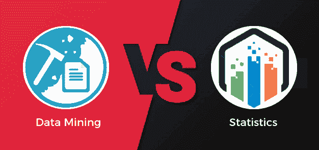

# 数据挖掘与统计的区别

> 原文：<https://www.javatpoint.com/data-mining-vs-statistics>

分析过去和现在的数据都是为了预测未来的问题。许多组织使用数据挖掘和统计来做出数据驱动的决策，这是数据科学的主要部分。数据挖掘和统计这两个术语听起来很相似，但实际上是不同的，因此有点令人困惑。统计是数据挖掘的主要部分，包括数据分析的整个过程。在本文中，我们将讨论什么是数据挖掘、统计以及数据挖掘和统计之间的区别。

## 什么是数据挖掘？

[数据挖掘](https://www.javatpoint.com/data-mining)是从庞大的数据集中提取有用的信息、模式和趋势，并利用它们做出数据驱动的决策的过程。数据挖掘包括各种过程，如网络挖掘、文本挖掘和社交媒体挖掘。数据挖掘可以通过简单或复杂的软件来完成。数据挖掘被称为数据中的知识发现(KDD)。

## 数据挖掘的过程

数据挖掘过程分为五类

**信息采集:**

从庞大的数据集中识别信息，并将其更新到分散的数据仓库。

**存储和管理数据**:

此步骤将数据存储在分布式存储、内部服务器或云中(例如 Azure)。

**建模:**

建模涉及业务团队；主题专家将访问数据，在数据中应用采样和传输，并移除所有不相关和不完整的数据。

**部署模式:**

在这个阶段，制定一个部署计划来帮助管理数据挖掘模型。

**可视化数据**:

在这个阶段，以不同的格式呈现数据，以便最终用户能够容易地理解。例如，图形、图表、模型、决策树格式等。

## 什么是统计？

统计是指对数值数据的分析和表示，这是所有数据挖掘算法的主要部分。它提供了处理大量数据的工具和分析技术。统计包括规划、设计、收集信息、分析和报告研究结果。由于这些统计不仅仅局限于数学，而是一个商业分析师也用统计来解决商业问题。

## 数据挖掘和统计学的区别

| 数据挖掘 | 统计数字 |
| 数据挖掘是从庞大的数据集中提取有用的信息、模式和趋势，并利用它们做出数据驱动的决策的过程。 | 统计是指对数值数据的分析和表示，是所有数据挖掘算法的主要部分。 |
| 数据挖掘中使用的数据是数字或非数字的。 | 统计中使用的数据仅为数字。 |
| 在数据挖掘中，数据收集并不更重要。 | 在统计学中，数据收集更为重要。 |
| 数据挖掘的类型有聚类、分类、关联、神经网络、基于序列的分析、可视化等。 | 统计的类型有描述性统计和推断性统计。 |
| 它适用于庞大的数据集。 | 它适用于较小的数据集。 |
| 数据挖掘是一个归纳过程。它意味着从数据中产生新的理论。 | 统计学是演绎的过程。它不沉溺于做任何预测。 |
| 数据清理是数据挖掘的一部分。 | 在统计学中，干净的数据被用来实现统计方法。 |
| 它需要较少的用户交互来验证模型，因此很容易自动化。 | 它需要用户交互来验证模型，因此它是复杂的自动化。 |
| 数据挖掘应用包括金融数据分析、零售业、电信业、生物数据分析、某些科学应用等。 | 统计学的应用包括生物统计学、质量控制、人口学、运筹学等。 |

* * *