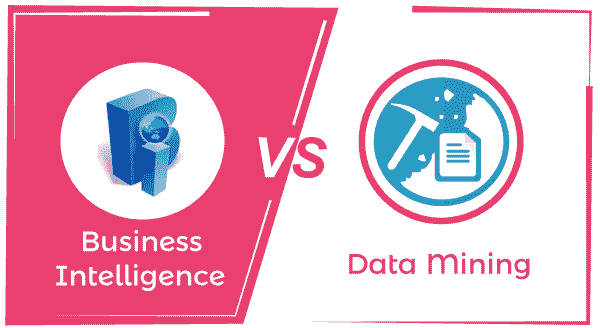

# 商业智能和数据挖掘的区别

> 原文：<https://www.javatpoint.com/business-intelligence-vs-data-mining>

商业智能(BI)指的是将数据转化为可操作信息的技术驱动过程。组织有大量来自其客户端的数据流。所有关于客户喜好、之前购买、搜索引擎查询、社交媒体平台(脸书、Instagram、Snapchat 等)的信息。)是了解顾客下一步会买什么的线索。数据挖掘这个术语本身解释了它的含义，它是对重要信息、模式和趋势的挖掘。数据挖掘有助于从庞大的数据集中提取重要数据。任何公司都有大量数据。在你把原始数据转换成有用的信息之前，它是没有用的。在开始区分商业智能和数据挖掘之前，让我们分别理解这两个术语。阅读给定的文章，了解商业智能和数据挖掘之间的基本区别。

## 什么是商业智能？

商业智能是许多组织用来更好地了解客户群和市场的最强大的工具之一。它描述了将原始数据转化为有助于决策的有用信息的业务方法。

商业智能的好处

商业智能有着广泛的应用，如果谈论商业智能在零售领域的优势，如今商业智能工具使组织能够利用数据的优势，不仅假设当前的销售额，而且估计未来的潜力、模式、趋势，并在更深层次上了解客户的需求。

### 商业智能技术

这些是给定的商业智能技术

**数据分析可视化:**

数据分析可视化是关于你如何可视化你的数据。它在仪表板上显示数据，并利用与业务相关的定制指标根据事实做出更好的决策。

**报告:**

商业智能工具用于报告从所有来源收集的信息，并对其进行处理，以便用理性的思维进行更好的报告和财务决策。

**预测分析:**

预测分析是关于你如何知道一个策略会起作用？事实是你不知道，如果你知道，也不是百分之百。然而，通过商业智能，您可以创建一个基于证据的决策来进一步推动业务。商业智能使您能够合理预测影响组织整体发展的最新趋势和客户行为。

## 什么是数据挖掘？

数据挖掘是指从庞大的数据集中发现有趣的趋势、模式和知识的过程。数据源可以包括数据仓库、网络、数据库、原始数据和另一个动态流入系统的信息库。

为什么企业需要数据提取？

随着大数据等新技术的出现，数据挖掘变得越来越多。大数据是指在计算机的帮助下可以分析的一组庞大的数据，以揭示人类能够理解的某些趋势、模式和有用信息。

因此，带有人工干预的简单统计无法处理这些数据集，因此数据挖掘技术满足了这一要求。它将简单的数据统计转变为复杂的数据挖掘算法。

数据挖掘技术从原始数据(如视频、照片、文件)中提取有用的信息，以开发对任何组织的决策都有用的报告。

### 数据挖掘过程

数据挖掘过程涉及以下步骤:

1.  商业理解
2.  数据理解
3.  数据准备
4.  建模
5.  估价
6.  部署

### 数据挖掘工具

在这个数字时代，大量的数据在几秒钟内就产生了。为了管理这些数据，我们应该对各种工具和技术有所了解。数据挖掘工具是指一组用于分析数据和数据集之间其他关系的方法。

这些是一些有助于我们分析数据的数据挖掘工具。

*   柑橘
*   快速采矿机
*   新西兰黑秧鸡
*   Sisense
*   SSDT 先生

## 商业智能和数据挖掘的区别

| 商业智能 | 数据挖掘 |
| 商业智能(BI)指的是将数据转化为可操作信息的技术驱动过程。组织有大量来自其客户端的数据流。 | 数据挖掘这个术语本身解释了它的含义，它是对重要信息、模式和趋势的挖掘。 |
| 数据驱动的决策有助于组织的决策目的。 | 它找到了企业问题的答案。 |
| 它有一个在关系数据库上处理的大型数据集。 | 它有小数据集，只处理一小部分数据。 |
| 它通过带有关键绩效指标的图表来表示仪表板和报告上的结果 | 它将问题的解决方案标识为仪表板或报告中的关键绩效指标之一。 |
| 它依赖于小规模的过往数据，并没有涉及到情报；企业管理层必须根据这些信息做出决定。 | 它专注于小规模数据业务管理中的一个特定问题，使用各种算法来确定解决方案。 |
| 解决方案的质量是体积的，并使用数据可视化呈现精确的解决方案。 | 它使用算法来识别问题的准确模式，并识别盲点。 |
| 它显示价格价值、总成本、利润等。 | 它确定了为商业智能创建新的关键绩效指标问题的解决方案。 |

* * *