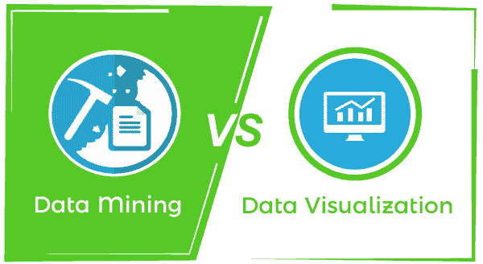

# 数据挖掘与数据可视化的区别

> 原文：<https://www.javatpoint.com/data-mining-vs-data-visualization>

数据挖掘就是从原始数据中寻找有用的信息、模式和趋势。数据挖掘用于大型数据库中的模式识别和关联，以使用各种数据挖掘技术进行预测。在数据挖掘中，提取的数据被许多公司用来改善客户关系、产生收入、降低风险等。相比之下，数据可视化是以图形、图表或任何其他视觉表示形式来表示数据。在开始区分数据挖掘和数据分析之前，让我们分别了解这两个领域。

## 什么是数据挖掘？

数据挖掘是从庞大的数据集中提取潜在重要信息、模式和数据的过程。数据挖掘不是收集数据；它是关于在你已经收集的原始数据中寻找关系。因此，主要目的是确定收集数据的知识发现。

### 数据挖掘的应用

数据挖掘有着广泛的应用。这是一种几乎可以应用于所有领域的技术。让我们探索数据挖掘的一些重要应用，如营销、情感分析和欺诈检测。

**营销:**

营销中数据挖掘的主要目标是帮助营销团队了解访问特定网站的目标受众(初学者和有经验者)。它使他们能够收集关于每个单独群体的知识，并通过定制的促销活动分别针对他们。考虑一个大型集市的例子。它针对每个客户，根据客户的购买行为提供各种折扣。

**情绪分析:**

情感分析基于文本挖掘。它是数据挖掘最常见的研究领域之一。它试图抓住人们的思维过程，并从中获得他们的感受。

**欺诈检测:**

一般来说，我们看到银行和金融机构通过追踪客户的交易来发现欺诈活动。当金融机构发现任何可疑交易时，该交易将被标记并暂停以供查询。在这里，数据挖掘在检测甚至防止欺诈交易方面发挥着至关重要的作用。

### 数据挖掘技术

数据挖掘有四种最重要的技术

*   寻找模式
*   分类
*   联合
*   预报

### 数据挖掘的优势

以下是数据挖掘最重要的优势:

1.  它支持决策。
2.  它帮助公司预测未来。
3.  它帮助组织在他们的数据中发现趋势和模式。
4.  它通过交叉销售和目标定位帮助组织增加收入。

## 什么是数据可视化？

数据可视化是指借助综合图表、图像、列表、图表和其他可视对象对数据进行可视化表示。它使用户能够在很短的时间内轻松理解信息，并提取有用的信息、模式和趋势。此外，它使信息易于理解。

换句话说，我们可以说，以图形形式表示数据，使用户能够容易地理解数据趋势的过程，称为数据可视化。数据可视化涉及到很多工具，如图表地图、图形等。用于数据可视化的工具帮助用户轻松理解和收集可视化表示提供的数据，而不是浏览整个数据表。

### 数据可视化的重要性？

数据可视化以可视化的形式表示数据。它很重要，因为它使信息更容易被看到。机器学习技术在进行有助于数据可视化的预测分析中发挥着重要作用。数据可视化不仅对业务分析师、数据分析师和数据科学家有帮助，而且在任何职业中理解数据可视化都起着至关重要的作用。无论我们在设计、运营、技术、营销、销售还是任何其他领域工作，我们都需要可视化数据。

数据可视化有着广泛的用途。数据可视化的一些重要好处如下。

*   发现错误和异常值
*   了解整个流程
*   快速掌握数据
*   探索商业见解
*   快速行动。

### 数据可视化图表的类型？

有各种工具可以帮助数据可视化过程。有些是自动的，有些是手动的，但是在这些工具的帮助下，你可以实现任何类型的可视化。

**折线图** : A 型折线图插图随时间变化。X 轴代表周期，y 轴代表数量。

**条形图**:条形图的插图也随着时间而变化。在一个以上变量的情况下，条形图可以更简单地区分每个变量在每个时刻的数据。

**饼图**:饼图是我们用来说明代数(百分比)的最佳选择之一，因为它把每个对象都描绘成一个整体的一部分。因此，如果你的数据解释了百分比误差，饼图将有助于以适当的比例呈现各个部分。

## 数据挖掘与数据可视化的区别

| 数据挖掘 | 数据可视化 |
| 数据挖掘是从原始数据中提取有用信息、模式和趋势的过程。 | 数据可视化是指借助综合图表、图像、列表、图表和其他可视对象对数据进行可视化表示。 |
| 它属于数据科学。 | 它属于数据科学领域。 |
| 在数据挖掘中，存在许多算法。 | 不需要使用任何算法。 |
| 它由网络软件系统操作。 | 它支持并更好地工作于预先数据分析。 |
| 它有着广泛的应用，主要是网络搜索引擎的首选。 | 它是数据预测和预测的首选。 |
| 这是新技术，但不发达。 | 它在实时数据预测中更有用。 |
| 它可以在任何支持 web 的平台上工作，也可以与任何应用程序一起工作。 | 无论硬件和软件如何，它都提供了可视化表示。 |

* * *