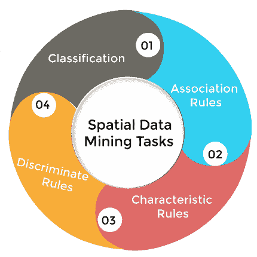
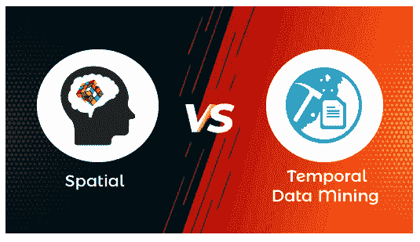

# 时空数据挖掘的区别

> 原文：<https://www.javatpoint.com/spatial-vs-temporal-data-mining>

空间数据挖掘是指提取没有专门存储在空间数据库中的知识、空间关系和有趣模式的过程；另一方面，时态数据挖掘指的是提取关于事件发生的知识的过程，无论它们是遵循的、随机的、循环的、季节变化的等等。空间意味着空间，而时间意味着时间。在本文中，我们将分别学习空间和时间数据挖掘；之后，我们将讨论它们之间的区别。

## 什么是空间数据挖掘？

空间数据的出现和空间数据库的广泛使用导致了空间知识的发现。空间数据挖掘可以理解为从空间数据库中确定一些令人兴奋的、假设有价值的模式的过程。

有几种工具可以帮助从地理空间数据中提取信息。这些工具对于像美国国家航空航天局、国家图像和制图局(NIMA)、国家癌症研究所(NCI)和美国运输部(美国运输部)这样倾向于基于大型空间数据集做出重大决策的组织来说发挥着至关重要的作用。

早些时候，使用了一些通用数据挖掘，如克莱曼婷 See5/C5.0 和 Enterprise Miner。这些工具被用来分析大型商业数据库，这些工具主要是为了了解数据库中所有客户的购买模式而设计的。

此外，通用工具最好用于分析科学和工程数据、天文数据、多媒体数据、基因组数据和网络数据。

这些是给定的地理数据的特定特征，这些特征阻止了通用数据挖掘算法的使用，这些特征是:

1.  变量之间的空间关系，
2.  误差的空间结构
3.  非独立的观察
4.  特征间的空间自相关
5.  特征空间中的非线性交互。

空间数据必须具有纬度或经度、UTM 东距或北距，或者表示空间中某个点位置的其他坐标。除此之外，空间数据可以包含与某个地方相关的任意数量的属性。你可以选择你想要描述一个地方的属性类型。政府网站通过提供空间数据来提供资源，但你不必局限于它们所产生的内容。你可以自己生产。

比方说，你想记录过去一周你去过的每个地方的信息。这可能有助于洞察你的日常习惯。您可以获取目的地的坐标，并列出许多属性，如地名、访问目的、访问持续时间等。然后，您可以使用这些信息在量子地理信息系统或类似软件中创建一个形状文件，并使用该软件来查询和可视化数据。例如，您可以生成最常去的地方的热图，或者选择离家 8 英里范围内您去过的所有地方。

如果任何数据可以链接到一个位置，它就可以成为空间数据，甚至可以将时空数据链接到空间和时间中的位置。例如，当在灾难发生后对推特的推文进行地理定位时，可能会生成一个动画，显示推文从事件中心的传播。

### 空间数据挖掘任务

这些是空间数据挖掘的主要任务。

**分类:**

分类确定一组规则，这些规则根据指定对象的属性来查找其类别。

**关联规则:**

关联规则从数据集中确定规则，它描述通常在数据库中的模式。

**特征规则:**

特征规则描述了数据集的某些部分。

**判别规则:**

顾名思义，歧视规则描述了数据库两个部分之间的差异，例如根据就业率计算两个城市之间的差异。

## 什么是时态数据挖掘？

时态数据挖掘是指从庞大的时态数据集中提取非平凡的、隐含的和潜在的重要数据的过程。时态数据是主要数据类型的序列，通常是数值，它处理从时态数据中收集有用的知识。

随着存储数据的增加，在过去十年中，人们对查找隐藏数据的兴趣已经破灭。隐藏数据的发现主要集中在数据分类、关系发现和数据聚类上。发现过程中的主要缺点是处理具有时间依赖性的数据。与此类数据集中的时态数据相关的属性必须与其他类型的属性区别对待。因此，大多数数据挖掘技术将时态数据视为无序的事件集合，而忽略其时态数据。

### 时态数据挖掘任务

*   数据表征和比较
*   聚类分析
*   分类
*   关联规则
*   预测和趋势分析
*   模式分析

## 空间和时间数据挖掘的区别

| 空间数据挖掘 | 时态数据挖掘 |
| 空间数据挖掘是指提取没有专门存储在空间数据库中的知识、空间关系和感兴趣的模式。 | 时间数据挖掘指的是提取关于事件发生的知识的过程，无论它们是随后的、随机的、周期性的、季节性的变化等 |
| 它需要空间。 | 这需要时间。 |
| 它主要处理空间数据，如位置、地理参考。 | 首先，它处理隐式和显式的时间内容，形成一个庞大的数据集。 |
| 它包括特征规则、判别规则、评价规则和关联规则。 | 它的目标是挖掘新的模式和未知的知识，这需要数据的时间方面。 |
| 例子:寻找热点，不寻常的位置。 | 例子:一个看似“买摩托车的人也买头盔”的关联规则。从时间的角度来看，这条规则是——“任何买摩托车的人在那之后都会买头盔。” |

* * *