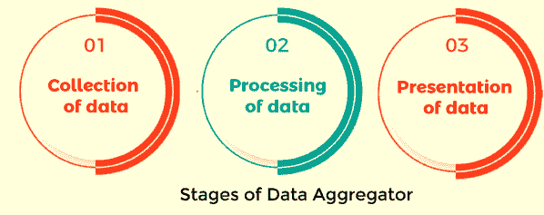
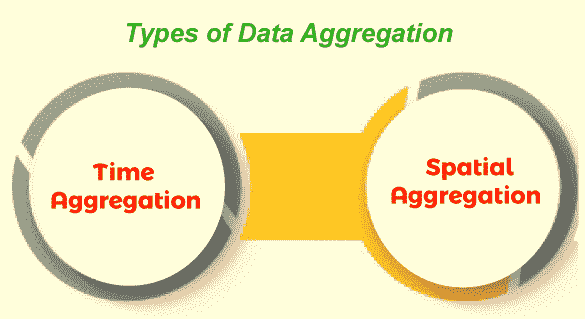

# 数据挖掘中的聚合

> 原文：<https://www.javatpoint.com/aggregation-in-data-mining>

数据聚合是指从不同来源收集信息并以汇总格式呈现信息的过程，以便业务分析师可以对业务方案进行统计分析。所收集的信息可以从各种数据源中收集，以将这些数据源汇总成用于数据分析的草稿。这一步是任何商业组织采取的主要步骤，因为数据分析的准确性主要取决于他们使用的数据质量。大量收集高质量的内容是非常必要的，这样他们才能创造相关的成果。数据聚合在任何商业组织的财务、产品、运营和营销策略中起着至关重要的作用。聚合数据存在于数据仓库中，可以解决各种问题，这有助于解决数据集的查询。

在本文中，我们将讨论数据挖掘中的聚合、它们的过程、它的应用以及一些例子。

### 数据聚合是如何工作的？

如果数据集包含无法用于分析的无用信息，则需要进行数据聚合。在数据聚合中，数据集被总结为重要的信息，这有助于获得理想的结果并增加用户体验。数据聚合提供了精确的度量，如总和、平均值和计数。收集的汇总数据有助于业务分析师对客户及其行为进行人口统计研究。汇总数据有助于确定特定组提交报告后的重要信息。借助数据聚合，我们还可以计算非数字数据的计数。通常，数据聚合是针对数据集进行的，而不是针对单个数据。

### 数据聚合示例

组织通常收集他们的在线客户和网站访问者的信息。这里，数据汇总涉及客户人口统计和行为矩阵的统计，例如客户的不同年龄组和交易总数。营销团队进行数据汇总，这有助于他们在用户与品牌的数字体验中个性化消息传递、优惠等。它还帮助任何组织的产品管理团队知道哪些产品产生更多的收入，哪些没有。财务和公司高管也使用汇总数据，这有助于他们选择如何为营销或产品开发战略分配预算。

它有助于确定购买特定产品的客户的平均年龄，这有助于业务管理团队找到该特定产品的目标年龄组。在数据汇总中通常更喜欢计算客户的平均年龄，而不是单个客户。

计算一个国家或州的投票率。它是通过计算特定地区候选人的总票数来实现的，而不是计算选民的个人记录。

### 数据聚合器

数据聚合器是指在数据挖掘中使用的系统，用于从各种来源收集数据，然后对数据进行处理，并将其提取为有用的信息，形成草稿。作为代理，他们在增强客户数据方面发挥着至关重要的作用。在客户请求特定产品的数据实例时，它也有助于查询和交付过程。营销团队进行数据汇总，这有助于他们在用户与品牌的数字体验中个性化消息传递、优惠等。它还帮助任何组织的产品管理团队知道哪些产品产生更多的收入，哪些没有。财务和公司高管也使用汇总数据，这有助于他们选择如何为营销或产品开发战略分配预算。

### 数据聚合器的工作

数据聚合器的工作可以分为三个阶段

*   资料收集
*   资料处理
*   数据显示

**数据采集**

顾名思义，收集数据意味着从不同的来源收集数据。可以使用物联网(IoT)提取数据，例如

*   社交媒体互动
*   新闻标题
*   像呼叫中心这样的语音识别
*   浏览个人数据和设备历史记录

**数据处理**

一旦收集到数据，数据聚合器就确定原子数据并将其聚合。在数据处理技术中，数据聚合器使用来自人工智能或最大似然技术的众多算法，并且还利用静态方法对其进行处理，如预测分析。

**数据呈现**

在这一步中，将对收集的信息进行汇总，提供具有准确数据的理想统计输出。

自动或手动数据聚合器的选择

数据聚合也可以手动应用。当有人开始时，任何一家初创公司都可以通过使用 excel 工作表和创建图表来管理绩效、营销和预算，从而选择手动聚合器。

数据聚合是一个成熟的组织，它使用中间件(通常是第三方软件)来使用各种营销工具自动实现数据。但是在大型数据集的情况下，需要一个数据聚合系统，因为它提供了准确的结果。

### 数据聚合的类型

数据聚合可以分为两种不同的类型

1.  时间聚合
2.  空间聚集

**时间聚合**

时间聚合为单个资源提供了定义的时间段内的数据点。

**空间聚合**

空间聚合为定义的时间段内的各种资源组提供数据点。

### 数据聚合过程的时间间隔

**报告期**

报告期是指为报告收集信息的时期。它可以是数据点聚合过程，也可以是原始数据。例如，在一天的指定时间内，从网络设备收集信息并将其处理成摘要格式。因此，报告期为一天。

**轮询周期**

轮询周期是指对资源进行数据采样的频率。例如，如果资源组可以每 5 分钟轮询一次，这意味着每 5 分钟将生成每个资源的数据点。轮询和粒度属于空间聚合。

**粒度**

粒度是指为聚合而收集信息的时期。例如，计算在 6 分钟内收集的特定资源的数据点总和。因此，粒度将是 6 分钟。粒度的值可以根据报告时间从分钟到月不等，它在粒度中起着至关重要的作用。

### 数据聚合的应用

这些是数据聚合的一些重要应用

**金融和投资领域的数据汇总**

金融和投资部门的建议大多基于替代数据。其中很大一部分数据来自新闻，因为投资者必须随时了解最新的金融和工业趋势。因此，金融机构可以使用数据聚合来收集标题和相关新闻，并将这些数据用于预测分析。与工业和金融部门相关的市场信息可以在新闻网站上免费获得，但它分布在多个网站上。手动从每个网站收集数据相当困难，并且由于数据缺失，可能会给出不可靠的数据集。

**零售行业的数据聚合**

数据聚合在零售和电子商务行业中发挥着至关重要的作用，例如竞争性价格监控。竞争性价格监控是营销人员在电子商务和零售领域取得成功的有用工具。组织需要知道他们面对的是什么。因此，他们更倾向于收集竞争对手的产品、促销和价格信息。与竞争对手网站相关的数据是从其产品所在的其他网站中提取的。必须从每个相关来源汇总数据，才能在竞争网站上获得正确的信息。

**旅游行业的数据聚合**

数据聚合在旅游行业有着巨大的应用，包括竞争性价格监控、获取市场洞察、客户行为分析，以及在其在线旅游网站上捕获服务的图像和描述。旅游行业需要关注每一个变化的旅游成本和财产可用性。他们还必须关注热门目的地，并以诱人的报价锁定目标受众。与旅游业相关的数据分布在互联网上的多个地方；手动收集数据是一项相当艰巨的任务。这里，数据提取和聚合服务进来了。

* * *