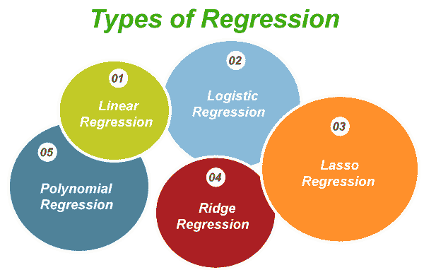
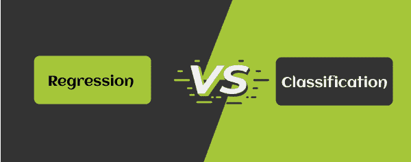

# 数据挖掘中的回归

> 原文：<https://www.javatpoint.com/regression-in-data-mining>

回归是指一种数据挖掘技术，用于预测给定数据集中的数值。例如，回归可以用来预测产品或服务成本或其他变量。它还用于各种行业的商业和营销行为、趋势分析和财务预测。在本教程中，我们将了解回归的概念，回归的类型和一些例子。

## 什么是回归？

回归是指一种有监督的机器学习技术，用于预测任何连续值属性。回归帮助任何商业组织分析目标变量和预测变量之间的关系。它是分析可用于财务预测和时间序列建模的数据的最重要的工具。

回归涉及在大量数据点上拟合直线或曲线的技术。它以这样一种方式发生，即数据点和 cure 之间的距离最小。

最流行的回归类型是线性回归和逻辑回归。除此之外，许多其他类型的回归可以根据它们在单个数据集上的表现来执行。

回归可以预测所有的因变量数据集，用自变量的表达式表示，趋势在一个有限的时期内是可用的。回归提供了一个预测变量的好方法，但是有一些限制和假设，比如变量的独立性，变量的固有正态分布。例如，假设考虑两个变量，A 和 B，它们的联合分布是二元分布，那么本质上。在这种情况下，这两个变量可能是独立的，但它们也是相关的。需要推导和使用 A 和 B 的边际分布。在应用回归分析之前，需要仔细研究数据，并执行某些初步测试，以确保回归适用。在这种情况下，可以进行非参数测试。

### 回归的类型

回归分为五种不同的类型

1.  线性回归
2.  逻辑回归
3.  套索回归
4.  里脊回归
5.  多项式回归

### 线性回归

线性回归是利用直线在目标变量和一个或多个独立变量之间形成关系的回归类型。给定的方程代表线性回归方程

Y = a + b*X + e。

哪里，

a 代表截距

b 代表回归线的斜率

e 代表误差

x 和 Y 分别代表预测变量和目标变量。

如果 X 由多个变量组成，称为多重线性方程。

在线性回归中，最佳拟合线是利用最小二乘法得到的，它使每个数据点到回归线的偏差平方和最小。这里，正偏差和负偏差不会被消除，因为所有偏差都是平方的。

### 多项式回归

如果回归方程中自变量的幂大于 1，则称之为多项式方程。借助下面给出的例子，我们将理解多项式回归的概念。

Y = a + b * x 2

在特定的回归中，最佳拟合线不像线性方程那样被认为是直线；然而，它代表一条适合所有数据点的曲线。

当你试图通过使曲线更复杂来最小化误差时，应用线性回归技术会导致过度拟合。因此，总是试图通过概括问题来拟合曲线。

### 逻辑回归

当因变量本质上是二元的，即 0 和 1，真或假，成功或失败时，逻辑回归技术就出现了。这里，目标值(Y)的范围从 0 到 1，它主要用于基于分类的问题。与线性回归不同，它不需要任何自变量和因变量来建立线性关系。

### 里脊回归

Ride 回归是指用于分析存在多重共线性问题的各种回归数据的过程。多重共线性是两个独立变量之间存在线性相关性。

当最小二乘估计是具有高方差的最小偏差时，岭回归存在，因此它们与真实值有很大不同。然而，通过给估计的回归值增加一定程度的偏差，通过应用岭回归来减少误差。

### 套索回归

术语 LASSO 代表最小绝对收缩和选择算子。套索回归是一种利用收缩的线性回归。在套索回归中，所有数据点都向一个中心点收缩，也称为平均值。套索过程最适合参数比其他回归少的简单稀疏模型。这种类型的回归非常适合遭受多重共线性的模型。

## 回归的应用

回归是一种非常流行的技术，在商业和工业中有着广泛的应用。回归过程包括预测变量和响应变量。回归的主要应用如下。

*   环境建模
*   分析业务和营销行为
*   财务预测或预测
*   分析新的趋势和模式。

## 数据挖掘中回归与分类的区别

回归和分类非常相似。分类和回归是数据挖掘中两个重要的预测问题。如果您已经给出了输入和输出的训练集，并学习了一个将两者联系起来的函数，那么有希望使您能够在给定新数据输入的情况下预测输出。唯一的区别是，在分类中，输出是离散的，而在回归中，输出不是离散的。但是这些概念是模糊的，就像“逻辑回归”一样，它可以被解释为分类或回归方法。因此，用户很难理解何时使用分类和回归。

## 数据挖掘中回归与分类的区别

| 回归 | 分类 |
| 回归是指一种有监督的机器学习技术，用于预测任何连续值属性。 | 分类是指根据实例的属性将预定义的类标签分配给实例的过程。 |
| 在回归中，预测数据的性质是有序的。 | 在分类中，预测数据的性质是无序的。 |
| 回归可以进一步分为线性回归和非线性回归。 | 分类分为两类:二元分类器和多类分类器。 |
| 在回归过程中，计算基本上是利用均方根误差完成的。 | 在分类过程中，计算基本上是通过测量效率来完成的。 |
| 回归的例子有回归树、线性回归等。 | 分类的例子是决策树。 |

回归分析通常使我们能够比较在许多尺度上测量的各种特征变量的效果。例如基于位置、总面积、周围环境等的土地价格预测。这些结果有助于市场研究人员或数据分析师移除无用的特征，并评估最佳特征以计算有效模型。

* * *