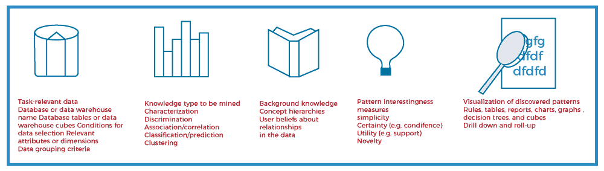

# 数据挖掘任务原语

> 原文：<https://www.javatpoint.com/data-mining-task-primitives>

数据挖掘任务可以以数据挖掘查询的形式指定，该查询被输入到数据挖掘系统。数据挖掘查询是根据数据挖掘任务原语定义的。这些原语允许用户在发现期间与数据挖掘系统交互通信，以指导挖掘过程或从不同角度或深度检查发现。数据挖掘原语指定了以下内容，

1.  要挖掘的一组任务相关数据。
2.  有待挖掘的知识。
3.  发现过程中使用的背景知识。
4.  模式评估的兴趣度和阈值。
5.  用于可视化已发现模式的表示。

可以设计一种数据挖掘查询语言来合并这些原语，允许用户灵活地与数据挖掘系统交互。拥有数据挖掘查询语言为构建用户友好的图形界面提供了基础。

设计一种全面的数据挖掘语言是具有挑战性的，因为数据挖掘涵盖了广泛的任务，从数据表征到进化分析。每个任务都有不同的要求。设计有效的数据挖掘查询语言需要深入了解各种数据挖掘任务的能力、局限性和底层机制。这有助于数据挖掘系统与其他信息系统的通信，并与整个信息处理环境集成。

## 数据挖掘任务原语列表

数据挖掘查询是根据以下原语定义的，例如:

**1。待挖掘的任务相关数据集**

这指定了用户感兴趣的数据库部分或数据集。这包括感兴趣的数据库属性或数据仓库维度(相关属性或维度)。

在关系数据库中，与任务相关的数据集可以通过关系查询来收集，包括选择、投影、连接和聚合等操作。

数据收集过程产生一个新的数据关系，称为 ***初始数据关系*** 。可以根据查询中指定的条件对初始数据关系进行排序或分组。这种数据检索可以看作是数据挖掘任务的一个子任务。

这个初始关系可能对应也可能不对应数据库中的物理关系。由于虚拟关系在数据库领域被称为视图，因此用于数据挖掘的任务相关数据集被称为可挖掘视图。

**2。要挖掘的知识种类**

这指定了要执行的数据挖掘功能，例如表征、区分、关联或相关分析、分类、预测、聚类、异常值分析或进化分析。

**3。发现过程中使用的背景知识**

关于要挖掘的领域的知识对于指导知识发现过程和评估发现的模式是有用的。概念层次是背景知识的一种流行形式，它允许在多个抽象层次上挖掘数据。

概念层次结构定义了从低级概念到更高级、更一般概念的映射序列。

*   **向上滚动-数据的一般化:**允许以更有意义和明确的抽象方式查看数据，并使其更容易理解。它压缩数据，并且需要更少的输入/输出操作。
*   **向下钻取-数据的特殊化:**概念值被较低级别的概念取代。基于不同的用户观点，给定的属性或维度可能有多个概念层次。

属性(或维度)年龄的概念层次结构示例如下所示。关于数据中关系的用户信念是背景知识的另一种形式。

**4。模式评估的兴趣度和阈值**

不同种类的知识可能有不同的有趣的衡量标准。它们可以用来指导挖掘过程，或者在发现之后，用来评估发现的模式。例如，关联规则的有趣度量包括支持度和置信度。支持度和置信度值低于用户指定阈值的规则被认为是无趣的。

*   **简单性:**有助于模式趣味性的一个因素是模式对于人类理解的整体简单性。例如，一个规则的结构越复杂，解释起来就越困难，因此就越没有意思。模式简单性的客观度量可以被视为模式结构的函数，根据模式的比特大小或模式中出现的属性或运算符的数量来定义。
*   **确定性(置信度):**每个发现的模式都应该有一个与之相关的确定性度量，用于评估模式的有效性或“可信度”。形式为“A = > B”的关联规则的确定性度量是置信度，其中 A 和 B 是项目集。信心是一种确定性的衡量标准。给定一组任务相关数据元组，“A = > B”的置信度定义为
    置信度(A= > B) = #包含 A 和 B 的元组/#包含 A 的元组
*   **效用(支持):**模式的潜在效用是定义其兴趣的一个因素。它可以通过效用函数来估计，例如支持。关联模式的支持指模式为真的任务相关数据元组(或事务)的百分比。
    效用(支持):模式的效用
    支持(A= > B) = #包含 A 和 B 的元组/元组总数
*   **新颖性:**新颖模式是那些为给定模式集贡献新信息或提高性能的模式。例如- >一个数据异常。检测新颖性的另一个策略是去除冗余模式。

**5。可视化发现模式的预期表示**

这是指显示发现的模式的形式，可能包括规则、表格、交叉标签、图表、图形、决策树、立方体或其他视觉表示。

用户必须能够指定用于显示发现的模式的呈现形式。某些表示形式可能比其他表示形式更适合特定类型的知识。

例如，广义关系及其对应的交叉标签或饼图/条形图有利于呈现特征描述，而决策树则常用于分类。

## 数据挖掘任务原语示例

假设，作为 ***【阿里电子】*** 的营销经理，您希望根据客户的购买模式对其进行分类。你特别感兴趣的是那些工资不低于 40，000 美元，购买价值超过 1，000 美元的商品，每件价格不低于 100 美元的顾客。

特别是，您对客户的年龄、收入、购买的物品类型、购买地点以及物品的产地感兴趣。您希望以规则的形式查看结果分类。这个数据挖掘查询在 DMQL3 中表示如下，其中已经列举了查询的每一行来帮助我们的讨论。

1.  使用数据库等位电子数据库
2.  使用层次结构位置层次结构代表 t 分支，年龄层次结构代表 c 年龄
3.  矿山分类为有前途的客户
4.  与年龄、收入、收入类型、地点、分支相关
5.  来自客户 C，一个项目 I，交易 T
6.  其中 I.item_ID = T.item_ID 和 C.cust_ID = T.cust_ID 和 c .收入≥ 4 万，I .价格≥ 100
7.  按客户标识分组

* * *