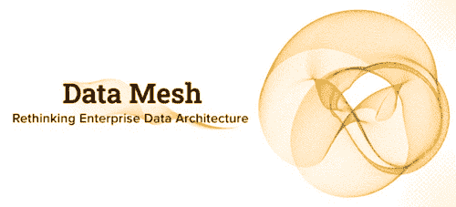
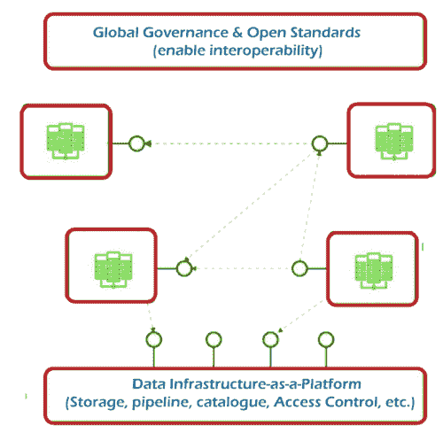
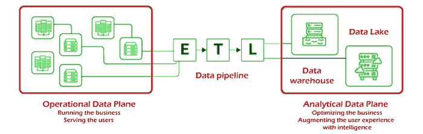

# 数据网格-重新思考企业数据架构

> 原文：<https://www.javatpoint.com/data-mesh-rethinking-enterprise-data-architecture>

在这个自助商业智能统治着这个领域的世界时代，每个企业都试图将自己确立为一个信息驱动的企业。许多企业都意识到通过杠杆作用做出明智决策所带来的诸多好处。最吸引人的是能够为客户提供卓越的、高度个性化的服务，同时降低成本和资本。

然而，企业在过渡到数据驱动型战略并充分利用其潜力方面仍然面临各种挑战。虽然转移遗留系统和避免遗留文化以及在不断变化的业务需求中优先管理数据都是合理的挑战，但数据平台的体系结构也是一大障碍。

孤立的数据仓库和数据湖体系结构在支持瞬时数据流的能力上是有限的。反过来，它们破坏了组织的可伸缩性和民主化目标。然而，数据网格——一种革命性的、新的架构范例，已经引起了相当大的轰动——可能有助于为您的数据相关目标提供一个为您的数据注入新生命的机会。

让我们仔细看看数据网格的细节，以及它如何改变我们对大数据管理的看法。

## 什么是数据网格？

数据网格本质上是指将孤岛和数据湖分解成更小、分散的部分。类似于软件开发中从单片软件到基于微服务的体系结构的过渡。数据网格可以描述为以数据为中心的微服务形式。

该术语最初是在 20 世纪 90 年代末由 ThoughtWorks 顾问 Zhamak Dehghani 定义的，是一种数据平台结构，旨在通过利用自助式结构化、面向领域的结构来利用企业数据的包罗万象的特性。

作为架构和组织中的一个创新理念，数据网格挑战了大数据需要集中化以最大化其分析潜力的普遍信念。如果不是所有数据都存储在一个位置并集中管理以最大限度地发挥其全部价值。数据网格与这种老式的观念有 180 度的偏差，它声称大数据只有被分发给域所有者，然后由域所有者提供数据作为产品，才能成为新技术发展的催化剂。

为了实现这一点，需要通过自动化流程采用新版本的联邦治理，以促进面向领域的产品之间的互操作性。信息使用的民主化是数据网格思想发展的主要基础。数据网格是静止的，如果没有分散化、互操作性和优先考虑用户体验，它就无法实现。

作为一个架构概念，数据网格通过提供对不断增长和快速增长的多样化领域集的访问，在实现大规模分析方面拥有巨大的潜力。尤其是在机器学习、分析或以数据为中心的应用程序的开发和部署等消费增加的场景中。

本质上，数据网格寻求解决传统平台的弱点，这些弱点导致了中央数据湖或数据仓库的发展。与将数据的消耗、存储和处理限制在单个数据湖的单一数据处理基础架构相比，数据网格支持将数据分发到特定的域。数据即产品的方法允许不同领域的人员自行管理各自领域的数据处理管道。

连接这些域的组织，以及与之相关的数据资产，提供了一个互操作性层，确保数据的格式和标准一致。不同的数据袋通过网格连接在一起。因此这个术语。

### 数据网格试图解决的问题:

如前所述，传统数据结构的局限性已被证明是企业努力充分利用现有数据以在改进业务实践和流程方面取得切实收益的一个重要障碍。主要的挑战是将大量数据转化为明智且可操作的信息。

数据网格通过解决传统大数据管理方法中的以下明显缺陷来解决这些问题:

*   **单片平台跟不上:**
    像湖泊和仓库这样的单片数据平台往往没有从海量数据中提取重要见解所需的数据源范围和特定领域的结构。最终，特定领域的重要信息会在集中式系统中丢失。这阻碍了数据分析师在数据点之间建立实时相关性并生成反映运营现实的精确分析的能力。
*   **数据管道制造瓶颈:**
    在他们当前的模型中，由于数据处理过程处理、转换和交付的分离，数据管道导致拥塞。不同的部门处理不同的数据功能集，没有任何协作。数据从一个部门传递到另一个部门，不可能进行有意义的集成或转换。
*   **跨目的工作的数据专家:**
    高度专业化的数据工程师、消费者和资源所有者通常以共生的方式工作，因为他们从完全不同的角度工作。这往往会成为反生产力的温床。这种缺乏有效性的主要原因是无法知道如何以允许建立与业务基础相关的相关性的方式来映射分析。

## 数据网格的三个关键组成部分

数据网格数据网格需要不同的元素才能无缝工作——面向领域的数据基础设施、数据源和管道。这些组件中的每一个对于确保互操作性、可观察性和管理以及确保数据网格设计中的领域中立标准都是必不可少的。

以下元素在帮助数据网格满足这些标准方面发挥着重要作用:

*   **面向域的数据所有者和管道:**
    数据网格将不同域所有者之间的数据所有权结合起来，负责将他们拥有的数据作为服务进行销售，并实现数据传播的各个位置之间的通信。虽然每个域都负责拥有和管理其提取-转换-加载(ETL)管道，但一组功能被应用于不同的域，以促进原始数据的存储、编目和访问。在数据被交付给特定的域并进行转换之后，域所有者能够利用数据来满足他们的操作或分析需求。
*   **自助服务功能:**
    与特定于领域的数据管理方法相关的一个主要问题是在每个领域内维护管道和基础设施的工作重复。为了解决这个问题，数据网格从位于中心的域中立数据基础架构中提取和收集功能，数据管道的基础架构可以从该数据基础架构中获得。此外，每个领域利用管理 ETL 管道所需的元素，这允许必要的自主性和支持。这种自助服务功能允许域所有者专注于数据的特定用例。
*   **通信的互操作性和标准化:**
    每个域都由一组对所有域通用的数据标准支持，这些标准有助于在任何情况下提供协作方式。这是至关重要的，因为同一组原始数据和转换后的数据可能会为许多不同的领域提供价值。数据属性的标准化，如治理、可发现性和形成。元数据规范允许跨域协作。

## 数据网格的四大核心原则和逻辑架构

数据网格是基于四个核心原则的范例。每种方法都是直观设计的，旨在解决传统集中式大数据管理和数据分析方法带来的众多挑战。这是对这些基本原则所指内容的回顾:

### 1.面向领域的分散数据所有权和体系结构:

该项目的核心是，数据网格寻求将数据分发的责任分散给与其密切合作的人员，希望能够实现可扩展性和任何修改的持续执行。数据的分解和分散是通过重塑数据生态系统来实现的，数据生态系统包括元数据、分析数据和底层计算。因为现在大多数公司根据他们工作的领域进行分散，数据的分解是在同一条线上进行的。这是一种将变化和进化的结果相对于特定领域的有限环境进行本地化的方法。这就是为什么为数据所有权分配创建最佳系统非常重要。

### 2.数据即产品:

单一数据结构的最大问题之一是识别、信任和解释使用高质量数据的重要性的巨大成本和困难。考虑到数据域数量的增加，如果从一开始就没有解决这个问题，那么数据网格可能会加剧这个问题。数据即产品的原则被视为解决旧数据孤岛及其数据质量问题的可行解决方案。在这个模型中，分析数据被视为一种产品，利用这些数据的人被认为是客户。利用可访问性、可理解性、安全性和可信赖性等功能对于将数据作为一个项目来使用至关重要。因此，它是数据网格实现的一个基本元素。

### 3.自助式数据基础架构作为平台:

将数据作为一个产品来建立、部署、监控、访问和管理，需要庞大的基础架构和适当的技能来提供。为使用数据网格方法创建的每个域复制这些资源是不可行的。此外，多个域可以访问相同的数据集合。为了防止工作和资源的重复，必须对基础设施进行高级抽象。这就是数据作为平台的自助基础设施变得相关的地方。它是运营和监控各种服务所需的当前交付平台的扩展。自助服务数据平台包括能够支持知识和专业技能很少的领域开发人员的工作流的工具。然而，它必须能够降低创建数据产品的成本。

### 4.联合计算治理:

数据网格需要一个独立的、由独立专家团队设计和开发的分布式系统。为了从这种架构中获得最大的好处，不同产品之间的互操作性是必不可少的。联邦计算治理模型恰恰提供了这一点。当数据域和平台产品所有者在一组全球定义的规则内工作时，他们的关联被赋予做出决策的权力。这导致了一个健康的互操作性生态系统。

## 为什么要使用数据网格？

到目前为止，大多数公司都受益于单一数据湖或数据仓库，作为更大数据基础架构的一部分，以满足他们对商业智能的需求。这些解决方案由一小群专家实施、管理和维护，他们通常不得不处理大量的技术债务。这导致数据团队难以跟上不断增长的业务需求、数据生产者和数据用户之间的差距以及对数据用户日益增长的怨恨。

像数据网格这样的分散结构融合了两个世界的优点——中央数据库和分散的数据域，以及独立的管道，提供了一个高效和可持续的替代方案。

数据网格数据网格能够通过在数据管理方面促进更大的自由度和独立性来消除数据湖的所有缺陷。这为数据和创造力的实验打开了更多的机会，因为数据管理的负担从少数专家手中被拿走了。

同样，自助服务平台为数据标准化以及数据共享和收集提供了更通用和自动化的方法。

最后，数据网格的优势数据网格无疑转化为相对于传统数据结构的竞争优势。

## 网状还是不网状——哪个是我们的正确选择？

鉴于这些众多优势，组织应该考虑利用数据网格。面向大数据管理的数据网格架构。然而，这对你来说是最好的选择吗？

一种简单的方法，可以根据数据质量、数据域数量、数据团队、规模以及数据工程和治理方法中存在的瓶颈来确定数据网格分数。

得分越高，数据基础设施就越复杂，因此对数据网格的要求也就越高。

## 结论

技术相关的兼容性是任何公司在采用和实施基于数据网格的数据管理方法时需要考虑的最重要的方面之一。为了有效地完全接受数据网格体系结构，公司必须重组数据平台，重新思考域所有者的角色，彻底改革他们的结构，以便使数据产品的所有权成为可能，并过渡到将其数据分析视为一个项目。

* * *