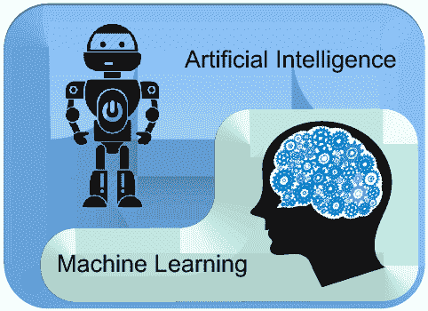

# 人工智能和机器学习的区别

> 原文：<https://www.javatpoint.com/difference-between-artificial-intelligence-and-machine-learning>

人工智能和机器学习是计算机科学中相互关联的部分。这两种技术是用于创建智能系统的最流行的技术。

虽然这是两个相关的技术，有时人们把它们当作彼此的同义词，但在各种情况下，两者仍然是两个不同的术语。

从广义上讲，我们可以将人工智能和人工智能区分为:

> *AI 是一个更大的概念，用来创建能够模拟人类思维能力和行为的智能机器，而机器学习是 AI 的一个应用或子集，它允许机器从数据中学习，而无需明确编程。*

下面是人工智能和机器学习之间的一些主要区别，以及人工智能和机器学习的概述。

* * *

## 人工智能

人工智能是计算机科学的一个领域，它制造一个可以模仿人类智能的计算机系统。它由两个词组成“**人工**”和“**智能**，意思是“一种人造的思维能力。”因此我们可以把它定义为，

> *人工智能是一种技术，利用它我们可以创建能够模拟人类智能的智能系统。*

人工智能系统不需要预先编程，相反，他们使用这样的算法，这些算法可以与他们自己的智能一起工作。它涉及机器学习算法，如强化学习算法和深度学习神经网络。AI 正在 Siri、谷歌等多个地方使用？s AlphaGo、下棋中的 AI 等。

基于能力，人工智能可以分为三种类型:

*   **弱 AI**
*   **通用 AI**
*   **强 AI**

目前，我们正在与弱人工智能和通用人工智能合作。人工智能的未来是强人工智能，为此据说它将比人类更智能。

* * *

## 机器学习

机器学习是从数据中提取知识。它可以被定义为，

> *机器学习是人工智能的一个子领域，它使机器能够从过去的数据或经验中学习，而无需明确编程。*

机器学习使计算机系统能够使用历史数据进行预测或做出一些决策，而无需明确编程。机器学习使用大量结构化和半结构化数据，因此机器学习模型可以根据这些数据生成准确的结果或给出预测。

机器学习是基于它所学习的算法？使用历史数据。它只适用于特定的领域，例如，如果我们正在创建一个机器学习模型来检测狗的图片，它只会给出狗图像的结果，但是如果我们提供一个像猫图像这样的新数据，那么它将变得没有响应。机器学习被广泛应用于在线推荐系统、谷歌搜索算法、垃圾邮件过滤、脸书汽车好友标记建议等。

它可以分为三种类型:

*   **监督学习**
*   **强化学习**
*   **无监督学习**

* * *

## 人工智能和机器学习的主要区别:

| 人工智能 | 机器学习 |
| 人工智能是一种使机器能够模拟人类行为的技术。 | 机器学习是人工智能的一个子集，它允许机器自动从过去的数据中学习，而无需显式编程。 |
| AI 的目标是制造一个像人类一样的智能计算机系统来解决复杂的问题。 | ML 的目标是允许机器从数据中学习，以便它们能够给出准确的输出。 |
| 在人工智能中，我们制造智能系统来像人类一样执行任何任务。 | 在 ML 中，我们用数据教机器执行特定的任务，并给出准确的结果。 |
| 机器学习和深度学习是人工智能的两个主要子集。 | 深度学习是机器学习的一个主要子集。 |
| 人工智能的范围非常广泛。 | 机器学习的范围有限。 |
| 人工智能正在努力创建一个能够执行各种复杂任务的智能系统。 | 机器学习致力于创造只能执行那些他们被训练的特定任务的机器。 |
| AI 系统关心的是最大化成功的机会。 | 机器学习主要关注准确性和模式。 |
| AI 的主要应用有 **Siri、使用猫船的客户支持**、专家系统、在线游戏玩法、智能仿人机器人等。 | 机器学习的主要应用有**在线推荐系统**、**谷歌搜索算法**、**脸书汽车好友标注建议**等。 |
| 基于能力，AI 可以分为三种类型，分别是，**弱 AI** 、**通用 AI** 、**强 AI** 。 | 机器学习也可以主要分为三种类型，分别是**监督学习**、**非监督学习**和**强化学习**。 |
| 它包括学习、推理和自我纠正。 | 当引入新数据时，它包括学习和自我纠正。 |
| 人工智能完全处理结构化、半结构化和非结构化数据。 | 机器学习处理结构化和半结构化数据。 |

* * *