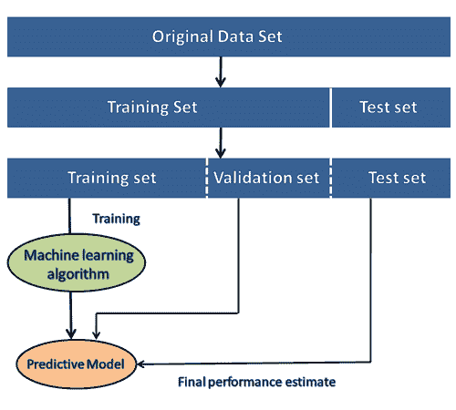
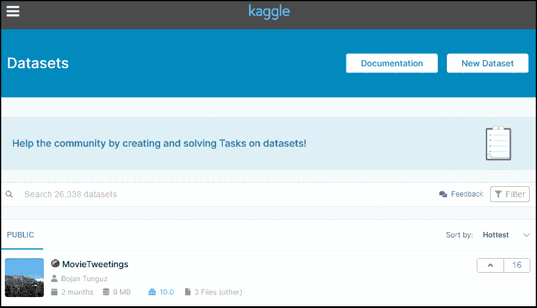
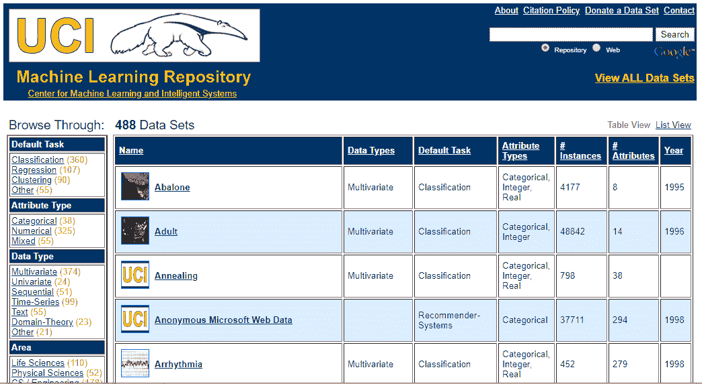
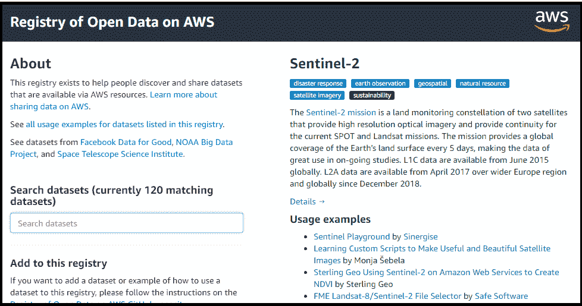
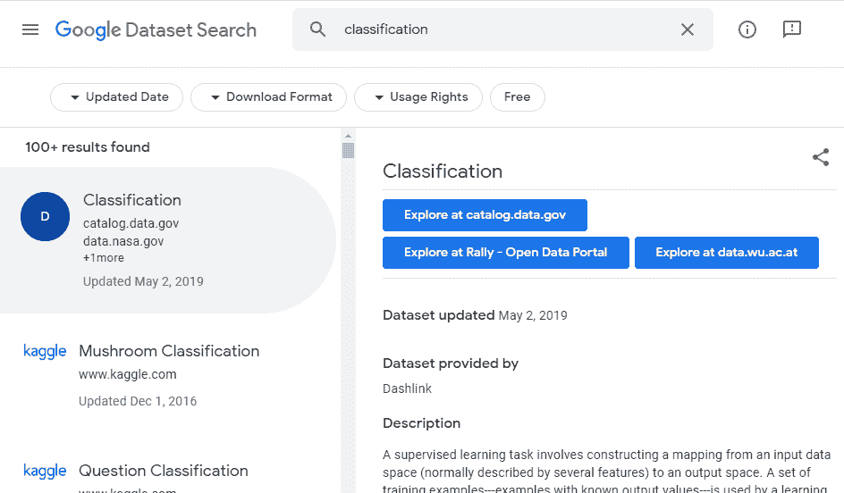
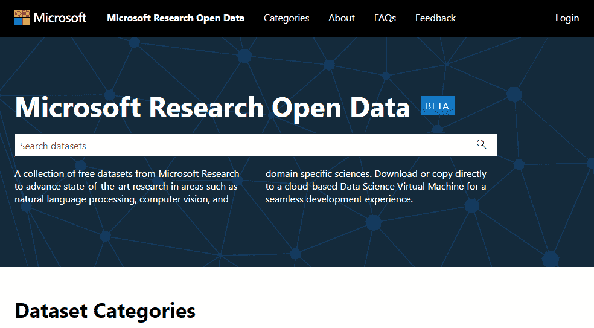
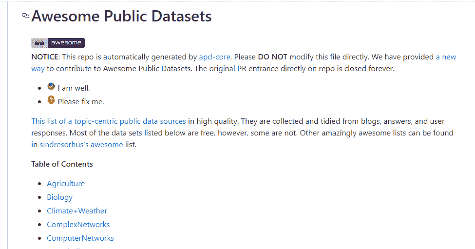
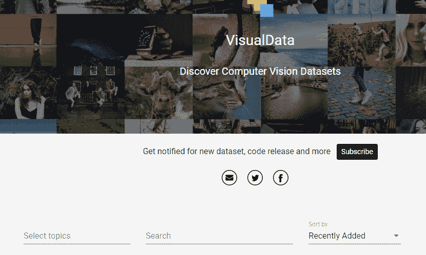
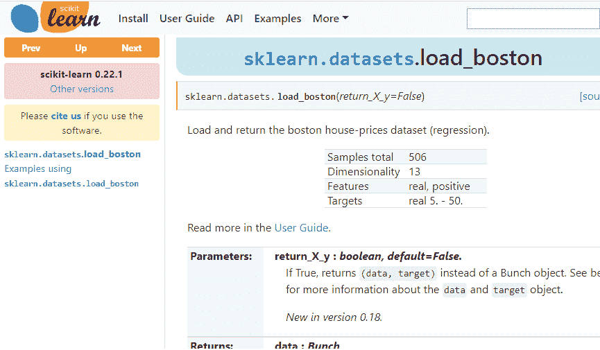

# 如何获取机器学习数据集

> 原文：<https://www.javatpoint.com/how-to-get-datasets-for-machine-learning>

在机器学习领域取得成功或成为伟大的数据科学家的关键是使用不同类型的数据集进行实践。但是为每种机器学习项目找到合适的数据集是一项困难的任务。因此，在本主题中，我们将提供源的详细信息，您可以根据您的项目从这些源轻松获取数据集。

在了解机器学习数据集的来源之前，让我们讨论数据集。

## 什么是数据集？

**数据集**是数据按一定顺序排列的数据集合。数据集可以包含从一系列数组到数据库表的任何数据。下表显示了数据集的示例:

| 国家 | 年龄 | 薪水 | 购买 |
| 印度 | Thirty-eight | Forty-eight thousand | 不 |
| 法国 | Forty-three | Forty-five thousand | 是 |
| 德国 | Thirty | Fifty-four thousand | 不 |
| 法国 | Forty-eight | Sixty-five thousand | 不 |
| 德国 | Forty |  | 是 |
| 印度 | Thirty-five | Fifty-eight thousand | 是 |

表格数据集可以理解为数据库表或矩阵，其中每一列对应一个**特定变量**，每一行对应数据集的**字段。**表格数据集最受支持的文件类型是**“逗号分隔文件”**或 **CSV。**但是为了存储“树状数据”，我们可以更有效地使用 JSON 文件。

## 数据集中的数据类型

*   **数值数据:**如房价、温度等。
*   **分类数据:**如是/否、真/假、蓝/绿等。
*   **序数数据:**这些数据类似于分类数据，但可以在比较的基础上进行测量。

#### 注意:真实世界的数据集非常大，在初始阶段很难管理和处理。因此，为了实践机器学习算法，我们可以使用任何虚拟数据集。

## 数据集的需求

要使用机器学习项目，我们需要大量的数据，因为没有数据，就无法训练 ML/AI 模型。收集和准备数据集是创建 ML/AI 项目时最关键的部分之一。

如果数据集准备和预处理不充分，任何 ML 项目背后应用的技术都无法正常工作。

在 ML 项目的开发过程中，开发人员完全依赖数据集。在构建 ML 应用程序时，数据集分为两部分:

*   **训练数据集:**
*   **测试数据集**

#### 注意:数据集很大，因此要下载这些数据集，您的计算机上必须有快速互联网。

## 机器学习数据集的流行来源

以下是可供公众自由使用的数据集列表:

### 1.kaggledataset

Kaggle 是为数据科学家和机器学习者提供数据集的最佳来源之一。它允许用户以简单的方式查找、下载和发布数据集。它还提供了与其他机器学习工程师合作并解决困难的数据科学相关任务的机会。

Kaggle 提供了不同格式的高质量数据集，我们可以轻松找到并下载。

卡格尔数据集的链接是[https://www.kaggle.com/datasets](https://www.kaggle.com/datasets)。

### 2.UCI 机器学习知识库

UCI 机器学习知识库是机器学习数据集的巨大来源之一。这个存储库包含数据库、领域理论和数据生成器，它们被机器学习社区广泛用于 ML 算法的分析。

自 1987 年以来，它已被学生、教授、研究人员广泛用作机器学习数据集的主要来源。

它根据机器学习的问题和任务对数据集进行分类，如**回归、分类、聚类等。**它还包含一些流行的数据集，如**虹膜数据集、汽车评估数据集、扑克手数据集等。**

UCI 机器学习资源库的链接是[https://archive.ics.uci.edu/ml/index.php](https://archive.ics.uci.edu/ml/index.php)。

### 3.通过 AWS 的数据集

我们可以搜索、下载、访问和共享通过 AWS 资源公开提供的数据集。这些数据集可以通过 AWS 资源访问，但由不同的政府组织、研究机构、企业或个人提供和维护。

任何人都可以通过 AWS 资源使用共享数据来分析和构建各种服务。云上的共享数据集有助于用户将更多时间花在数据分析上，而不是数据获取上。

该来源为各种类型的数据集提供了使用数据集的示例和方法。它还提供了搜索框，我们可以使用它来搜索所需的数据集。任何人都可以将任何数据集或示例添加到 AWS 上的**开放数据注册表中。**

资源的链接是[https://registry.opendata.aws/](https://registry.opendata.aws/)。

### 4.谷歌的数据集搜索引擎

**谷歌数据集搜索引擎**是由**谷歌**于**2018 年 9 月 5 日推出的搜索引擎。**该来源帮助研究人员获得可免费使用的在线数据集。

谷歌数据集搜索引擎的链接是[https://toolbox.google.com/datasetsearch](https://toolbox.google.com/datasetsearch)。

### 5.微软数据集

微软已经推出了**“微软研究开放数据”**存储库，收集了各个领域的免费数据集，如**自然语言处理、计算机视觉和特定领域科学。**

使用此资源，我们可以下载数据集以在当前设备上使用，或者我们也可以直接在云基础架构上使用它。

从该资源下载或使用数据集的链接是[https://msropendata.com/](https://msropendata.com/)。

### 6.令人敬畏的公共数据集集合

令人敬畏的公共数据集集合提供了高质量的数据集，这些数据集根据农业、生物、气候、复杂网络等主题在列表中以组织良好的方式排列。大多数数据集都是免费的，但有些可能不是，所以最好在下载数据集之前检查许可证。

从 Awesome 公共数据集集合下载数据集的链接是[https://github.com/awesomedata/awesome-public-datasets](https://github.com/awesomedata/awesome-public-datasets)。

### 7.政府数据集

获取政府相关数据有不同的来源。不同的国家公布他们从不同部门收集的供公众使用的政府数据。

提供这些数据集的目的是增加政府工作在民众中的透明度，并以创新的方式使用数据。以下是政府数据集的一些链接:

*   [印度政府数据集](https://data.gov.in/)
*   [美国政府数据集](https://www.data.gov/)
*   [北爱尔兰公共部门数据集](https://www.opendatani.gov.uk/)
*   [欧盟开放数据门户](https://data.europa.eu/euodp/data/dataset)

### 8.计算机视觉数据集

视觉数据提供了大量特定于计算机视觉的大数据集，如图像分类、视频分类、图像分割等。因此，如果你想建立一个关于深度学习或图像处理的项目，那么你可以参考这个来源。

从该来源下载数据集的链接是[https://www.visualdata.io/](https://www.visualdata.io/)。

### 9.sci kit-学习数据集

Scikit-learn 是机器学习爱好者的绝佳资源。这个来源提供了玩具和现实世界的数据集。这些数据集可以从 sklearn.datasets 包中获取，并使用通用数据集 API。

scikit-learn 上提供的玩具数据集可以使用一些预定义的函数加载，例如， **load_boston([return_X_y])，load_iris([return_X_y])，**等，而不是从外部源导入任何文件。但是这些数据集不适合现实世界的项目。

从该来源下载数据集的链接是[https://scikit-learn.org/stable/datasets/index.html](https://scikit-learn.org/stable/datasets/index.html)。

* * *