# 机器学习中的数据预处理

> 原文：<https://www.javatpoint.com/data-preprocessing-machine-learning>

数据预处理是准备原始数据并使其适合机器学习模型的过程。这是创建机器学习模型的第一步，也是最关键的一步。

在创建机器学习项目时，我们并不总是会遇到干净的格式化数据。在对数据进行任何操作时，必须对其进行清理并以格式化的方式放入。为此，我们使用数据预处理任务。

## 为什么我们需要数据预处理？

真实世界的数据通常包含噪声、缺失值，并且可能是无法直接用于机器学习模型的不可用格式。数据预处理是清理数据并使其适用于机器学习模型的必要任务，这也提高了机器学习模型的准确性和效率。

它包括以下步骤:

*   **获取数据集**
*   **导入库**
*   **导入数据集**
*   **查找缺失数据**
*   **编码分类数据**
*   **将数据集拆分成训练和测试集**
*   **特征缩放**

* * *

## 1)获取数据集

要创建机器学习模型，我们首先需要的是数据集，因为机器学习模型完全基于数据。以适当格式为特定问题收集的数据称为**数据集**。

对于不同的目的，数据集可能是不同的格式，例如，如果我们想要为商业目的创建机器学习模型，那么数据集将与肝脏患者所需的数据集不同。所以每个数据集都不同于另一个数据集。为了在我们的代码中使用数据集，我们通常将其放入 CSV **文件**中。然而，有时，我们可能还需要使用一个 HTML 或 xlsx 文件。

### 什么是 CSV 文件？

CSV 代表“**逗号分隔值**”文件；这是一种文件格式，允许我们保存表格数据，如电子表格。它对大型数据集很有用，可以在程序中使用这些数据集。

这里我们将使用一个演示数据集进行数据预处理，为了练习，可以从这里下载，[https://www.superdatascience.com/pages/machine-learning](https://www.superdatascience.com/pages/machine-learning)。对于现实问题，我们可以从各种来源在线下载数据集，如[【https://www.kaggle.com/uciml/datasets】](https://www.kaggle.com/uciml/datasets)[【https://archive.ics.uci.edu/ml/index.php】](https://archive.ics.uci.edu/ml/index.php)等。

我们还可以通过使用 Python 的各种 API 收集数据来创建数据集，并将这些数据放入. csv 文件中。

## 2)导入库

为了使用 Python 执行数据预处理，我们需要导入一些预定义的 Python 库。这些库用于执行一些特定的工作。我们将使用三个特定的库进行数据预处理，它们是:

**Numpy:** Numpy Python 库用于在代码中包含任何类型的数学运算。它是 Python 中科学计算的基础包。它还支持添加大型多维数组和矩阵。因此，在 Python 中，我们可以将其导入为:

```

import numpy as nm

```

这里我们使用了 **nm** ，这是 Numpy 的简称，整个程序都会用到。

**Matplotlib:** 第二个库是 **matplotlib** ，是一个 Python 2D 绘图库，有了这个库，我们需要导入一个子库 **pyplot** 。该库用于在 Python 中为代码绘制任何类型的图表。它将按如下方式导入:

```

import matplotlib.pyplot as mpt

```

这里我们使用 mpt 作为这个库的简称。

**Pandas:** 最后一个库是 Pandas 库，它是最著名的 Python 库之一，用于导入和管理数据集。这是一个开源的数据操作和分析库。它将按如下方式导入:

这里，我们使用 pd 作为这个库的简称。请考虑下图:

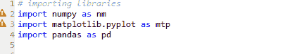

## 3)导入数据集

现在我们需要导入我们为机器学习项目收集的数据集。但是在导入数据集之前，我们需要将当前目录设置为工作目录。要在 Spyder IDE 中设置工作目录，我们需要遵循以下步骤:

1.  将 Python 文件保存在包含数据集的目录中。
2.  转到 Spyder IDE 中的文件资源管理器选项，并选择所需的目录。
3.  单击 F5 按钮或运行选项执行文件。

#### 注意:我们可以将任意目录设置为工作目录，但必须包含需要的数据集。

在下图中，我们可以看到 Python 文件以及所需的数据集。现在，当前文件夹被设置为工作目录。

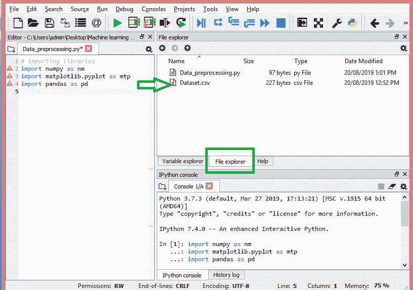

**read_csv()函数:**

现在导入数据集，我们将使用Pandas库的 <storng>read_csv()函数，该函数用于读取一个 <storng>csv</storng> 文件并对其执行各种操作。使用这个函数，我们可以在本地以及通过一个网址读取一个 csv 文件。</storng>

我们可以如下使用 read_csv 函数:

```

data_set= pd.read_csv('Dataset.csv')

```

这里， **data_set** 是存储我们数据集的变量的名称，在函数内部，我们已经传递了我们数据集的名称。一旦我们执行了上面的代码行，它将在我们的代码中成功导入数据集。我们也可以通过点击**变量浏览器**部分，然后双击**数据集**来检查导入的数据集。请看下图:

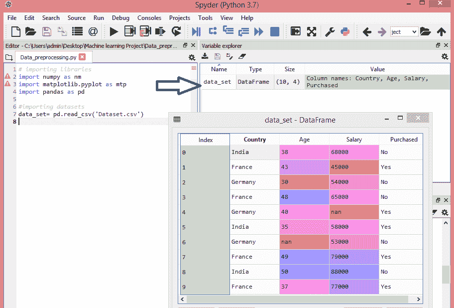

如上图所示，索引从 0 开始，这是 Python 中的默认索引。我们还可以通过单击格式选项来更改数据集的格式。

**提取因变量和自变量:**

在机器学习中，区分特征矩阵(自变量)和因变量与数据集是很重要的。在我们的数据集中，有三个自变量，分别是**国家、年龄**和**工资**，还有一个因变量是**购买的**。

**提取自变量:**

为了提取一个自变量，我们将使用Pandas库的 **iloc[ ]** 方法。它用于从数据集中提取所需的行和列。

```

x= data_set.iloc[:,:-1].values

```

在上面的代码中，第一个冒号(:)用于取所有行，第二个冒号(:)用于所有列。这里我们使用了:-1，因为我们不想取最后一列，因为它包含因变量。通过这样做，我们将得到特征矩阵。

通过执行上述代码，我们将获得如下输出:

```

[['India' 38.0 68000.0]
 ['France' 43.0 45000.0]
 ['Germany' 30.0 54000.0]
 ['France' 48.0 65000.0]
 ['Germany' 40.0 nan]
 ['India' 35.0 58000.0]
 ['Germany' nan 53000.0]
 ['France' 49.0 79000.0]
 ['India' 50.0 88000.0]
 ['France' 37.0 77000.0]]

```

正如我们在上面的输出中看到的，只有三个变量。

**提取因变量:**

为了提取因变量，我们将再次使用Pandas。iloc[]方法。

```

y= data_set.iloc[:,3].values

```

这里我们只取了最后一列的所有行。它会给出因变量的数组。

通过执行上述代码，我们将获得如下输出:

**输出:**

```
array(['No', 'Yes', 'No', 'No', 'Yes', 'Yes', 'No', 'Yes', 'No', 'Yes'],
      dtype=object)

```

#### 注意:如果你使用 Python 语言进行机器学习，那么抽取是必须的，但是对于 R 语言则不是必须的。

## 4)处理缺失数据:

数据预处理的下一步是处理数据集中丢失的数据。如果我们的数据集包含一些缺失的数据，那么它可能会给我们的机器学习模型带来巨大的问题。因此，有必要处理数据集中存在的缺失值。

**处理缺失数据的方法:**

主要有两种方法来处理丢失的数据，它们是:

**通过删除特定行:**第一种方法通常用于处理空值。这样，我们只需删除包含空值的特定行或列。但是这种方法效率不高，删除数据可能会导致信息丢失，从而无法提供准确的输出。

**通过计算平均值:**这样，我们将计算包含任何缺失值的列或行的平均值，并将它放在缺失值的位置。这种策略对于包含年龄、工资、年份等数字数据的功能非常有用。在这里，我们将使用这种方法。

为了处理丢失的值，我们将在代码中使用 **Scikit-learn** 库，该库包含用于构建机器学习模型的各种库。这里我们将使用 **sklearn .预处理**库的**估算器**类。下面是它的代码:

```

#handling missing data (Replacing missing data with the mean value)
from sklearn.preprocessing import Imputer
imputer= Imputer(missing_values ='NaN', strategy='mean', axis = 0)
#Fitting imputer object to the independent variables x. 
imputer= imputer.fit(x[:, 1:3])
#Replacing missing data with the calculated mean value
x[:, 1:3]= imputer.transform(x[:, 1:3])

```

**输出:**

```
array([['India', 38.0, 68000.0],
       ['France', 43.0, 45000.0],
       ['Germany', 30.0, 54000.0],
       ['France', 48.0, 65000.0],
       ['Germany', 40.0, 65222.22222222222],
       ['India', 35.0, 58000.0],
       ['Germany', 41.111111111111114, 53000.0],
       ['France', 49.0, 79000.0],
       ['India', 50.0, 88000.0],
       ['France', 37.0, 77000.0]], dtype=object

```

正如我们在上面的输出中看到的，丢失的值已经被替换为 rest 列值的平均值。

## 5)分类数据编码:

分类数据是具有某些类别的数据，例如，在我们的数据集中；有两个分类变量，**国家**，和**购买**。

由于机器学习模型完全基于数学和数字，但是如果我们的数据集有一个分类变量，那么它可能会在构建模型时制造麻烦。所以有必要把这些分类变量编码成数字。

**国家变量:**

首先，我们将把国家变量转换成分类数据。为此，我们将使用来自**预处理**库的**标签编码器()**类。

```

#Catgorical data
#for Country Variable
from sklearn.preprocessing import LabelEncoder
label_encoder_x= LabelEncoder()
x[:, 0]= label_encoder_x.fit_transform(x[:, 0])

```

**输出:**

```
Out[15]: 
  array([[2, 38.0, 68000.0],
            [0, 43.0, 45000.0],
         [1, 30.0, 54000.0],
         [0, 48.0, 65000.0],
         [1, 40.0, 65222.22222222222],
         [2, 35.0, 58000.0],
         [1, 41.111111111111114, 53000.0],
         [0, 49.0, 79000.0],
         [2, 50.0, 88000.0],
        [0, 37.0, 77000.0]], dtype=object)

```

**说明:**

在上面的代码中，我们已经导入了 **sklearn 库**的**标签编码器**类。这个类已经成功地将变量编码成数字。

但是在我们的例子中，有三个国家变量，正如我们在上面的输出中看到的，这些变量被编码成 0、1 和 2。通过这些值，机器学习模型可以假设这些变量之间存在某种相关性，这将产生错误的输出。所以为了消除这个问题，我们将使用**伪编码**。

**虚拟变量:**

虚拟变量是那些值为 0 或 1 的变量。值 1 表示该变量出现在特定列中，其余变量变为 0。使用虚拟编码，我们将拥有与类别数相等的列数。

在我们的数据集中，我们有 3 个类别，因此它将产生三个具有 0 和 1 值的列。对于伪编码，我们将使用**预处理**库的 **OneHotEncoder** 类。

```

#for Country Variable
from sklearn.preprocessing import LabelEncoder, OneHotEncoder
label_encoder_x= LabelEncoder()
x[:, 0]= label_encoder_x.fit_transform(x[:, 0])
#Encoding for dummy variables
onehot_encoder= OneHotEncoder(categorical_features= [0])  
x= onehot_encoder.fit_transform(x).toarray()

```

**输出:**

```
array([[0.00000000e+00, 0.00000000e+00, 1.00000000e+00, 3.80000000e+01,
        6.80000000e+04],
       [1.00000000e+00, 0.00000000e+00, 0.00000000e+00, 4.30000000e+01,
        4.50000000e+04],
       [0.00000000e+00, 1.00000000e+00, 0.00000000e+00, 3.00000000e+01,
        5.40000000e+04],
       [1.00000000e+00, 0.00000000e+00, 0.00000000e+00, 4.80000000e+01,
        6.50000000e+04],
       [0.00000000e+00, 1.00000000e+00, 0.00000000e+00, 4.00000000e+01,
        6.52222222e+04],
       [0.00000000e+00, 0.00000000e+00, 1.00000000e+00, 3.50000000e+01,
        5.80000000e+04],
       [0.00000000e+00, 1.00000000e+00, 0.00000000e+00, 4.11111111e+01,
        5.30000000e+04],
       [1.00000000e+00, 0.00000000e+00, 0.00000000e+00, 4.90000000e+01,
        7.90000000e+04],
       [0.00000000e+00, 0.00000000e+00, 1.00000000e+00, 5.00000000e+01,
        8.80000000e+04],
       [1.00000000e+00, 0.00000000e+00, 0.00000000e+00, 3.70000000e+01,
        7.70000000e+04]])

```

正如我们在上面的输出中看到的，所有的变量都被编码成数字 0 和 1，并分成三列。

在变量浏览器部分可以更清楚地看到，点击 x 选项如下:

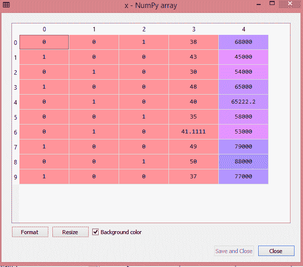

**对于采购变量:**

```

labelencoder_y= LabelEncoder()
y= labelencoder_y.fit_transform(y)

```

对于第二个分类变量，我们将只使用**标签编码器**类的标签编码器对象。这里我们不使用 **OneHotEncoder** 类，因为购买的变量只有两个类别是或否，它们被自动编码为 0 和 1。

**输出:**

```
Out[17]: array([0, 1, 0, 0, 1, 1, 0, 1, 0, 1])

```

**也可以看成:**

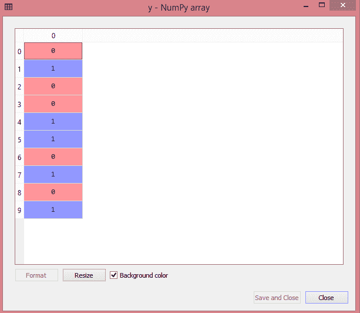

## 6)将数据集分为训练集和测试集

在机器学习数据预处理中，我们将数据集分为训练集和测试集。这是数据预处理的关键步骤之一，因为通过这样做，我们可以提高机器学习模型的性能。

假设，如果我们已经通过数据集对机器学习模型进行了训练，并通过完全不同的数据集对其进行了测试。那么，这将为我们的模型理解模型之间的相关性带来困难。

如果我们很好地训练我们的模型，并且它的训练精度也很高，但是我们向它提供一个新的数据集，那么它将降低性能。因此，我们总是试图建立一个机器学习模型，该模型在训练集和测试数据集上都表现良好。在这里，我们可以将这些数据集定义为:

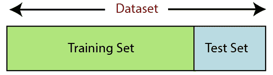

**训练集:**训练机器学习模型的数据集子集，我们已经知道输出。

**测试集:**测试机器学习模型的数据集子集，通过使用测试集，模型预测输出。

为了分割数据集，我们将使用下面几行代码:

```

from sklearn.model_selection import train_test_split
x_train, x_test, y_train, y_test= train_test_split(x, y, test_size= 0.2, random_state=0)

```

**说明:**

*   在上面的代码中，第一行用于将数据集的数组拆分为随机训练和测试子集。
*   在第二行中，我们在输出中使用了四个变量，它们是
    *   **x_train:** 训练数据的特征
    *   **x_test:** 测试数据的特征
    *   **y_train:** 训练数据的因变量
    *   **y_test:** 测试数据的自变量
*   在 **train_test_split()函数**中，我们已经通过了四个参数，其中前两个用于数据数组， **test_size** 用于指定测试集的大小。test_size 可能是. 5、. 3 或. 2，它表示训练集和测试集的划分比例。
*   最后一个参数 **random_state** 用于为随机生成器设置一个种子，这样您总是可以得到相同的结果，这个参数最常用的值是 42。

**输出:**

通过执行上面的代码，我们将得到 4 个不同的变量，可以在变量浏览器部分看到。

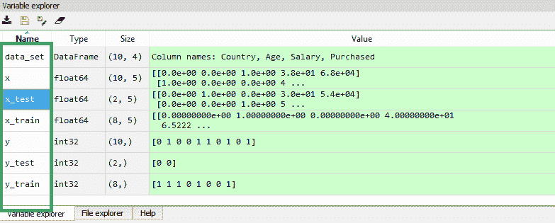

从上图中我们可以看到，x 和 y 变量被分成 4 个不同的变量，并有相应的值。

## 7)特征缩放

特征缩放是机器学习中数据预处理的最后一步。这是一种在特定范围内标准化数据集自变量的技术。在特征缩放中，我们将变量放在相同的范围和比例中，这样就没有任何变量支配另一个变量。

考虑以下数据集:

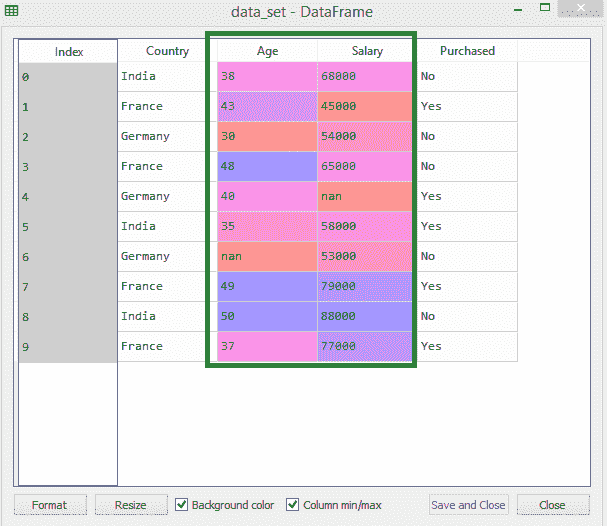

我们可以看到，年龄和薪资列值不在同一个级别上。一个机器学习模型是基于**欧几里德距离**的，如果我们不缩放这个变量，那么它会在我们的机器学习模型中引起一些问题。

欧几里得距离给出为:

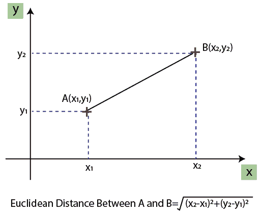

如果我们从年龄和工资计算任何两个值，那么工资值将支配年龄值，并且它将产生不正确的结果。因此，为了消除这个问题，我们需要为机器学习执行特征缩放。

在机器学习中，有两种方法可以执行特征缩放:

**标准化**

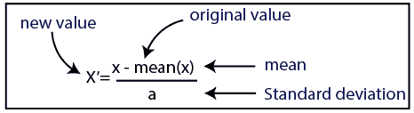

**归一化**

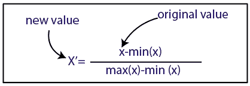

这里，我们将对数据集使用标准化方法。

对于特征缩放，我们将导入 ***的 ***标准缩放器*** 类库如下:***

```

from sklearn.preprocessing import StandardScaler

```

现在，我们将为自变量或特征创建**标准缩放器**类的对象。然后我们将拟合和转换训练数据集。

```

st_x= StandardScaler()
x_train= st_x.fit_transform(x_train)

```

对于测试数据集，我们将直接应用**变换()**函数，而不是 **fit_transform()** ，因为它已经在训练集中完成了。

```

x_test= st_x.transform(x_test)

```

**输出:**

通过执行上述代码行，我们将得到 x_train 和 x_test 的缩放值，如下所示:

**x_train:**

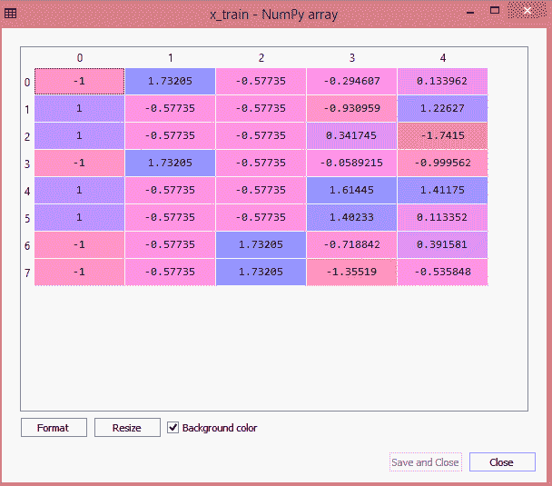

**x_test:**

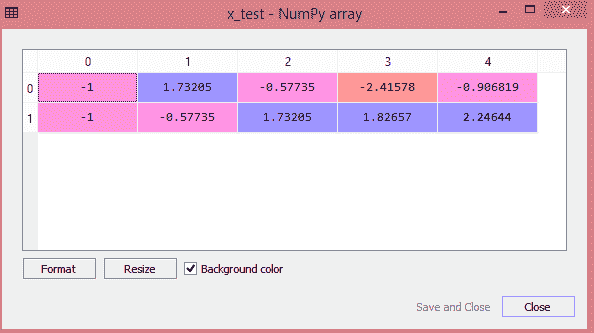

正如我们在上面的输出中看到的，所有的变量都在-1 到 1 之间进行缩放。

#### 注意:这里，我们没有缩放因变量，因为只有两个值 0 和 1。但是如果这些变量有更多的取值范围，那么我们也需要缩放这些变量。

**合并所有步骤:**

现在，最终，我们可以将所有步骤结合在一起，使我们完整的代码更容易理解。

```

# importing libraries
import numpy as nm
import matplotlib.pyplot as mtp
import pandas as pd

#importing datasets
data_set= pd.read_csv('Dataset.csv')

#Extracting Independent Variable
x= data_set.iloc[:, :-1].values

#Extracting Dependent variable
y= data_set.iloc[:, 3].values

#handling missing data(Replacing missing data with the mean value)
from sklearn.preprocessing import Imputer
imputer= Imputer(missing_values ='NaN', strategy='mean', axis = 0)

#Fitting imputer object to the independent varibles x. 
imputer= imputer.fit(x[:, 1:3])

#Replacing missing data with the calculated mean value
x[:, 1:3]= imputer.transform(x[:, 1:3])

#for Country Variable
from sklearn.preprocessing import LabelEncoder, OneHotEncoder
label_encoder_x= LabelEncoder()
x[:, 0]= label_encoder_x.fit_transform(x[:, 0])

#Encoding for dummy variables
onehot_encoder= OneHotEncoder(categorical_features= [0])  
x= onehot_encoder.fit_transform(x).toarray()

#encoding for purchased variable
labelencoder_y= LabelEncoder()
y= labelencoder_y.fit_transform(y)

# Splitting the dataset into training and test set.
from sklearn.model_selection import train_test_split
x_train, x_test, y_train, y_test= train_test_split(x, y, test_size= 0.2, random_state=0)

#Feature Scaling of datasets
from sklearn.preprocessing import StandardScaler
st_x= StandardScaler()
x_train= st_x.fit_transform(x_train)
x_test= st_x.transform(x_test)

```

在上面的代码中，我们一起包含了所有的数据预处理步骤。但是有些步骤或代码行并不是所有机器学习模型都需要的。因此，我们可以将它们从代码中排除，使其可用于所有模型。

* * *