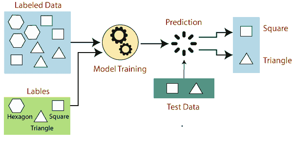
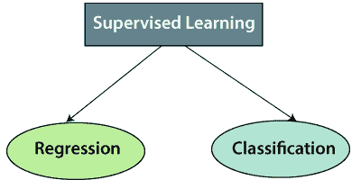

# 监督机器学习

> 原文：<https://www.javatpoint.com/supervised-machine-learning>

监督学习是机器学习的类型，其中机器使用良好“标记”的训练数据进行训练，并且基于该数据，机器预测输出。标记的数据意味着一些输入数据已经标记了正确的输出。

在监督学习中，提供给机器的训练数据作为指导者，教导机器正确预测输出。它应用了与学生在老师监督下学习相同的概念。

监督学习是向机器学习模型提供输入数据和正确输出数据的过程。监督学习算法的目的是**找到一个映射函数，将输入变量(x)映射到输出变量(y)** 。

在现实世界中，监督学习可以用于**风险评估、图像分类、欺诈检测、垃圾邮件过滤**等。

## 监督学习是如何工作的？

在监督学习中，模型使用标记数据集进行训练，其中模型学习每种类型的数据。一旦训练过程完成，模型就根据测试数据(训练集的子集)进行测试，然后预测输出。

通过下面的例子和图表可以很容易理解监督学习的工作原理:

假设我们有一个不同形状类型的数据集，包括正方形、矩形、三角形和多边形。现在第一步是我们需要为每个形状训练模型。

*   如果给定的形状有四条边，并且所有边都相等，那么它将被标记为**正方形**。
*   如果给定的形状有三条边，那么它将被标记为一个**三角形**。
*   如果给定的形状有六条相等的边，那么它将被标记为**六边形**。

现在，在训练之后，我们使用测试集测试我们的模型，模型的任务是识别形状。

机器已经在所有类型的形状上进行了训练，当它发现一个新的形状时，它会根据多个边对形状进行分类，并预测输出。

## 监督学习涉及的步骤:

*   首先确定训练数据集的类型
*   收集/收集贴有标签的培训数据。
*   将训练数据集拆分为训练**数据集、测试数据集和验证数据集**。
*   确定训练数据集的输入特征，训练数据集应该具有足够的知识，以便模型能够准确预测输出。
*   确定适合模型的算法，如支持向量机、决策树等。
*   在训练数据集上执行算法。有时我们需要验证集作为控制参数，它是训练数据集的子集。
*   通过提供测试集来评估模型的准确性。如果模型预测正确的输出，这意味着我们的模型是准确的。

## 监督机器学习算法的类型:

监督学习可以进一步分为两类问题:

**1。回归**

如果输入变量和输出变量之间存在关系，则使用回归算法。它用于预测连续变量，如天气预报、市场趋势等。下面是一些受监督学习的流行回归算法:

*   线性回归
*   回归树
*   非线性回归
*   贝叶斯线性回归
*   多项式回归

**2。分类**

当输出变量是分类变量时，使用分类算法，这意味着有两个类，如是-否、男-女、真-假等。

垃圾邮件过滤，

*   随机森林
*   决策树
*   逻辑回归
*   支持向量机

#### 注意:我们将在后面的章节中详细讨论这些算法。

## 监督学习的优势:

*   在监督学习的帮助下，该模型可以在先前经验的基础上预测输出。
*   在监督学习中，我们可以对对象的类别有一个准确的概念。
*   监督学习模型帮助我们解决各种现实问题，如**欺诈检测、垃圾邮件过滤**等。

## 监督学习的缺点:

*   监督学习模型不适合处理复杂的任务。
*   如果测试数据与训练数据集不同，监督学习无法预测正确的输出。
*   训练需要大量的计算时间。
*   在监督学习中，我们需要足够的关于对象类的知识。

* * *