# 机器学习中的回归分析

> 原文：<https://www.javatpoint.com/regression-analysis-in-machine-learning>

回归分析是一种用一个或多个自变量来模拟因变量(目标)和自变量(预测变量)之间关系的统计方法。更具体地说，回归分析有助于我们理解当其他自变量保持不变时，因变量的值如何对应于自变量而变化。它预测连续/真实值，如**温度、年龄、工资、价格、**等。

我们可以通过下面的例子来理解回归分析的概念:

**例:**假设有一家营销公司 A，每年做各种广告，并以此获得销量。下表显示了公司在过去 5 年中所做的广告以及相应的销售额:

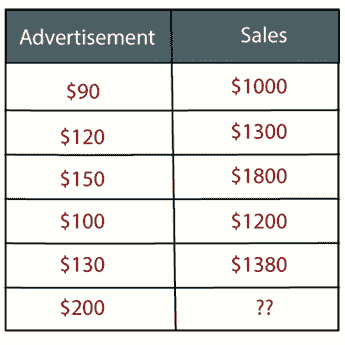

现在公司想做 2019 年 200 美元的广告**，想知道今年**的销量预测。因此，为了解决机器学习中的这类预测问题，我们需要回归分析。

回归是一种[监督学习技术](supervised-machine-learning)，它有助于找到变量之间的相关性，并使我们能够基于一个或多个预测变量预测连续输出变量。主要用于**预测，预测，时间序列建模，确定变量**之间的因果关系。

在回归中，我们在变量之间绘制了一个最适合给定数据点的图，使用这个图，机器学习模型可以对数据进行预测。简单来说， ***“回归显示了一条直线或曲线，它以数据点和回归线之间的垂直距离最小的方式穿过目标预测图上的所有数据点。”*** 数据点和线之间的距离告诉我们一个模型是否捕捉到了一个强关系。

回归的一些例子如下:

*   利用温度和其他因素预测降雨
*   决定市场趋势
*   鲁莽驾驶导致的道路事故预测。

## 与回归分析相关的术语:

*   **因变量:**回归分析中我们要预测或理解的主要因素称为因变量。它也被称为**目标变量**。
*   **自变量:**影响因变量或用于预测因变量值的因素称为自变量，也称为**预测因子**。
*   **异常值:**异常值是指与其他观测值相比，包含非常低的值或非常高的值的观测值。异常值可能会妨碍结果，因此应该避免。
*   **多重共线性:**如果自变量之间的相关性高于其他变量，那么这种情况称为多重共线性。它不应该出现在数据集中，因为它会在对影响最大的变量进行排序时产生问题。
*   **欠拟合和过拟合:**如果我们的算法在训练数据集上运行良好，但在测试数据集上运行不佳，那么这样的问题被称为**过拟合**。如果我们的算法即使在训练数据集上也表现不佳，那么这种问题被称为**欠拟合**。

## 我们为什么使用回归分析？

如上所述，回归分析有助于预测连续变量。现实世界中有各种各样的场景，我们需要一些未来的预测，比如天气状况、销售预测、营销趋势等。在这种情况下，我们需要一些能够更准确地进行预测的技术。因此，对于这种情况，我们需要回归分析，这是一种统计方法，用于机器学习和数据科学。以下是使用回归分析的一些其他原因:

*   回归估计目标和自变量之间的关系。
*   它被用来发现数据的趋势。
*   它有助于预测真实/连续值。
*   通过执行回归，我们可以自信地确定**最重要的因素、最不重要的因素，以及每个因素如何影响其他因素**。

## 回归的类型

数据科学和机器学习中使用了各种类型的回归。每种类型在不同场景下都有其重要性，但核心是所有回归方法都分析自变量对因变量的影响。这里我们讨论一些重要的回归类型，如下所示:

*   **线性回归**
*   **逻辑回归**
*   **多项式回归**
*   **支持向量回归**
*   **决策树回归**
*   **随机森林回归**
*   **岭回归**
*   **套索回归:**

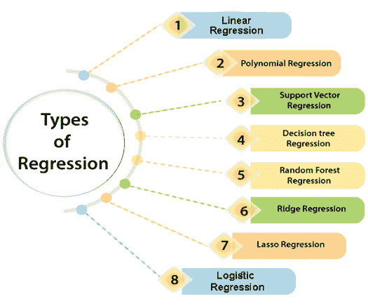

### 线性回归:

*   线性回归是一种用于预测分析的统计回归方法。
*   这是一个非常简单和容易的算法，在回归工作，并显示连续变量之间的关系。
*   它用于解决机器学习中的回归问题。
*   线性回归显示自变量(X 轴)和因变量(Y 轴)之间的线性关系，因此称为线性回归。
*   如果只有一个输入变量(x)，那么这样的线性回归称为**简单线性回归**。而如果输入变量不止一个，那么这样的线性回归称为**多元线性回归**。
*   线性回归模型中变量之间的关系可以用下图来解释。这里我们是根据**经历的年份**来预测员工的工资。

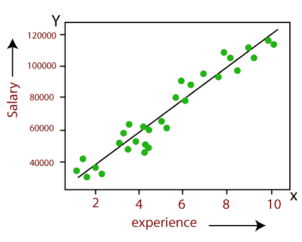

*   下面是线性回归的数学方程:

```

      Y= aX+b

```

**这里，Y =因变量(目标变量)**
**X=自变量(预测变量)** **a、b 为线性系数**

线性回归的一些流行应用是:

*   **分析趋势和销售预测**
*   **薪资预测**
*   **房地产预测**
*   **交通到达 ETAs。**

### 逻辑回归:

*   逻辑回归是另一种用于解决分类问题的监督学习算法。在**分类问题**中，我们有二进制或离散格式的因变量，如 0 或 1。
*   逻辑回归算法适用于分类变量，如 0 或 1、是或否、真或假、垃圾邮件或非垃圾邮件等。
*   这是一种基于概率概念的预测分析算法。
*   逻辑回归是回归的一种类型，但它与线性回归算法的区别在于它们的使用方式。
*   逻辑回归使用 **sigmoid 函数**或复杂成本函数的逻辑函数。该 sigmoid 函数用于逻辑回归中的数据建模。该函数可以表示为:

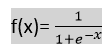

*   f(x)= 0 和 1 值之间的输出。
*   x=函数的输入
*   e=自然对数的基数。

当我们向函数提供输入值(数据)时，它给出如下 S 曲线:

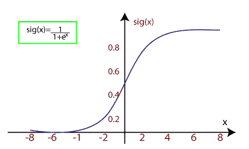

*   它使用阈值级别的概念，阈值级别以上的值向上舍入为 1，阈值级别以下的值向上舍入为 0。

逻辑回归有三种类型:

*   **二进制(0/1，通过/失败)**
*   **多只(猫、狗、狮子)**
*   **序数(低、中、高)**

### 多项式回归:

*   多项式回归是一种使用线性模型对**非线性数据集**建模的回归类型。
*   它类似于多元线性回归，但它拟合了 x 值和相应的 y 条件值之间的非线性曲线。
*   假设有一个数据集由以非线性方式出现的数据点组成，因此对于这种情况，线性回归不会最适合这些数据点。为了覆盖这些数据点，我们需要多项式回归。
*   I **n 多项式回归，将原始特征转化为给定次数的多项式特征，然后使用线性模型建模。**这意味着数据点最好用多项式拟合。

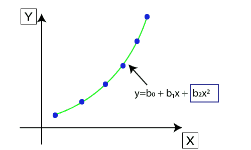

*   多项式回归的方程也是由线性回归方程导出的，即线性回归方程 Y= b <sub>0</sub> + b <sub>1</sub> x，转化为多项式回归方程 Y = b<sub>0</sub>+b<sub>1</sub>x+b<sub>2</sub>x<sup>2</sup>+b<sub>3</sub>x<sup>3</sup>+.....+ b <sub>n</sub> x <sup>n</sup> 。
*   这里 Y 为**预测/目标产量，b <sub>0</sub> ，b <sub>1</sub> ，...b <sub>n</sub> 为回归系数**。x 是我们的**独立/输入变量**。
*   模型仍然是线性的，因为系数仍然是二次线性的

#### 注:这与多元线性回归的不同之处在于，多项式回归中，单个元素的度数不同，而不是多个变量的度数相同。

### 支持向量回归:

支持向量机是一种可用于回归和分类问题的监督学习算法。所以如果我们把它用于回归问题，那么它被称为支持向量回归。

支持向量回归是一种适用于连续变量的回归算法。以下是**支持向量回归**中使用的一些关键词:

*   **内核:**是用来将一个低维数据映射到高维数据的函数。
*   **超平面:**在一般的 SVM 中，它是两个类之间的分隔线，但在 SVR 中，它是一条有助于预测连续变量并覆盖大部分数据点的线。
*   **边界线:**边界线是超平面之外的两条线，它为数据点创建了一个边界。
*   **支持向量:**支持向量是最接近超平面和相反类的数据点。

在支持向量回归机中，我们总是试图确定一个具有最大余量的超平面，以便在该余量中覆盖最大数量的数据点。***SVR 的主要目标是考虑边界线内的最大数据点，超平面(最佳拟合线)必须包含最大数量的数据点*** 。请考虑下图:

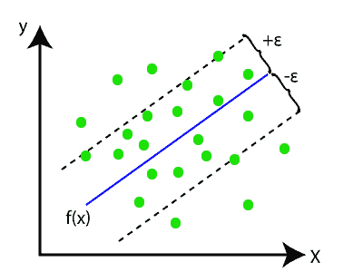

这里，蓝线称为超平面，另外两条线称为边界线。

### 决策树回归:

*   决策树是一种有监督的学习算法，可用于解决分类和回归问题。
*   它可以解决分类和数字数据的问题
*   决策树回归构建了一个树状结构，其中每个内部节点代表一个属性的“测试”，每个分支代表测试的结果，每个叶节点代表最终的决策或结果。
*   决策树从根节点/父节点(数据集)开始构建，分为左右子节点(数据集的子集)。这些子节点被进一步划分为它们的子节点，它们自己成为这些节点的父节点。请考虑下图:

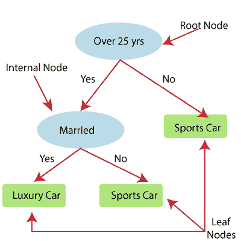

上图展示了 Decision Tee 回归的例子，在这里，模型试图预测一个人在跑车或豪华车之间的选择。

*   随机森林是最强大的监督学习算法之一，能够执行回归和分类任务。
*   随机森林回归是一种集成学习方法，它结合了多个决策树，并根据每个树输出的平均值预测最终输出。组合决策树称为基础模型，它可以更正式地表示为:

```
g(x)= f0(x)+ f1(x)+ f2(x)+....

```

*   随机森林使用 **Bagging 或 Bootstrap Aggregation** 集成学习技术，其中聚合决策树并行运行，并且彼此不交互。
*   借助随机森林回归，我们可以通过创建数据集的随机子集来防止模型中的过度拟合。

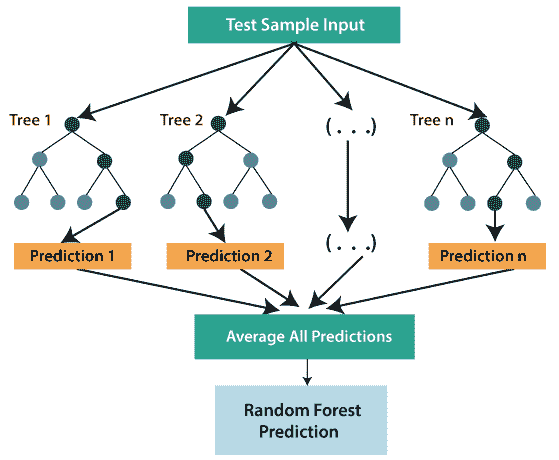

### 岭回归:

*   岭回归是线性回归最稳健的版本之一，其中引入了少量的偏差，以便我们可以获得更好的长期预测。
*   添加到模型中的偏差量称为**岭回归惩罚**。我们可以通过将λ乘以每个单独特征的平方权重来计算这个惩罚项。
*   岭回归方程为:

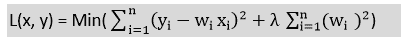

*   如果自变量之间存在较高的共线性，一般的线性或多项式回归会失败，因此可以使用岭回归来解决这类问题。
*   岭回归是一种正则化技术，用于降低模型的复杂度。也叫 **L2 正则化**。
*   如果我们有比样本更多的参数，这有助于解决问题。

### 套索回归:

*   套索回归是另一种降低模型复杂度的正则化技术。
*   它类似于岭回归，只是惩罚项只包含绝对权重，而不是权重的平方。
*   由于它采用绝对值，因此，它可以将斜率缩小到 0，而岭回归只能将其缩小到接近 0。
*   也叫 **L1 正则化**。套索回归的方程是:

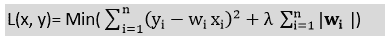

* * *