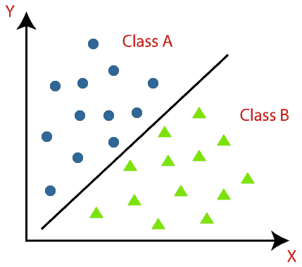
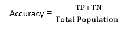

# 机器学习中的分类算法

> 原文：<https://www.javatpoint.com/classification-algorithm-in-machine-learning>

众所周知，监督机器学习算法可以大致分为回归算法和分类算法。在回归算法中，我们已经预测了连续值的输出，但是要预测分类值，我们需要分类算法。

## 什么是分类算法？

分类算法是一种监督学习技术，用于根据训练数据识别新观察的类别。在分类中，程序从给定的数据集或观察中学习，然后将新的观察分类到多个类或组中。如，**是或否，0 或 1，垃圾邮件或非垃圾邮件，猫或狗，**等。类可以被称为目标/标签或类别。

与回归不同，分类的输出变量是一个类别，而不是一个值，如“绿色或蓝色”、“水果或动物”等。由于分类算法是一种监督学习技术，因此它采用带标签的输入数据，这意味着它包含输入和相应的输出。

在分类算法中，离散输出函数(y)映射到输入变量(x)。

```

 y=f(x), where y = categorical output

```

ML 分类算法的最佳示例是**电子邮件垃圾邮件检测器**。

分类算法的主要目标是识别给定数据集的类别，这些算法主要用于预测分类数据的输出。

使用下图可以更好地理解分类算法。在下图中，有两个类，类 A 和类 b。这些类具有彼此相似但不同于其他类的特性。



在数据集上实现分类的算法称为分类器。有两种类型的分类:

*   **二元分类器:**如果分类问题只有两种可能的结果，那么称之为二元分类器。
    **例如:**是或否、男或女、垃圾邮件或非垃圾邮件、猫或狗等。
*   **多类分类器:**如果一个分类问题有两个以上的结果，那么称之为多类分类器。
    **例:**农作物类型分类，音乐类型分类。

## 分类问题中的学习者:

在分类问题中，有两类学习者:

1.  **懒惰学习者:**懒惰学习者首先存储训练数据集，等到收到测试数据集。在懒惰学习者的情况下，分类是基于存储在训练数据集中最相关的数据来完成的。训练花费的时间更少，但预测花费的时间更多。
    **示例:** K-NN 算法，基于案例的推理
2.  **渴望学习者:**渴望学习者在接收测试数据集之前，基于训练数据集开发分类模型。与懒惰型学习者相反，渴望型学习者花更多的时间在学习上，花更少的时间在预测上。**例子:**决策树，朴素贝叶斯，人工神经网络。

## 最大似然分类算法的类型:

分类算法可以进一步分为主要两类:

*   **线性模型**
    *   逻辑回归
    *   支持向量机
*   **非线性模型**
    *   k 近邻
    *   内核 SVM
    *   天真的贝叶斯
    *   决策树分类
    *   随机森林分类

#### 注:我们将在后面的章节中学习上述算法。

## 评估分类模型:

一旦我们的模型完成，就需要评估它的性能；要么是分类模型，要么是回归模型。因此，为了评估分类模型，我们有以下方法:

**1。对数损失或交叉熵损失:**

*   它用于评估分类器的性能，分类器的输出是介于 0 和 1 之间的概率值。
*   对于一个好的二进制分类模型，日志丢失的值应该接近 0。
*   如果预测值偏离实际值，日志丢失的值会增加。
*   较低的对数损失代表较高的模型精度。
*   对于二元分类，交叉熵可以计算为:

```

      ?(ylog(p)+(1?y)log(1?p))

```

其中 y=实际输出，p=预测输出。

**2。混淆矩阵:**

*   混淆矩阵为我们提供了一个矩阵/表格作为输出，并描述了模型的性能。
*   它也被称为误差矩阵。
*   该矩阵由汇总形式的预测结果组成，包括正确预测和错误预测的总数。矩阵如下表所示:

|  | 实际正值 | 实际负值 |
| 预测阳性 | 正确肯定 | 假阳性 |
| 预测负值 | 假阴性 | 正确否定 |



**3。AUC-ROC 曲线:**

*   ROC 曲线代表**接收机工作特性曲线**，AUC 代表【曲线下的 T2】区域。
*   它是显示分类模型在不同阈值下的性能的图表。
*   为了可视化多类分类模型的性能，我们使用 AUC-ROC 曲线。
*   ROC 曲线用 TPR 和 FPR 绘制，其中 TPR(真阳性率)在 Y 轴，FPR(假阳性率)在 X 轴。

## 分类算法的用例

分类算法可以用在不同的地方。下面是分类算法的一些流行用例:

*   电子邮件垃圾邮件检测
*   语音识别
*   癌症肿瘤细胞的鉴定。
*   药物分类
*   生物识别等。

* * *