# 机器学习中的逻辑回归

> 原文：<https://www.javatpoint.com/logistic-regression-in-machine-learning>

*   逻辑回归是最流行的机器学习算法之一，属于监督学习技术。它用于使用一组给定的自变量预测分类因变量。
*   逻辑回归预测分类因变量的输出。因此，结果必须是一个分类或离散值。它可以是是或否，0 或 1，真或假，等等。但是**不是给出 0 和 1 的精确值，而是给出 0 和 1 之间的概率值**。
*   逻辑回归与线性回归非常相似，除了它们是如何使用的。线性回归用于解决回归问题，而**逻辑回归用于解决分类问题**。
*   在逻辑回归中，我们不是拟合回归线，而是拟合一个“S”形逻辑函数，它预测两个最大值(0 或 1)。
*   逻辑函数的曲线表明了一些事情的可能性，比如细胞是否癌变，老鼠是否肥胖，等等。
*   逻辑回归是一种重要的机器学习算法，因为它能够使用连续和离散数据集提供概率并对新数据进行分类。
*   逻辑回归可用于使用不同类型的数据对观察值进行分类，并可轻松确定用于分类的最有效变量。下图显示了逻辑函数:

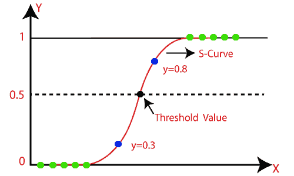

#### 注: Logistic 回归使用预测建模的概念作为回归；因此，它被称为逻辑回归，但用于对样本进行分类；因此，它属于分类算法。

## 逻辑函数(西格玛函数):

*   sigmoid 函数是用于将预测值映射到概率的数学函数。
*   它将任何实值映射到 0 到 1 范围内的另一个值。
*   逻辑回归的值必须在 0 和 1 之间，不能超过这个极限，所以它形成了一条类似“S”形的曲线。S 型曲线被称为 Sigmoid 函数或逻辑函数。
*   在逻辑回归中，我们使用阈值的概念，它定义了 0 或 1 的概率。例如高于阈值的值趋向于 1，低于阈值的值趋向于 0。

## 逻辑回归的假设:

*   因变量本质上必须是分类的。
*   自变量不应有多重共线性。

## 逻辑回归方程:

逻辑回归方程可以从线性回归方程得到。获得逻辑回归方程的数学步骤如下:

*   我们知道直线的方程可以写成:


*   在逻辑回归中，y 只能在 0 和 1 之间，因此，让我们用(1-y)除上面的等式:

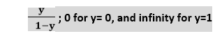

*   但是我们需要介于-[无穷大]到+[无穷大]之间的范围，然后取方程的对数，它将变成:

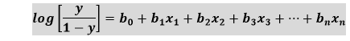

上述方程是逻辑回归的最终方程。

## 逻辑回归的类型:

根据类别，逻辑回归可以分为三种类型:

*   **二项式:**在二项式逻辑回归中，因变量只能有两种可能的类型，如 0 或 1、通过或失败等。
*   **多项式:**在多项式逻辑回归中，因变量可以有 3 种或更多可能的无序类型，如“猫”、“狗”或“羊”
*   **序数:**在序数逻辑回归中，因变量可以有 3 种或更多可能的有序类型，如“低”、“中”或“高”。

## <u>逻辑回归(二项式)的 Python 实现</u>

为了理解逻辑回归在 Python 中的实现，我们将使用下面的例子:

**示例:**给出了一个数据集，其中包含从社交网站获得的各种用户的信息。有一家汽车制造公司最近推出了一款新的 SUV 汽车。所以公司想从数据集中查一下有多少用户想买车。

对于这个问题，我们将使用逻辑回归算法建立一个机器学习模型。数据集如下图所示。在这个问题中，我们将使用**年龄和工资(自变量)**来预测**购买变量(因变量)**。

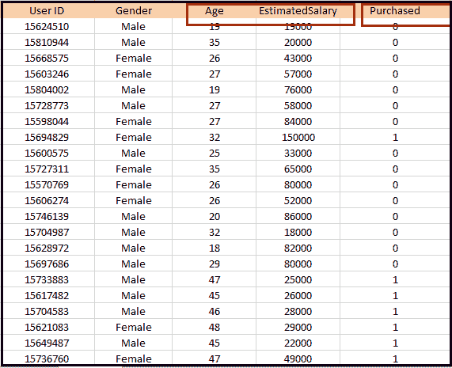

**逻辑回归中的步骤:**要使用 Python 实现逻辑回归，我们将使用与前面的回归主题中相同的步骤。以下是步骤:

*   数据预处理步骤
*   训练集的逻辑回归拟合
*   预测测试结果
*   测试结果的准确性(创建混淆矩阵)
*   可视化测试集结果。

**1。数据预处理步骤:**在这一步中，我们将对数据进行预处理/准备，以便在我们的代码中高效地使用它。这将与我们在数据预处理主题中所做的相同。这方面的代码如下:

```

#Data Pre-procesing Step
# importing libraries
import numpy as nm
import matplotlib.pyplot as mtp
import pandas as pd

#importing datasets
data_set= pd.read_csv('user_data.csv')

```

通过执行上述代码行，我们将获得数据集作为输出。考虑给定的图像:

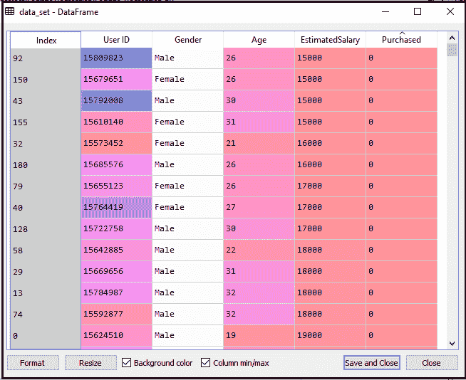

现在，我们将从给定的数据集中提取因变量和自变量。下面是它的代码:

```

#Extracting Independent and dependent Variable
x= data_set.iloc[:, [2,3]].values
y= data_set.iloc[:, 4].values

```

在上面的代码中，我们对 x 取了[2，3]，因为我们的自变量是年龄和工资，它们在指数 2，3。我们把 y 变量取为 4，因为我们的因变量在指数 4。输出将是:

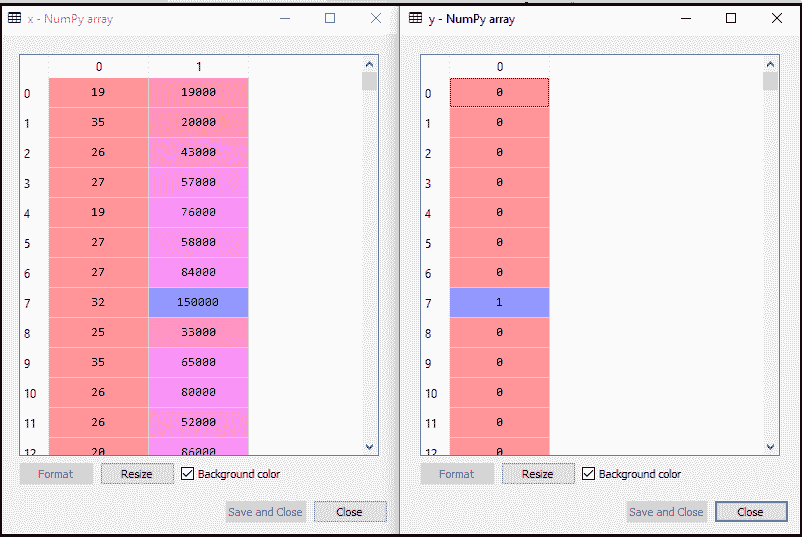

现在我们将数据集分成训练集和测试集。下面是它的代码:

```

# Splitting the dataset into training and test set.
from sklearn.model_selection import train_test_split
x_train, x_test, y_train, y_test= train_test_split(x, y, test_size= 0.25, random_state=0)

```

这方面的输出如下:

**测试集:** 

**训练集:**

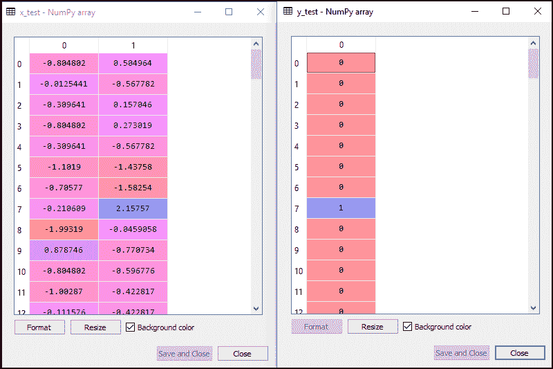

在逻辑回归中，我们将进行特征缩放，因为我们想要准确的预测结果。这里我们只缩放自变量，因为因变量只有 0 和 1 的值。下面是它的代码:

```

#feature Scaling
from sklearn.preprocessing import StandardScaler  
st_x= StandardScaler()  
x_train= st_x.fit_transform(x_train)  
x_test= st_x.transform(x_test)

```

缩放后的输出如下所示:

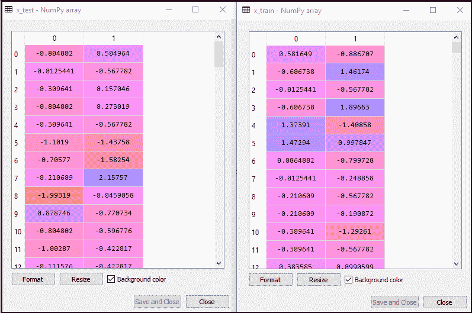

**2。将逻辑回归拟合到训练集:**

我们已经准备好了数据集，现在我们将使用训练集训练数据集。为了提供训练或将模型拟合到训练集，我们将导入 **sklearn** 库的**后勤导出**类。

导入类后，我们将创建一个分类器对象，并使用它来使模型适合逻辑回归。下面是它的代码:

```

#Fitting Logistic Regression to the training set
from sklearn.linear_model import LogisticRegression
classifier= LogisticRegression(random_state=0)
classifier.fit(x_train, y_train)

```

**输出:**通过执行上面的代码，我们将得到下面的输出:

**输出[5]:**

```

LogisticRegression(C=1.0, class_weight=None, dual=False, fit_intercept=True,
                   intercept_scaling=1, l1_ratio=None, max_iter=100,
                   multi_class='warn', n_jobs=None, penalty='l2',
                   random_state=0, solver='warn', tol=0.0001, verbose=0,
                   warm_start=False)

```

因此，我们的模型非常适合训练集。

**3。预测测试结果**

我们的模型在训练集上得到了很好的训练，所以我们现在将通过使用测试集数据来预测结果。下面是它的代码:

```

#Predicting the test set result
y_pred= classifier.predict(x_test)

```

在上面的代码中，我们创建了一个 y_pred 向量来预测测试集结果。

**输出:**通过执行上述代码，将在变量浏览器选项下创建一个新的向量(y_pred)。可以看作是:

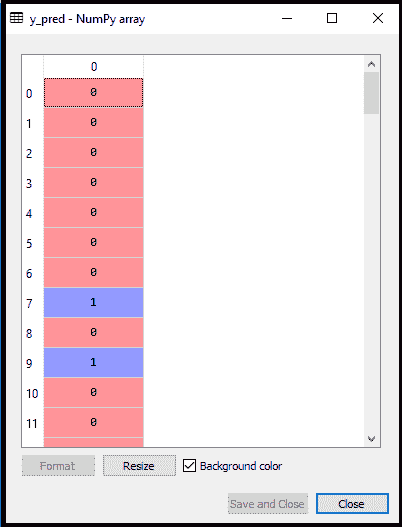

上面的输出图像显示了相应的想要购买或不购买汽车的预测用户。

**4。测试结果的准确性**

现在我们将在这里创建混淆矩阵，以检查分类的准确性。要创建它，我们需要导入 sklearn 库的**混乱 _ 矩阵**函数。导入函数后，我们将使用新变量 **cm** 调用它。该函数取两个参数，主要是 **y_true** (实际值)和 **y_pred** (分类器返回的目标值)。下面是它的代码:

```

#Creating the Confusion matrix
from sklearn.metrics import confusion_matrix
cm= confusion_matrix()

```

**输出:**

通过执行上述代码，将创建一个新的混淆矩阵。请考虑下图:

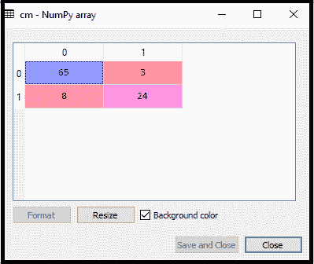

我们可以通过解释混淆矩阵来发现预测结果的准确性。通过上面的输出，我们可以解释为 65+24= 89(正确输出)和 8+3= 11(不正确输出)。

**5。可视化训练集结果**

最后，我们将可视化训练集结果。为了可视化结果，我们将使用 matplotlib 库的 **ListedColormap** 类。下面是它的代码:

```

#Visualizing the training set result
from matplotlib.colors import ListedColormap
x_set, y_set = x_train, y_train
x1, x2 = nm.meshgrid(nm.arange(start = x_set[:, 0].min() - 1, stop = x_set[:, 0].max() + 1, step  =0.01),
nm.arange(start = x_set[:, 1].min() - 1, stop = x_set[:, 1].max() + 1, step = 0.01))
mtp.contourf(x1, x2, classifier.predict(nm.array([x1.ravel(), x2.ravel()]).T).reshape(x1.shape),
alpha = 0.75, cmap = ListedColormap(('purple','green' )))
mtp.xlim(x1.min(), x1.max())
mtp.ylim(x2.min(), x2.max())
for i, j in enumerate(nm.unique(y_set)):
    mtp.scatter(x_set[y_set == j, 0], x_set[y_set == j, 1],
        c = ListedColormap(('purple', 'green'))(i), label = j)
mtp.title('Logistic Regression (Training set)')
mtp.xlabel('Age')
mtp.ylabel('Estimated Salary')
mtp.legend()
mtp.show()

```

在上面的代码中，我们已经导入了 Matplotlib 库的 **ListedColormap** 类来创建可视化结果的 Colormap。我们创建了两个新变量 **x_set** 和 **y_set** 来替换 **x_train** 和 **y_train** 。之后，我们使用 **nm.meshgrid** 命令创建一个矩形网格，其范围为-1(最小)到 1(最大)。我们拍摄的像素点分辨率为 0.01。

为了创建填充轮廓，我们使用了 **mtp.contourf** 命令，它将创建提供颜色的区域(紫色和绿色)。在这个函数中，我们通过了**分类器，预测**来显示分类器预测的预测数据点。

**输出:**通过执行上面的代码，我们将得到下面的输出:


该图可以解释为以下几点:

*   在上图中，我们可以看到绿色区域内有一些**绿色点**，紫色区域内有**紫色点**。
*   所有这些数据点都是训练集中的观察点，显示了购买变量的结果。
*   该图由两个独立变量构成，即 x 轴上的**年龄**和 y 轴上的**预计工资**。
*   **紫点观察**为已购买(因变量)可能为 0 的用户，即未购买 SUV 汽车的用户。
*   **绿点观察**是购买的(因变量)可能是 1 表示购买了 SUV 汽车的用户。
*   从图中我们还可以估计出，低薪的年轻用户没有买车，而预估薪资高的老年用户买车。
*   但是绿色区域有一些紫色点(买车)，紫色区域有一些绿色点(不买车)。因此，我们可以说，估计工资高的年轻用户购买了汽车，而估计工资低的老年用户没有购买汽车。

**分类器的目标:**

我们已经成功地可视化了逻辑回归的训练集结果，并且我们这个分类的目标是划分购买了 SUV 汽车和没有购买汽车的用户。因此，从输出图中，我们可以清楚地看到带有观察点的两个区域(紫色和绿色)。紫色区域是给那些没有买车的用户，绿色区域是给那些买车的用户。

**线性分类器:**

从图中我们可以看到，分类器本质上是直线或线性的，因为我们使用了逻辑回归的线性模型。在进一步的主题中，我们将学习非线性分类器。

**可视化测试集结果:**

使用训练数据集很好地训练了我们的模型。现在，我们将可视化新观察结果(测试集)。测试集的代码将保持与上面相同，除了这里我们将使用 **x_test 和 y_test** 代替 **x_train 和 y_train** 。下面是它的代码:

```

#Visulaizing the test set result
from matplotlib.colors import ListedColormap
x_set, y_set = x_test, y_test
x1, x2 = nm.meshgrid(nm.arange(start = x_set[:, 0].min() - 1, stop = x_set[:, 0].max() + 1, step  =0.01),
nm.arange(start = x_set[:, 1].min() - 1, stop = x_set[:, 1].max() + 1, step = 0.01))
mtp.contourf(x1, x2, classifier.predict(nm.array([x1.ravel(), x2.ravel()]).T).reshape(x1.shape),
alpha = 0.75, cmap = ListedColormap(('purple','green' )))
mtp.xlim(x1.min(), x1.max())
mtp.ylim(x2.min(), x2.max())
for i, j in enumerate(nm.unique(y_set)):
    mtp.scatter(x_set[y_set == j, 0], x_set[y_set == j, 1],
        c = ListedColormap(('purple', 'green'))(i), label = j)
mtp.title('Logistic Regression (Test set)')
mtp.xlabel('Age')
mtp.ylabel('Estimated Salary')
mtp.legend()
mtp.show()

```

**输出:**

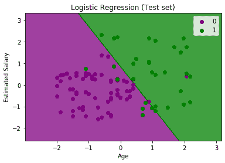

上图显示了测试集结果。如我们所见，该图分为两个区域(紫色和绿色)。绿色观测值在绿色区域，紫色观测值在紫色区域。所以我们可以说它是一个很好的预测和模型。一些绿色和紫色数据点位于不同的区域，这可以忽略，因为我们已经使用混淆矩阵计算了这个错误(11 不正确的输出)。

因此，我们的模型非常好，可以对这个分类问题做出新的预测。

* * *